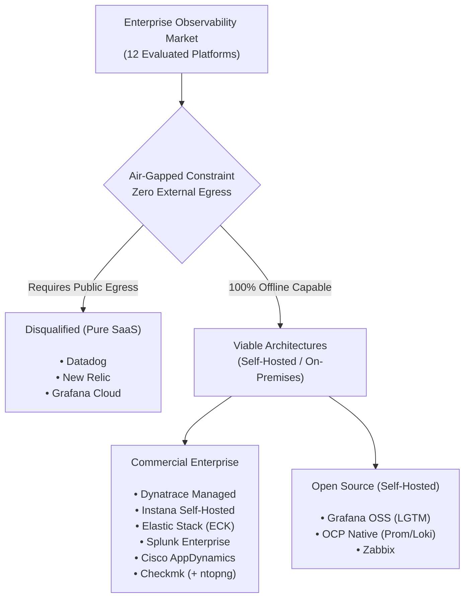
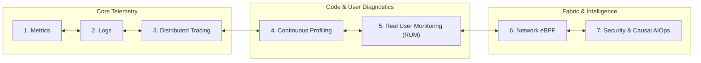
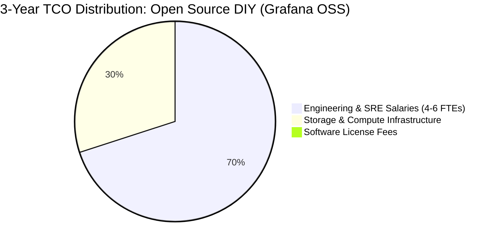
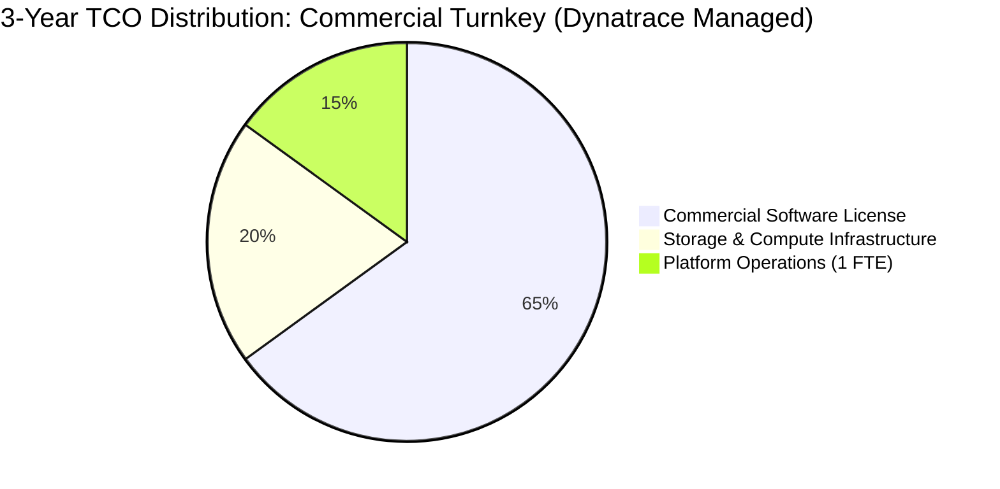
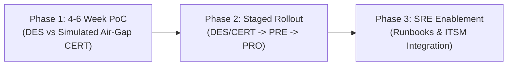
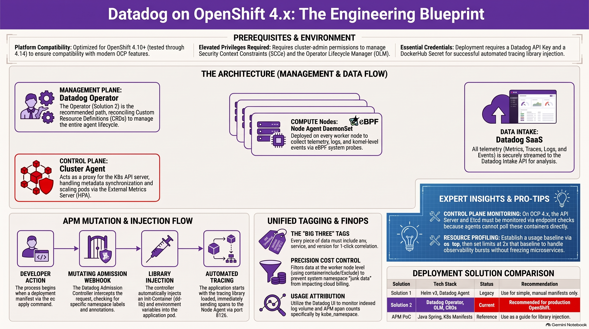
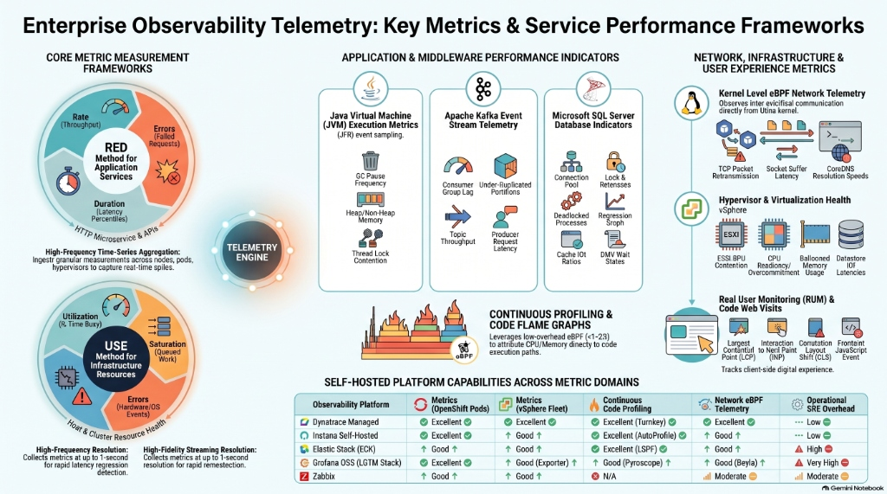
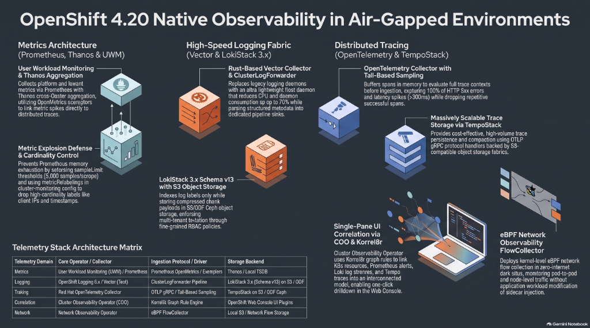
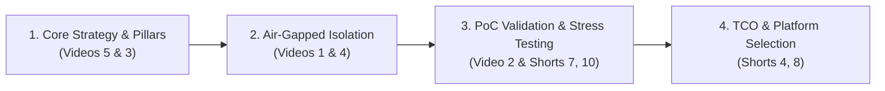

# Enterprise Observability Platforms Comparison (The 7 Pillars)

### Strategic Architectural Analysis & Comparative Evaluation of 12 Observability Platforms for Hybrid Cloud, Air-Gapped OpenShift, and Enterprise Workloads

[](LICENSE)
[](https://kubernetes.io/)
[](https://www.redhat.com/en/technologies/cloud-computing/openshift)
[](docs/ARCHITECTURE_AND_AIRGAP.md)
[](https://www.cncf.io/)
[](https://www.gartner.com/)
[](https://github.com/nubenetes/observability-platforms-comparison/releases/latest)
[](https://www.youtube.com/@nubenetes)

---

> [!WARNING]
> ### ⚠️ AI-Generated Content & Environment Testing Disclaimer
> This repository, its technical documentation, architectural analyses, comparison matrices, reference code, proof-of-concept (PoC) templates, and configuration manifests were generated by **Gemini 3.8 Flash** and **have NOT been tested on a real platform or production environment**.
>
> Its sole purpose is to serve as an **architectural reference guide**, **conceptual framework**, and **educational companion** for enterprise platform engineering teams evaluating full-stack observability. All manifests, operators, chaos injection scripts, and sizing guidelines must be independently reviewed, audited, benchmarked, and verified in isolated sandbox or staging environments before any live cluster deployment.


---

## 📑 Table of Contents
1. [Executive Summary & The Air-Gapped Imperative](#1-executive-summary--the-air-gapped-imperative)
2. [From Monitoring to Observability (Unknown Unknowns)](#2-from-monitoring-to-observability-unknown-unknowns)
3. [The 7 Pillars of Modern Cloud-Native Observability](#3-the-7-pillars-of-modern-cloud-native-observability)
4. [Enterprise Target Architecture & Workload Landscape](#4-enterprise-target-architecture--workload-landscape)
5. [The Master Comparison Matrix (12 Platforms Across the 7 Pillars)](#5-the-master-comparison-matrix-12-platforms-across-the-7-pillars)
6. [Strategic Architectural Archetypes: Infra-First vs. App-First](#6-strategic-architectural-archetypes-infra-first-vs-app-first)
7. [Total Cost of Ownership (TCO): Open Source vs. Commercial](#7-total-cost-of-ownership-tco-open-source-vs-commercial)
8. [Strategic Recommendations & Decision Tiers](#8-strategic-recommendations--decision-tiers)
9. [Proof of Concept (PoC) & Implementation Roadmap](#9-proof-of-concept-poc--implementation-roadmap)
10. [Visual Architecture Blueprints](#10-visual-architecture-blueprints)
    - [Blueprint 1: Datadog on OpenShift 4.x](#blueprint-1-datadog-on-openshift-4x-the-engineering-blueprint)
    - [Blueprint 2: Grafana Observability on OpenShift](#blueprint-2-grafana-observability-on-openshift-engineering-blueprint)
    - [Blueprint 3: Enterprise Observability Telemetry Frameworks](#blueprint-3-enterprise-observability-telemetry-key-metrics--service-performance-frameworks)
    - [Blueprint 4: OpenShift 4.20 Native Observability in Air-Gapped Environments](#blueprint-4-openshift-420-native-observability-in-air-gapped-environments)
11. [Repository Documentation & Advanced Solutions Map](#11-repository-documentation--advanced-solutions-map)
12. [References & Industry Citations](#12-references--industry-citations)
13. [Video Walkthroughs & Architecture References (YouTube)](#13-video-walkthroughs--architecture-references-youtube)

---

## 🤖 AI-Generated Multimedia & Video Series (NotebookLM & YouTube)

This repository includes a comprehensive multi-format educational series synthesized with **Gemini NotebookLM** based directly on this repository's architectural analyses, comparison matrices, manifests, and PoC documentation. All videos and shorts are published and freely accessible on YouTube on the [**@nubenetes**](https://youtube.com/@nubenetes) channel.

> [!NOTE]
> **Multilingual Learning Experience**:
> Content features native spoken audio in **English 🇺🇸**, and includes automated YouTube subtitles / closed captions (CC) translated into **20+ languages** (Spanish, French, German, Japanese, Portuguese, Italian, Arabic, Hindi, etc.) for global knowledge sharing.

### 🎬 Full-Length Technical Deep Dives (Videos & Podcasts)

| # | Format | Video / Podcast Title | Category / Domain | Origin Language | Duration | Direct YouTube Link |
|---|:---:|---|---|:---:|:---:|---|
| 1 | 🎙️ **Podcast** | [**Air Gapped Observability**](https://www.youtube.com/watch?v=iXf_TEDysyk) | Air-Gapped Architecture & Sovereign Cloud | 🇺🇸 English *(CC 20+)* | `8:53` | [▶️ Listen to Podcast](https://www.youtube.com/watch?v=iXf_TEDysyk) |
| 2 | 📽️ Video Guide | [**Air Gapped Observability PoC**](https://www.youtube.com/watch?v=-rGxrU7KLWw) | PoC Execution, Validation & Roadmap | 🇺🇸 English *(CC 20+)* | `9:21` | [▶️ Watch Video](https://www.youtube.com/watch?v=-rGxrU7KLWw) |
| 3 | 📽️ Video Guide | [**12 Observability Platforms**](https://www.youtube.com/watch?v=EClMYT-XXE0) | Master Comparison Matrix & Vendor Evaluation | 🇺🇸 English *(CC 20+)* | `12:29` | [▶️ Watch Video](https://www.youtube.com/watch?v=EClMYT-XXE0) |
| 4 | 📽️ Video Guide | [**Operation Air Gap**](https://www.youtube.com/watch?v=r_oFEMNqN5U) | Enterprise Architecture & Zero-Trust Isolation | 🇺🇸 English *(CC 20+)* | `9:21` | [▶️ Watch Video](https://www.youtube.com/watch?v=r_oFEMNqN5U) |
| 5 | 📽️ Video Guide | [**Enterprise Observability**](https://www.youtube.com/watch?v=Ul3c9WCKmNY) | Strategy & The 7 Pillars of Observability | 🇺🇸 English *(CC 20+)* | `9:35` | [▶️ Watch Video](https://www.youtube.com/watch?v=Ul3c9WCKmNY) |
| 6 | 📽️ Video Guide | [**Air-Gapped Observability: 7 Pillars & SLO Metrics**](https://www.youtube.com/watch?v=AknmFwjITHo) | The 7 Pillars, PromQL Math & SLO Metrics | 🇺🇸 English *(CC 20+)* | `10:05` | [▶️ Watch Video](https://www.youtube.com/watch?v=AknmFwjITHo) |
| 7 | 📽️ Video Guide | [**Air-Gapped Observability: Diagnosing Unknown Unknowns**](https://www.youtube.com/watch?v=AeDhNiCUlBs) | Unknown Unknowns, Kafka & Database Diagnostics | 🇺🇸 English *(CC 20+)* | `9:06` | [▶️ Watch Video](https://www.youtube.com/watch?v=AeDhNiCUlBs) |
| 8 | 📽️ Video Guide | [**Air-Gapped Observability Strategy: 12 Platforms & TCO**](https://www.youtube.com/watch?v=22ELDrv1i4o) | 12 Platforms Matrix, Decision Tiers & FinOps TCO | 🇺🇸 English *(CC 20+)* | `8:33` | [▶️ Watch Video](https://www.youtube.com/watch?v=22ELDrv1i4o) |
| 9 | 🎙️ **Podcast** | [**Air Gapped Observability: 12 Platforms Comparison & TCO**](https://www.youtube.com/watch?v=b8RVbo6ecUg) | Master Comparison, 3 Tiers & 3-Year FinOps TCO | 🇺🇸 English *(CC 20+)* | `55:23` | [▶️ Listen to Podcast](https://www.youtube.com/watch?v=b8RVbo6ecUg) |
| 10 | 🎙️ **Podcast** | [**Observabilidad en Entornos Air Gapped: 12 Plataformas**](https://www.youtube.com/watch?v=xyBbVX3wbqM) | Arquitectura Air-Gapped, 7 Pilares y TCO Real | 🇪🇸 Spanish *(CC 20+)* | `17:17` | [▶️ Escuchar Podcast](https://www.youtube.com/watch?v=xyBbVX3wbqM) |

### ⚡ Topic-Focused Technical Shorts

| # | Short Title | Category | Origin Language | Duration | Direct YouTube Link |
|---|---|---|:---:|:---:|---|
| 1 | [**How Air Gapped Observability Works**](https://www.youtube.com/shorts/PKlhN5HfWM8) | Air-Gapped Architecture & Security | 🇺🇸 English *(CC 20+)* | `1:16` | [▶️ Watch Short](https://www.youtube.com/shorts/PKlhN5HfWM8) |
| 2 | [**Why Legacy Monitors Fail on Kubernetes**](https://www.youtube.com/shorts/J8vhWDuoBU0) | Infra-First vs App-First Strategy | 🇺🇸 English *(CC 20+)* | `1:18` | [▶️ Watch Short](https://www.youtube.com/shorts/J8vhWDuoBU0) |
| 3 | [**How to Observe Highly Secure Hybrid Enterprise Clouds**](https://www.youtube.com/shorts/Mx-aNHy-a-4) | Hybrid Cloud Architecture & Governance | 🇺🇸 English *(CC 20+)* | `1:25` | [▶️ Watch Short](https://www.youtube.com/shorts/Mx-aNHy-a-4) |
| 4 | [**The Best Observability Platforms for Secure Enterprises**](https://www.youtube.com/shorts/3BDnVOpvRww) | Platform Selection & Decision Tiers | 🇺🇸 English *(CC 20+)* | `1:28` | [▶️ Watch Short](https://www.youtube.com/shorts/3BDnVOpvRww) |
| 5 | [**How Observability Spots Invisible Software Failures**](https://www.youtube.com/shorts/Sitc___A2PQ) | Observability vs Monitoring (Unknown Unknowns) | 🇺🇸 English *(CC 20+)* | `1:24` | [▶️ Watch Short](https://www.youtube.com/shorts/Sitc___A2PQ) |
| 6 | [**The Swivel Chair Observability Trap**](https://www.youtube.com/shorts/eKm-os3DdEI) | Architectural Anti-Patterns & SRE Friction | 🇺🇸 English *(CC 20+)* | `1:22` | [▶️ Watch Short](https://www.youtube.com/shorts/eKm-os3DdEI) |
| 7 | [**How to Stress Test Observability**](https://www.youtube.com/shorts/yKEEMcVsuDA) | Chaos Engineering & Fault Injection | 🇺🇸 English *(CC 20+)* | `1:23` | [▶️ Watch Short](https://www.youtube.com/shorts/yKEEMcVsuDA) |
| 8 | [**The Hidden Cost of Free Software**](https://www.youtube.com/shorts/Tnn8h_Q_kiU) | FinOps & Total Cost of Ownership (TCO) | 🇺🇸 English *(CC 20+)* | `1:08` | [▶️ Watch Short](https://www.youtube.com/shorts/Tnn8h_Q_kiU) |
| 9 | [**Decoding Cloud Chaos: The 7 Pillars of Observability**](https://www.youtube.com/shorts/nm6cs6NN2n8) | Telemetry Standards & Core Pillars | 🇺🇸 English *(CC 20+)* | `1:29` | [▶️ Watch Short](https://www.youtube.com/shorts/nm6cs6NN2n8) |
| 10 | [**Inside the Ultimate Observability Stress Test Toolkit**](https://www.youtube.com/shorts/EwPDZ26T1OQ) | PoC Framework & Chaos Tooling | 🇺🇸 English *(CC 20+)* | `1:13` | [▶️ Watch Short](https://www.youtube.com/shorts/EwPDZ26T1OQ) |
| 11 | [**Why Averages Lie in Microservices: SLO Metrics & P99 Latency**](https://www.youtube.com/shorts/5q_3PnAU1DM) | SLO Engineering & Tail Latency | 🇺🇸 English *(CC 20+)* | `1:16` | [▶️ Watch Short](https://www.youtube.com/shorts/5q_3PnAU1DM) |
| 12 | [**Por Qué las Medias Mienten en Microservicios: Métricas SLO**](https://www.youtube.com/shorts/2XFYvmGmaS0) | SLO Engineering & Tail Latency | 🇪🇸 Spanish *(CC 20+)* | `1:12` | [▶️ Watch Short](https://www.youtube.com/shorts/2XFYvmGmaS0) |

*For complete descriptions and the full progressive learning path, see [Section 13: Video Walkthroughs & Architecture References](#13-video-walkthroughs--architecture-references-youtube).*

---

## 1. Executive Summary & The Air-Gapped Imperative

In complex hybrid enterprises—spanning on-premises datacenters, sovereign cloud enclaves, **Red Hat OpenShift 4.18+**, and **VMware vSphere** virtualization—visibility is frequently fractured by organizational silos and strict security boundaries.

This project delivers an exhaustive, objective architectural evaluation of **12 market-leading observability platforms** to identify the optimal platform for mission-critical Java microservices, Apache Kafka event streaming, and Microsoft SQL Server databases.

### The Primary Architectural Divider: Air-Gapped Isolation
The single most decisive architectural filter in enterprise evaluation is the presence of **strictly disconnected (air-gapped) production (PRO) and pre-production (PRE) enclaves**. 

A truly air-gapped system operates with zero outbound internet connectivity. This creates an immediate market bifurcation:
1. **Viable Platforms (Self-Hosted / On-Premises)**: Platforms providing fully functional, autonomous backends installable on-cluster or within private datacenters without external dependencies.
2. **Disqualified Platforms (Pure SaaS)**: Platforms such as **Datadog**, **New Relic**, and **Grafana Cloud** that require continuous HTTPS telemetry egress to public cloud endpoints.



### The "Swivel-Chair" Anti-Pattern (The Two-Tool Fallacy)
Attempting to deploy a SaaS platform in connected lower environments (DES/CERT) and an on-premises tool in air-gapped production (PRE/PRO) is strongly discouraged. This introduces severe operational friction:
- **Telemetry Silos**: Inability to correlate or baseline transaction traces between staging and production.
- **Cognitive Overhead**: Operations teams must navigate two disparate user interfaces, query languages, and alerting engines.
- **Double TCO**: Paying cloud SaaS ingestion/host bills while simultaneously funding internal server infrastructure, storage, and maintenance for on-premises tools.

---

## 2. From Monitoring to Observability (Unknown Unknowns)

Traditional IT systems management relied on **monitoring**: tracking predefined metrics and firing threshold alerts (*"Is server CPU > 90%?"* or *"Is the HTTP ping responding?"*). Monitoring focuses on detecting **"known knowns"** and **"known unknowns"**.

In distributed microservices, asynchronous event pipelines, and container clusters, failures rarely manifest as simple server outages. Instead, they appear as subtle, emergent, cascading anomalies:
- A thread pool exhaustion triggered by uncommitted SQL locks.
- A consumer lag spike in Kafka caused by JVM garbage collection pauses.
- CFS quota CPU throttling on containers with low average utilization.

**Observability** is the mathematical and operational property of inferring the internal states of a system based on its external telemetry outputs. It enables engineers to ask arbitrary, complex questions without predicting failures in advance—diagnosing **"unknown unknowns"**.

---

## 3. The 7 Pillars of Modern Cloud-Native Observability

To achieve holistic observability, enterprise architecture has evolved beyond the classic "Three Pillars" (Metrics, Logs, Traces) into **7 Interconnected Pillars**:



1. **Pillar 1: Metrics (Aggregated Time-Series)**: High-frequency numeric measurements capturing resource utilization, throughput, error counts, and latency percentiles (USE/RED methods) across nodes, pods, JVMs, and hypervisors.
2. **Pillar 2: Logs (Immutable Event Context)**: Structured (JSON) and unstructured chronological records from operating systems, containers, application runtimes, and audit trails providing granular contextual narrative.
3. **Pillar 3: Distributed Tracing & APM (Transaction Waterfalls)**: End-to-end request path tracking across asynchronous microservice boundaries, Kafka message headers (W3C TraceContext), and database query executions.
4. **Pillar 4: Continuous Profiling (Code-Level Attribution)**: Always-on, low-overhead (<1–2%) CPU, memory allocation, and thread lock profiling via eBPF and JVM Flight Recorder (JFR), visualized as interactive **Flame Graphs**.
5. **Pillar 5: Real User Monitoring (RUM) & Digital Experience (DEM)**: Client-side browser and mobile performance tracking, Core Web Vitals (LCP, INP, CLS), JavaScript error capturing, and synthetic journey probing.
6. **Pillar 6: Network Observability & eBPF Telemetry**: Deep kernel-level visibility into inter-pod and inter-host communication flows, TCP packet retransmissions, socket buffer latency, and CoreDNS resolution metrics.
7. **Pillar 7: Security Observability, Audit & Causal AIOps**: Kubernetes API server audit logs, runtime threat detection, privilege escalation tracking, and topological causal AI engines (e.g., Davis AI) that collapse alert storms to pinpoint root causes.

*For an in-depth breakdown of telemetry standards, data models, and protocols, see [docs/THE_7_PILLARS.md](docs/THE_7_PILLARS.md).*

---

## 4. Enterprise Target Architecture & Workload Landscape

The evaluated architecture mirrors high-security enterprise environments across public sector, banking, and critical infrastructure:

| Infrastructure Category | Component / Environment | Network Zone | Primary Workloads & Dependencies | Critical Observability Needs |
| :--- | :--- | :--- | :--- | :--- |
| **Container Platform** | **OpenShift 4.18+ PRO** (Production) | **Air-Gapped Sovereign Cloud** | Core Java Microservices, Kafka, Keycloak IAM, HashiCorp Vault | 100% self-hosted, deep APM, continuous profiling, native Kafka tracing. |
| **Container Platform** | **OpenShift 4.18+ PRE** (Pre-Production)| **Air-Gapped Sovereign Cloud** | Pre-release Java microservices, regression test suites | Production environment parity, latency regression detection. |
| **Container Platform** | **OpenShift 4.18+ CERT** (Staging) | Sovereign Cloud (Controlled Egress) | Acceptance testing, simulated air-gap validation | Cross-environment correlation, APM performance baselining. |
| **Container Platform** | **OpenShift 4.18+ DES** (Development) | Enterprise On-Prem Datacenter | Feature development, Tekton CI, ArgoCD GitOps | Rapid developer feedback, CI/CD pipeline tracing. |
| **Virtualization Fleet**| **VMware vSphere (vCenter)** | Sovereign Cloud & Datacenter | Supporting services, legacy applications, VMs | Hypervisor CPU contention, ballooned memory, datastore latency. |
| **Relational Database** | **Microsoft SQL Server** | Internal Secure Network | Shared mission-critical business database | Wait-state analysis, execution plans, APM trace-to-query linking. |

*Detailed air-gapped network flows and mirroring mechanics are documented in [docs/ARCHITECTURE_AND_AIRGAP.md](docs/ARCHITECTURE_AND_AIRGAP.md).*

---

## 5. The Master Comparison Matrix (12 Platforms Across the 7 Pillars)

The table below synthesizes the findings across all **12 evaluated platforms**, scoring their capabilities across the **7 Pillars of Observability**, air-gapped viability, hybrid infrastructure support, and economic profiles:

| Evaluation Criteria | OCP Native (Prom/Loki) | Datadog | Elastic Stack (ECK) | Dynatrace | New Relic | Splunk Enterprise | Instana (IBM) | Cisco AppDynamics | Grafana Cloud | Checkmk (+ ntopng) | Grafana OSS (LGTM) | Zabbix |
| :--- | :---: | :---: | :---: | :---: | :---: | :---: | :---: | :---: | :---: | :---: | :---: | :---: |
| **Air-Gapped Viable** | **Yes** | **No** (SaaS) | **Yes** | **Yes** | **No** (SaaS) | **Yes** | **Yes** | **Yes** | **No** (SaaS) | **Yes** | **Yes** | **Yes** |
| **Pillar 1: Metrics (OpenShift)** | Excellent | Excellent | Good | Excellent | Excellent | Good | Excellent | Good | Excellent | Good | Excellent | Good |
| **Pillar 1b: Metrics (vSphere)** | Good (Exporter) | Excellent | Good | Excellent | Good | Good | Good | Good | Good | Excellent | Good (Exporter) | Good |
| **Pillar 2: Logs** | Good (Loki) | Excellent | Excellent | Excellent | Good | Excellent | Good | Moderate | Excellent | Moderate | Excellent (Loki) | Moderate |
| **Pillar 3: Tracing / APM (Java)** | Moderate (Tempo) | Excellent | Good | Excellent | Excellent | Good | Excellent | Excellent | Good | Poor / N/A | Good (Tempo) | Poor / N/A |
| **Pillar 3b: Tracing (Kafka)** | Moderate | Excellent | Good | Excellent | Good | Good | Excellent | Good | Good | N/A | Moderate | N/A |
| **Pillar 4: Continuous Profiling** | Poor / Assembly | Excellent | Excellent (eBPF) | Excellent | Good (JFR) | Poor / N/A | Excellent | Moderate (Snapshots) | Good (Pyroscope) | N/A | Good (Pyroscope) | N/A |
| **Pillar 5: Real User Monitoring (RUM)**| Poor / Assembly | Excellent | Good | Excellent | Excellent | Good | Good | Excellent | Good (Faro) | N/A | Moderate (Faro) | Moderate (Synthetic) |
| **Pillar 6: Network eBPF Observability**| Good (NetObserv) | Excellent (NPM)| Good | Excellent | Excellent (Pixie)| Moderate | Good | Good | Good (Beyla) | Good (ntopng) | Good (Beyla/NetObs)| Moderate |
| **Pillar 7: Security & Causal AIOps**  | Moderate | Excellent | Excellent | Excellent (Davis)| Good | Excellent (SIEM) | Excellent (DynGraph) | Good | Moderate | Moderate | Moderate | Moderate |
| **Microsoft SQL Server Monitoring**   | Good (Exporter) | Excellent | Good | Excellent | Good | Good | Good | Excellent | Good | Good | Good (Exporter) | Good |
| **Gartner MQ Position** | N/A | **Leader** | **Visionary** | **Leader** | **Leader** | **Leader** | **Visionary** | **Leader** | N/A | Niche | N/A | Niche |
| **CNCF / OTel Alignment** | **Very High** | Medium | Medium | Medium | Medium | Medium | Medium | Low | High | Low | **Very High** | Low |
| **Relative License Cost** | **$ (OSS)** | **$$$$** | **$$$** | **$$$$** | **$$$$** | **$$$$** | **$$$** | **$$$$** | **$$$** | **$$** | **$ (OSS)** | **$ (OSS)** |
| **Operational & SRE Overhead** | **Very High** | Low | High | **Low** | Low | High | **Low** | High | Low | Low | **Very High** | Moderate |

*For individual platform profiles and detailed rationales, see [docs/PLATFORM_EVALUATION_DEEP_DIVE.md](docs/PLATFORM_EVALUATION_DEEP_DIVE.md) and [docs/COMPARISON_MATRICES.md](docs/COMPARISON_MATRICES.md).*

---

## 6. Strategic Architectural Archetypes: Infra-First vs. App-First

Understanding platform origins is essential for proper evaluation:

```mermaid
graph TD
    subgraph "Infra-First Platforms (Checkmk, Zabbix)"
        I1["Originated in Hardware, Network & SNMP"]
        I2["Treats OpenShift as Just Another Node"]
        I3["Deep vSphere & Storage Health Checks"]
        I4["BLIND SPOT: No APM, No Kafka Traces, No Profiling"]
        I1 --> I2 --> I3 --> I4
    end

    subgraph "App-First Platforms (Dynatrace, Instana)"
        A1["Originated in Code Execution & Bytecode APM"]
        A2["Automated Runtime Container Injection"]
        A3["Infrastructure Exists Solely as App Context"]
        A4["STRENGTH: Instant Root-Cause & Code Flame Graphs"]
        A1 --> A2 --> A3 --> A4
    end

    subgraph "Convergent Platforms (Elastic, Splunk, Grafana OSS)"
        C1["Originated in Search/Logs or Time-Series Metrics"]
        C2["Expanded via Modules, Operators & Standards (OTel)"]
        C3["Exceptional Flexibility & Powerful Custom Querying"]
        C4["TRADE-OFF: Higher SRE Assembly & Scaling Burden"]
        C1 --> C2 --> C3 --> C4
    end
```



### The Checkmk / Zabbix Dilemma on OpenShift
While tools like **Checkmk** and **Zabbix** are exceptional for bare-metal, switches, and VMware ESXi, attempting to use them as the primary observability engine for containerized microservices on OpenShift is a critical architectural mistake:
- They lack distributed transaction tracing (Pillar 3).
- They have zero continuous profiling capabilities (Pillar 4).
- They cannot track Kafka consumer lag or correlate asynchronous message hops to database calls.
- Selecting them leaves software engineering teams blind to application bottlenecks.

---

## 7. Total Cost of Ownership (TCO): Open Source vs. Commercial

A common enterprise trap is assuming Open Source software (OSS) is "free":

$$\text{TCO} = \text{Direct License Cost} + \text{Infrastructure / Storage Compute} + \text{SRE Headcount and Maintenance} + \text{MTTR Business Impact}$$





- **Open Source (Grafana OSS, Prometheus/Loki)**:
  - Direct License: **$0**.
  - Operational Reality: Requires establishing a dedicated Platform Engineering / SRE team (4–6 senior engineers) to deploy, secure, shard, patch, and maintain distributed storage backends (Mimir, Loki, Tempo, Pyroscope) across air-gapped enclaves.
- **Commercial Enterprise (Dynatrace Managed, Instana Self-Hosted)**:
  - Direct License: **High / Predictable**.
  - Operational Reality: Vendor assumes R&D, integration, and upgrade stability. Automated agent injection and causal AI root-cause analysis drastically reduce manual engineering overhead.

---

## 8. Strategic Recommendations & Decision Tiers

Based on the air-gapped mandate, workload complexity (Java, Kafka, SQL Server), and operational economics, platforms are categorized into strategic decision tiers:

```text
+=============================================================================+
|                        ENTERPRISE DECISION MANDATE                          |
|       Sovereign Air-Gapped Cloud  *  Java, Kafka & SQL Server Fleet         |
+=============================================================================+
                                       |
                                       | [Primary Path: Turnkey & Lowest Risk]
                                       v
+-----------------------------------------------------------------------------+
| TRACK 1: PRIMARY ENTERPRISE RECOMMENDATION (Turnkey & Lowest Risk)          |
| -> Dynatrace Managed                                                        |
+-----------------------------------------------------------------------------+
| * Turnkey OneAgent Injection  : Automated OpenShift, VM & container attach  |
| * Davis(R) Causal AI Engine   : Deterministic topological root-cause engine |
| * Air-Gapped Sovereign Parity : 100% offline cluster, zero egress required  |
| * Out-of-the-Box Coverage     : Complete turnkey coverage across 7 Pillars  |
+-----------------------------------------------------------------------------+
| OUTCOME: Lowest operational risk & fastest time-to-value for the enterprise |
+-----------------------------------------------------------------------------+
                                       |
                                       | [Commercial Alternatives: 4-6 Wk PoC]
                                       v
+-----------------------------------------------------------------------------+
| TRACK 2: VIABLE COMMERCIAL ALTERNATIVES (Parallel PoC Validation)           |
+-----------------------------------------------------------------------------+
| [2A] Instana Self-Hosted (APM & Host Pricing Focus)                         |
| * 1-Second Metric Resolution  : Real-time high-fidelity streaming           |
| * AutoTrace(TM) Bytecode      : Zero-code instant container sensor injection|
| * Host-Based Licensing        : Predictable host pricing model              |
| > VALUE: Best APM fallback if host pricing model is favored                 |
+ - - - - - - - - - - - - - - - - - - - - - - - - - - - - - - - - - - - - - - +
| [2B] Elastic Stack ECK (Log Search & Whole-System Profiling Focus)          |
| * Forensic Lucene Search      : Industry standard log analytics & compliance|
| * Universal Profiling (eBPF)  : Whole-system kernel CPU & memory profiling  |
| * Cloud-Native ECK Operator   : Deep certified OpenShift operator management|
| > VALUE: Best alternative if log analytics is primary organizational driver |
+-----------------------------------------------------------------------------+
                                       |
                                       | [Open-Source Track: Build vs Buy]
                                       v
+-----------------------------------------------------------------------------+
| TRACK 3: STRATEGIC OPEN-SOURCE PATHWAY (High SRE Investment)                |
| -> Grafana OSS Stack (LGTM + Pyroscope)                                     |
+-----------------------------------------------------------------------------+
| * Zero Software Licensing     : 100% open-source, vendor-neutral telemetry  |
| * CNCF / OTel Standards       : Mimir (metrics), Loki (logs), Tempo (traces)|
| * Continuous Profiling        : Pyroscope eBPF-based runtime profiling      |
| * In-House Operational Burden : Demands dedicated 4-6 FTE SRE platform team |
+-----------------------------------------------------------------------------+
| OUTCOME: Maximum architectural freedom with highest internal SRE burden     |
+-----------------------------------------------------------------------------+
```

### 1. Tier 1 (Primary Recommendation): Dynatrace Managed
- **Why**: Delivers the most complete, turnkey coverage across all **7 Pillars of Observability**. Its **Dynatrace Managed** architecture is purpose-built for air-gapped enclaves.
- **Differentiators**: Single OneAgent deployment via certified OpenShift Operator; **Davis® Causal AI** automatically identifies root causes without manual alert rules; native deep visibility into Java, Kafka, vSphere, and SQL Server.

### 2. Tier 2 (Viable Alternatives): Instana & Elastic Stack
- **Instana Self-Hosted**: The closest direct competitor to Dynatrace. Exceptional 1-second metric resolution, **AutoTrace™** zero-touch instrumentation, and predictable host-based licensing.
- **Elastic Stack (ECK)**: Industry-leading log analysis and search. Now enhanced with **Universal Profiling** (whole-system eBPF). Best suited for teams with strong Elasticsearch operational skills.

### 3. Special Strategic Pathway: Grafana OSS Stack (LGTM + Pyroscope)
- **Why**: Highest technical flexibility, zero license costs, and complete CNCF alignment.
- **The Organizational Commitment**: Successfully adopting this stack is not merely a software choice; it requires committing to build and sustain an in-house SRE platform team responsible for distributed systems scaling, exporter patching, and custom dashboard development.

---

## 9. Proof of Concept (PoC) & Implementation Roadmap

To de-risk the investment, the enterprise should execute a structured **3-Phase Roadmap**:



### Phase 1: 5 Measurable Acceptance Criteria
1. **Disconnected Deployment**: Complete offline installation in air-gapped CERT via internal private registry; zero external internet egress.
2. **Zero-Touch Auto-Instrumentation**: Deploy a Java microservice container; verify agent bytecode injection without code or Dockerfile changes.
3. **End-to-End Tracing Across Kafka & SQL Server**: Generate test transactions; verify unbroken trace propagation from HTTP Ingress $\to$ Kafka $\to$ Consumer $\to$ SQL Server query.
4. **Unified Hybrid Visibility**: Display OpenShift pods and VMware vSphere host metrics side-by-side in a single pane.
5. **Causal Diagnostic Usability**: Inject a simulated SQL lock and Kafka lag; verify platform surfaces a single causal root-cause incident.

*The step-by-step test harness and failure injection scripts are in [docs/POC_EXECUTION_GUIDE.md](docs/POC_EXECUTION_GUIDE.md).*

---

## 10. Visual Architecture Blueprints

### Blueprint 1: Datadog on OpenShift 4.x: The Engineering Blueprint

[](assets/datadog-openshift-engineering-blueprint.png)

#### Architectural Breakdown & Implementation Dimensions

| Architecture Dimension | Engineering Specification & Component Details |
| :--- | :--- |
| **Prerequisites & Environment** | • **Platform Compatibility**: Optimized for OpenShift 4.10+ (validated through 4.14+) ensuring compatibility with modern OCP features.<br/>• **Elevated Privileges**: Requires `cluster-admin` permissions to manage Security Context Constraints (`SCCs`) and Operator Lifecycle Manager (`OLM`).<br/>• **Essential Credentials**: Requires a Datadog API Key secret and DockerHub credentials for automated tracing library injection. |
| **Management Plane** | **Datadog Operator**: Reconciles Custom Resource Definitions (`DatadogAgent` CRDs) to automate agent deployment, configuration updates, and lifecycle operations across the cluster. |
| **Control Plane** | **Datadog Cluster Agent**: Acts as an intelligent proxy to the Kubernetes API Server, reducing API load, synchronizing pod metadata, and providing cluster-level metrics via the External Metrics Server for Horizontal Pod Autoscaling (`HPA`). |
| **Compute Nodes** | **Node Agent DaemonSet (with eBPF)**: Deployed across all OpenShift worker nodes to collect system metrics, container logs, and low-level kernel socket/network events via eBPF probes with minimal runtime overhead. |
| **Data Intake** | **Datadog SaaS Ingest**: Telemetry (Metrics, Traces, Logs, and Events) is securely transmitted via outbound TLS/HTTPS to Datadog's cloud intake API endpoints. *(Note: Disqualifies this architecture from strictly air-gapped enclaves without external proxy routing).* |
| **APM Mutation & Injection Flow** | **1. Developer Action**: Standard deployment manifest applied via `oc apply`.<br/>**2. Mutating Admission Webhook**: Datadog Admission Controller intercepts the pod creation request and checks for namespace/pod annotations.<br/>**3. Library Injection**: Automatically injects an Init-Container (`dd-lib`) and mounts tracing libraries and environment variables into the application pod without modifying source code or Dockerfiles.<br/>**4. Automated Tracing**: Application runtime starts with the tracing library active, streaming APM spans locally to the Node Agent via port 8126. |
| **Unified Tagging & FinOps Strategy** | • **The "Big Three" Tags**: Mandatory injection of `env`, `service`, and `version` across all telemetry streams for instant 1-click correlation.<br/>• **Precision Cost Control**: Node-level filtering via `containerInclude` and `containerExclude` rules to prevent system namespace "junk data" (e.g. OpenShift internal operator churn) from inflating SaaS ingestion bills.<br/>• **Usage Attribution**: Segment and attribute indexed log volume and APM span counts by `kube_namespace` for internal chargeback and FinOps reporting. |
| **Expert Insights & Pro-Tips** | • **Control Plane Monitoring**: On OpenShift 4.x, master control plane nodes (API Server, Etcd) must be monitored via dedicated endpoint checks because agents cannot poll these restricted containers directly.<br/>• **Resource Profiling**: Establish a steady-state usage baseline using `oc adm top`, then set container resource limits at 2x that baseline to safely handle bursty observability loads without throttling application microservices. |
| **Deployment Solution Comparison** | • **Solution 1 (Helm v3 / Datadog Agent)**: *Legacy* — Suitable for basic manual deployments, but lacks native OLM lifecycle automation.<br/>• **Solution 2 (Datadog Operator / OLM / CRDs)**: *Current / Recommended* — Production standard for OpenShift with automated upgrades and health checks.<br/>• **APM PoC (Java Spring / K8s Manifests)**: *Reference Guide* — Proven pattern for testing automated tracing library injection. |

#### Detailed Engineering Blueprint Breakdown (Bullet Points)

- **Prerequisites & Platform Environment**:
  - **OpenShift Version Compatibility**: Specifically tailored for OpenShift 4.10+ (tested and validated through 4.14+) to leverage modern Kubernetes APIs, Operator Lifecycle Manager (OLM), and Red Hat enterprise features.
  - **Elevated RBAC & Privileges**: Requires `cluster-admin` privileges to create and manage Red Hat Security Context Constraints (`SCCs`) and deploy through the OLM catalog.
  - **Cluster Credentials**: Demands a valid Datadog API Key secret for cloud intake authentication and a DockerHub/Registry pull secret to fetch automated APM tracing init-containers (`dd-lib`).

- **Core Architecture: Management & Data Flow**:
  - **Management Plane (Datadog Operator)**: Operates as a Level 5 operator reconciling `DatadogAgent` Custom Resource Definitions (CRDs). Automatically manages the deployment, configuration, and rolling upgrades of all agent pods.
  - **Control Plane (Datadog Cluster Agent)**: Sits between the Kubernetes API server and worker nodes. Serves as a caching proxy to prevent node agents from overwhelming the API server, correlates cluster-level metadata, and acts as an External Metrics Server to drive Horizontal Pod Autoscaling (HPA).
  - **Compute Nodes (Node Agent DaemonSet with eBPF)**: Deployed across every OpenShift worker node. Directly collects container metrics, logs, and kernel-level network flow data via low-overhead eBPF system probes without requiring kernel modifications.
  - **Data Intake (Datadog SaaS Ingestion)**: Aggregates metrics, distributed traces, structured logs, and security events locally before securely streaming them over outbound TLS/HTTPS to Datadog's cloud intake API.

- **APM Mutation & Automated Zero-Code Injection Flow**:
  - **Developer Action**: Developers push and deploy standard Kubernetes deployment manifests using `oc apply` without modifying application source code or `Dockerfile` configurations.
  - **Mutating Admission Webhook**: The Datadog Admission Controller intercepts pod creation requests, inspecting pod annotations (e.g., `admission.datadoghq.com/java-lib.version`).
  - **Library Injection**: Automatically injects a lightweight init-container (`dd-lib`) that copies the tracing library binary into a shared in-memory volume and injects environment variables (e.g., `JAVA_TOOL_OPTIONS`).
  - **Automated Tracing**: The application container initializes with the tracer active, automatically instrumenting HTTP calls, JDBC queries, and Kafka streams, sending traces to the node agent on port `8126`.

- **Unified Tagging & FinOps Cost Governance**:
  - **The "Big Three" Tags**: Mandates attaching `env` (e.g., `prod`, `staging`), `service` (e.g., `order-service`), and `version` (e.g., `v2.4.0`) to every telemetry point, enabling seamless 1-click cross-pillar correlation across metrics, logs, traces, and profiles.
  - **Precision Cost Control**: Configures worker-node level filtering (`containerInclude` / `containerExclude`) to discard noise from platform and operator namespaces, preventing runaway cloud ingestion bills.
  - **Usage Attribution**: Enables detailed FinOps cost tracking in the Datadog UI by breaking down indexed log volume and APM span counts by `kube_namespace`.

- **Expert Insights & Operational Pro-Tips**:
  - **OpenShift Control Plane Monitoring**: On OpenShift 4.x, master nodes and etcd cannot be scraped directly by container agents; they must be monitored via dedicated Kubernetes API server and etcd endpoint checks.
  - **Resource Profiling & Sizing**: SRE teams must establish an agent baseline using `oc adm top`, then configure resource limits at 2x that baseline to absorb telemetry bursts during high-traffic incidents without starving business workloads.

- **Deployment Solution Comparison Matrix**:
  - **Solution 1 (Helm v3 / Datadog Agent)**: *Legacy* — Simple manual manifest application, but lacks automatic day-2 lifecycle management and OpenShift OLM integration.
  - **Solution 2 (Datadog Operator / OLM / CRDs)**: *Current / Recommended* — The official production-grade approach on OpenShift, ensuring declarative state, automatic updates, and native security compliance.
  - **APM PoC (Java Spring / K8s Manifests)**: *Reference Blueprint* — Provides a battle-tested template for testing automated webhook mutation and library injection on sample workloads.

---

### Blueprint 2: Grafana Observability on OpenShift: Engineering Blueprint

[](assets/grafana-openshift-engineering-blueprint.png)

#### Architectural Breakdown & Implementation Dimensions

| Architecture Dimension | Engineering Specification & Component Details |
| :--- | :--- |
| **The 3 Observability Pathways** | • **Solution 1 (Grafana Cloud / SaaS)**: Low-maintenance hybrid model using Grafana Alloy as a local agent forwarding to managed cloud storage. Ideal for SaaS-first organizations.<br/>• **Solution 2 (Community Chart / Self-Managed)**: Air-gap friendly local stack leveraging `kube-prometheus-stack` Helm chart for high-control environments keeping all telemetry on-cluster.<br/>• **Solution 3 (Grafana Operator / Recommended)**: Native OpenShift integration deploying Kubernetes CRDs to query internal Thanos/Prometheus data with medium maintenance and zero data duplication. |
| **Security & Identity Framework** | • **Custom SCC Requirements**: Elevated privileges (`allowPrivilegedContainer`, `allowHostPID`) for Grafana Alloy to perform deep eBPF-based socket filtering and kernel process mapping.<br/>• **Azure AD OAuth Flow**: Secure header-based authentication through OpenShift OAuth Proxy (`oauth-proxy`) with `X-WEBAUTH-USER` mapping to Grafana RBAC roles.<br/>• **Standardized Discovery Labels**: Unified tagging schema (`app.kubernetes.io/name`) for automated discovery and telemetry enrichment. |
| **Operational Excellence & FinOps** | • **Token Management**: Use OpenShift `TokenRequest` API to generate long-lived (1-year) Service Account tokens, bypassing 24-hour expiration for stable Thanos query connectivity.<br/>• **Telemetry Optimization (FinOps)**: Strategic metric dropping (e.g. `container_threads`) and label filtering in `metrics.alloy` pipelines delivering up to **15% reduction in time-series cardinality and volume**. |
| **Troubleshooting Decision Tree** | • **Missing Metrics**: Verify Alloy-specific Security Context Constraints (`SCC`) applied to namespace.<br/>• **403 Unauthorized (Thanos)**: Regenerate expired Service Account token via `oc create token`.<br/>• **Login Failure / Redirect URI Mismatch**: Audit OAuth proxy container logs and verify OpenShift Route public hostname matches Azure App Registration redirect URI. |

#### Detailed Engineering Blueprint Breakdown (Bullet Points)

- **The Three Observability Pathways on OpenShift**:
  - **Solution 1: Grafana Cloud (SaaS-First Hybrid Model)**:
    - *Operational Model*: Low-maintenance hybrid strategy where Grafana Alloy runs locally on OpenShift as an agent/collector forwarding telemetry to Grafana Cloud's hosted managed backend.
    - *Profile*: Managed backend, low maintenance burden, pay-per-use consumption pricing, and medium OpenShift native integration. Best for cloud-forward enterprises with outbound internet connectivity.
  - **Solution 2: Community Helm Chart (Self-Managed Air-Gapped Stack)**:
    - *Operational Model*: Air-gapped friendly local stack using the community `kube-prometheus-stack` Helm chart. Keeps 100% of telemetry data within the local cluster boundaries.
    - *Profile*: Local Prometheus/Loki/Tempo backend, infrastructure-only cost profile (zero software licensing fees), but demands high SRE maintenance overhead to manage storage scaling, compaction, and retention.
  - **Solution 3: Grafana Operator (Recommended OpenShift Production Standard)**:
    - *Operational Model*: Native OpenShift integration using Red Hat-certified Operator Lifecycle Manager (OLM) Custom Resources (`Grafana`, `GrafanaDatasource`, `GrafanaDashboard`).
    - *Profile*: Directly queries OpenShift's built-in Thanos and Prometheus endpoints, reusing existing platform infrastructure without data duplication. Delivers the lowest TCO with medium operator-led maintenance and very high OpenShift native integration.

- **Security & Identity Governance Framework**:
  - **Custom SCC Requirements for Deep Telemetry**:
    - Grafana Alloy containers require elevated Security Context Constraints (`SCCs`) with `allowPrivilegedContainer` (to enable eBPF-based socket filtering and kernel network tracing) and `allowHostPID` (to map OS process-level metrics and container namespaces).
  - **Azure AD OAuth Flow with OpenShift OAuth Proxy**:
    - Implements secure header-based authentication: The user authenticates against Azure Active Directory (Entra ID), routed through the OpenShift OAuth Proxy (`oauth-proxy` sidecar).
    - The proxy injects the `X-WEBAUTH-USER` header into upstream requests, securely mapping user identities directly to Grafana Role-Based Access Control (RBAC) groups (Admin, Editor, Viewer).
  - **Unified Tagging Schema & Automated Discovery**:
    - Enforces standardized discovery labels such as `app.kubernetes.io/name` across all deployed pods and services to enable automatic metric scrape target discovery, log stream aggregation, and cross-dashboard filtering.

- **Operational Excellence (Day-1 Provisioning & Day-2 FinOps)**:
  - **Day 1 – Automated Lifecycle Management**:
    - Declarative GitOps management where the Grafana Operator reconciles Custom Resources (`CRs`) into StatefulSets, automatically injecting Thanos datasources, TLS certificates, and dashboard ConfigMaps without manual UI configuration.
  - **Telemetry Optimization & FinOps (15% Volume Reduction)**:
    - Deploys strategic metric dropping and label pruning rules directly in `metrics.alloy` pipeline configs (e.g., filtering out noisy, high-churn `container_threads` metrics).
    - Achieves an estimated **15% reduction in time-series cardinality and storage volume** at the collection source before telemetry hits storage backends.
  - **Token Management (Bypassing 24-Hour Expiration)**:
    - Solves OpenShift 4.x's default 24-hour Service Account token expiration: Uses the `TokenRequest` API or dedicated long-lived Secret tokens (1-year validity) to guarantee uninterrupted, production-grade Thanos query connectivity.

- **Troubleshooting & Diagnostic Decision Tree**:
  - **Symptom 1: Missing Metrics**: Check Alloy agent container logs and verify that the required custom Security Context Constraint (`SCC`) is bound to the collector's ServiceAccount in the target namespace.
  - **Symptom 2: 403 Unauthorized (Thanos)**: Frequent HTTP 403 errors indicate an expired Service Account bearer token; regenerate the authentication secret or token via `oc create token` with appropriate Thanos reader roles.
  - **Symptom 3: Login Failure / Redirect URI Mismatch**: Inspect `oauth-proxy` container logs to confirm that the Azure App Registration redirect URI matches the public OpenShift Route URL exactly (including HTTPS protocol and route suffix).

---

### Blueprint 3: Enterprise Observability Telemetry: Key Metrics & Service Performance Frameworks

[](assets/enterprise-observability-telemetry-frameworks.png)

#### Architectural Breakdown & Implementation Dimensions

| Architecture Dimension | Engineering Specification & Component Details |
| :--- | :--- |
| **Core Metric Frameworks** | • **RED Method (Applications)**: Standardized for microservice endpoints — **Rate** (throughput in req/sec), **Errors** (HTTP 5xx / failed operations), and **Duration** (P50, P90, P99 latency percentiles).<br/>• **USE Method (Infrastructure)**: Standardized for physical & virtual resources — **Utilization** (% time active), **Saturation** (run queues / thread contention), and **Errors** (hardware / kernel error counters).<br/>• **High-Frequency Telemetry**: Sub-second to 1-second streaming resolution capturing micro-bursts and ephemeral CFS throttling invisible to traditional 15s/60s polling. |
| **Application & Middleware Indicators** | • **JVM Execution (JFR)**: Stop-The-World (STW) GC pause duration/frequency, Heap vs. Non-Heap (Metaspace, native) allocation, and thread lock contention.<br/>• **Apache Kafka**: Consumer group lag (unprocessed records), under-replicated partitions (URP), topic partition throughput, and producer queue latency.<br/>• **Microsoft SQL Server**: Connection pool saturation, lock/latch waits, deadlock rates, buffer cache hit ratio (>99%), and DMV wait state categorization (`PAGEIOLATCH`, `ASYNC_NETWORK_IO`, `LCK_M_X`). |
| **Continuous Profiling & Flame Graphs** | • **Kernel-Level eBPF Probes**: Non-intrusive whole-system sampling (<1–2% CPU overhead) attributing CPU cycles and heap allocations directly to code paths without bytecode instrumentation.<br/>• **Production Flame Graphs**: Interactive hierarchical stack visualizations pinpointing runtime hotspot methods and memory leaks in production. |
| **Network, Infrastructure & UX (RUM)** | • **Kernel eBPF Network**: TCP retransmissions, socket buffer latency, and CoreDNS query/failure rates.<br/>• **VMware vSphere**: ESXi host CPU contention, CPU Ready (% RDY >5%), hypervisor memory ballooning (`vmmemctl`), and datastore I/O latency (>20ms).<br/>• **Real User Monitoring (RUM)**: Google Core Web Vitals (Largest Contentful Paint `<2.5s`, Interaction to Next Paint `<200ms`, Cumulative Layout Shift `<0.1`), client JS errors, and HTTP network waterfall timings. |
| **Self-Hosted Comparison Matrix** | • **Dynatrace Managed**: Fully automated full-stack AI topology, high-fidelity eBPF/profiling, zero SRE maintenance overhead, commercial on-prem license.<br/>• **Instana Self-Hosted**: 1-second metric streaming, automated AutoTrace microservice discovery, medium SRE maintenance, commercial on-prem license.<br/>• **Elastic Stack (ECK)**: Unified logging/search/profiling with eBPF Universal Profiling, high storage/SRE maintenance overhead, open-source/elastic license.<br/>• **Grafana OSS (LGTM)**: Modular, composable Prometheus/Loki/Tempo/Pyroscope stack, highly scalable, zero software licensing, high operational SRE toil.<br/>• **Zabbix**: Host/infra-centric monitoring, strong SNMP/vSphere integration, lacks native distributed tracing and continuous profiling, low cost but legacy architecture. |

#### Detailed Engineering Blueprint Breakdown (Bullet Points)

- **Core Metric Frameworks (RED, USE & High-Frequency Streaming)**:
  - **The RED Method (Application Microservice Performance)**:
    - **Rate (Throughput)**: Measures incoming workload demand in requests per second (`req/s`) across REST endpoints, gRPC methods, and messaging consumers to establish baseline traffic capacity.
    - **Errors (Failure Ratio)**: Tracks explicit HTTP 5xx responses, unhandled exceptions, and gRPC status errors. Drives SLO error budgets and immediate incident triggering.
    - **Duration (Latency Distributions)**: Measures end-to-end request duration across percentiles (**P50** median, **P90**, **P99** tail latency). Captures tail latency degradation experienced by 1% of users that average metrics completely conceal.
  - **The USE Method (Infrastructure & Host Resource Governance)**:
    - **Utilization (% Time Busy)**: Measures the proportion of time a physical or virtual resource is actively serving work (e.g., CPU core busy time, memory consumption, storage device active time).
    - **Saturation (Queued Work & Backlog)**: Measures extra work that cannot be serviced immediately and is forced to wait in line. Key indicators include Linux run queue length (`loadavg`), container CFS CPU quota throttling (`container_cpu_cfs_throttled_periods_total`), and storage I/O queue depth.
    - **Errors (Hardware & OS Events)**: Audits hardware device error counters, interface packet drops (`eth0` rx/tx drops), and storage controller retries before they trigger catastrophic subsystem failures.
  - **High-Frequency & Streaming Telemetry**:
    - Replaces legacy 15-second or 60-second polling intervals with sub-second / 1-second metric streaming resolution for critical data paths.
    - Unmasks transient micro-bursts, instantaneous container thread freezes, and rapid queue spikes that average polling intervals flatten and overlook.

- **Application & Middleware Performance Indicators**:
  - **JVM Execution (Java Flight Recorder & Runtime Metrics)**:
    - **Garbage Collection (GC) Mechanics**: Monitors Stop-The-World (STW) pause frequency, total GC pause duration, and generational transitions (Eden, Survivor, Tenured/Old Gen) across modern collectors (G1GC, ZGC, Shenandoah).
    - **Memory Pool Segmentation**: Tracks Heap utilization against Non-Heap allocations (Metaspace, CodeCache, off-heap DirectByteBuffers) to prevent catastrophic container out-of-memory (`OOMKilled`) termination.
    - **Thread Lock Contention**: Detects synchronized block lock wait times, blocked thread counts, and active Java thread deadlocks via JFR sampling.
  - **Apache Kafka Telemetry**:
    - **Consumer Group Lag**: Measures the absolute delta between topic partition log end offset and consumer offset. The primary leading indicator of downstream microservice bottlenecks and ingestion backpressure.
    - **Under-Replicated Partitions (URP)**: Identifies topic partitions where follower replicas fail to mirror the leader broker. An urgent cluster health alert signaling risk of permanent data loss or broker storage failure.
    - **Topic & Partition Throughput**: Audits message ingestion rate, bytes in/out per second, and partition distribution to eliminate uneven hot-broker skews.
    - **Producer Latency & Network Buffers**: Tracks producer request latency, batch queue hold times, and broker ack response times.
  - **Microsoft SQL Server Indicators**:
    - **Connection Pool Sizing & Starvation**: Monitors active vs. idle connections and tracks connection pool acquisition wait times from application runtimes.
    - **Locks, Latches & Deadlocks**: Records lock wait time (ms), lock request rates, latch contention, and deadlock events per second.
    - **Buffer Cache Hit Ratio & Page Life Expectancy (PLE)**: Enforces `>99%` buffer cache hit ratio and tracks PLE (seconds a database page stays in memory without being flushed, with `<300s` signaling severe memory pressure).
    - **Dynamic Management Views (DMV) Wait States**: Analyzes SQL Server wait types: `PAGEIOLATCH_SH/UP` (disk storage subsystem bottleneck), `ASYNC_NETWORK_IO` (slow client application consuming query results), `LCK_M_X` (exclusive write lock blocking), and `CXPACKET` (parallel query coordination).

- **Continuous Profiling & Flame Graphs**:
  - **Zero-Bytecode Overhead Production Sampling**:
    - Deploys whole-system, kernel-level eBPF continuous profiling agents maintaining runtime CPU overhead strictly below `<1–2%`.
    - Eliminates invasive JVM byte-code instrumentation agents and runtime restarts, making profiling safe for mission-critical production clusters.
  - **Code-Level CPU & Memory Attribution**:
    - Generates interactive hierarchical Flame Graphs mapping CPU consumption, thread execution, and object memory allocations directly to package names, class names, method signatures, and code line numbers.
    - Pinpoints expensive CPU burn (e.g., inefficient regular expressions, JSON deserialization loops, crypto hashing) and memory leaks directly in production.

- **Network, Infrastructure & Real User Monitoring (RUM)**:
  - **Kernel-Level eBPF Network Probes**:
    - Inspects Linux socket buffers directly to measure TCP handshake latency, TCP window starvation, and connection establishment delays.
    - Tracks TCP retransmissions in real-time, providing immediate visibility into network congestion, inter-switch packet loss, and MTU misconfigurations.
    - Measures CoreDNS resolution latency and audits NXDOMAIN / ServFail spikes within Kubernetes clusters.
  - **VMware vSphere & Enterprise Storage Health**:
    - **ESXi CPU Contention**: Monitors CPU Ready percentage (`% RDY` >5% indicating hypervisor CPU overcommitment) and hyperthread co-scheduling wait times.
    - **Hypervisor Memory Pressure**: Audits memory ballooning (`vmmemctl`) and hypervisor-level swap activity, protecting virtualized databases from devastating memory paging latency.
    - **Datastore I/O Latency**: Tracks read/write latency (>20ms) and SCSI queue aborts on vSAN, NFS, or Fibre Channel SAN arrays.
  - **Real User Monitoring (RUM) & Core Web Vitals**:
    - **Largest Contentful Paint (LCP)**: Measures perceived page loading speed (benchmark: `<2.5s`).
    - **Interaction to Next Paint (INP)**: Measures frontend responsiveness to user input and event loop stalls (benchmark: `<200ms`).
    - **Cumulative Layout Shift (CLS)**: Quantifies unexpected visual movement and UI instability (benchmark: `<0.1`).
    - Tracks frontend JavaScript unhandled exceptions, client browser versions, and end-user geographic telemetry.

- **Self-Hosted Observability Platform Comparison Matrix**:
  - **Dynatrace Managed**:
    - *Coverage*: Native automated OpenShift pod injection, deep VMware vSphere discovery, integrated eBPF, continuous profiling, and AI root cause detection (Davis AI).
    - *Operations*: Enterprise on-premises self-hosted appliance with automated zero-touch updates and lowest SRE operational maintenance toil.
  - **Instana Self-Hosted**:
    - *Coverage*: 1-second metric streaming resolution, automated AutoTrace microservice discovery, deep JVM/Kafka/SQL middleware sensors, and vSphere infrastructure monitoring.
    - *Operations*: On-prem single/multi-node backend requiring medium SRE maintenance with commercial enterprise licensing.
  - **Elastic Stack (ECK)**:
    - *Coverage*: Powerful log aggregation, search analytics, APM tracing, and eBPF Universal Profiling across Kubernetes and bare metal.
    - *Operations*: High SRE maintenance burden (index lifecycle management, shard tuning, hot/warm/cold storage tiering, node scaling).
  - **Grafana OSS (LGTM Stack)**:
    - *Coverage*: Best-in-class modular visualization, Prometheus/Mimir metrics, Loki logs, Tempo traces, and Pyroscope continuous profiling.
    - *Operations*: Pure open-source ($0 license), but demands high SRE operational engineering to build, tune, scale, and maintain high availability across distributed microservices.
  - **Zabbix**:
    - *Coverage*: Robust traditional SNMP/agent-based infrastructure, network, and VMware vSphere monitoring.
    - *Operations*: Simple infrastructure maintenance, but completely lacks modern cloud-native distributed tracing, APM code profiling, and automated microservice correlation.

---

### Blueprint 4: OpenShift 4.20 Native Observability in Air-Gapped Environments

[](assets/openshift-4-20-native-observability-airgap.png)

#### Architectural Breakdown & Implementation Dimensions

| Architecture Dimension | Engineering Specification & Component Details |
| :--- | :--- |
| **Metrics Architecture (Prometheus & UWM)** | • **Separation of Concerns**: Dual-tier Prometheus architecture separating platform monitoring (`openshift-monitoring`) from tenant applications (`openshift-user-workload-monitoring`).<br/>• **Thanos Federation**: In-cluster Thanos Querier unifies global metric queries and connects to S3 object storage for long-term retention.<br/>• **Cardinality Control & Defense**: Strict `sampleLimit: 5000` enforced per scrape target, with `metricRelabelings` dropping volatile client IPs, UUIDs, and timestamps at the collection edge. |
| **High-Speed Logging Fabric (Vector & LokiStack 3.x)** | • **Vector Collector**: High-performance Rust daemon replacing legacy Fluentd, cutting agent CPU consumption by ~70% and eliminating garbage collection pauses.<br/>• **ClusterLogForwarder API**: Declaratively routes `application`, `infrastructure`, and `audit` log streams to dedicated destinations.<br/>• **LokiStack 3.x with Schema v13**: TSDB index format with structured metadata, persisting compressed log chunks directly to S3/ODF Ceph with fine-grained namespace-level RBAC. |
| **Distributed Tracing (OpenTelemetry & TempoStack)** | • **OpenTelemetry Collector**: Auto-instruments Java, Python, Go, and Node.js runtimes; receives spans over OTLP/gRPC (4317) and OTLP/HTTP (4318).<br/>• **Tail-Based Sampling**: Retains 100% of HTTP 5xx errors and latency spikes (>300ms) while dynamically sampling 2xx traces down to 1–5% to optimize object storage.<br/>• **TempoStack**: High-throughput distributed tracing backend storing immutable trace blocks on object storage with zero indexing overhead. |
| **Single-Pane Correlation (COO & Korrel8r)** | • **Cluster Observability Operator (COO)**: Integrates native logging and tracing UI plugins directly into the OpenShift Web Console.<br/>• **Korrel8r Graph Engine**: Automatically navigates relationships between Prometheus alerts, OpenMetrics exemplars, Loki log lines, and Tempo trace IDs in a single unified workflow. |
| **eBPF Network Observability** | • **NetObserv Operator**: Kernel-level eBPF probes capturing pod-to-pod and node-to-node network traffic without application sidecars.<br/>• **FlowCollector**: Enriches raw network flows with Kubernetes pod/service topology, tracking latency (RTT), packet loss, and inter-zone bandwidth. |
| **Air-Gapped Sovereign Compliance** | • **Zero Outbound Egress**: Operates entirely within disconnected enclaves backed by on-premises OpenShift Data Foundation (ODF Ceph) object storage.<br/>• **Offline Mirroring**: All operator images mirrored locally via `oc-mirror` v2 with strict cryptographic digest verification. |

#### Detailed Engineering Blueprint Breakdown (Bullet Points)

- **Metrics Architecture (Prometheus, Thanos & User Workload Monitoring - UWM)**:
  - **Decoupled Multi-Tenant Architecture**:
    - Implements the Red Hat Cluster Monitoring Operator (CMO) with two isolated Prometheus stacks: `prometheus-k8s` in `openshift-monitoring` for core platform components, and `prometheus-user-workload` in `openshift-user-workload-monitoring` for business applications.
    - Prevents runaway tenant scrape targets from exhausting platform monitoring memory or jeopardizing cluster alert evaluation.
  - **Thanos Cross-Cluster Querying & Long-Term Storage**:
    - Deploys the Thanos Querier component to aggregate and deduplicate metric time-series across both Prometheus instances into a single unified PromQL API endpoint.
    - Integrates with Thanos Sidecar and Compact components to flush TSDB blocks into on-premises S3 object storage (ODF Ceph), enabling years of historical metric retention with automated downsampling (5m and 1h resolutions).
  - **Metric Explosion Defense & Cardinality Control**:
    - Enforces strict target-level cardinality guardrails using `sampleLimit: 5000` inside `ServiceMonitor` and `PodMonitor` Custom Resources, rejecting scrape jobs that exceed cardinality limits before they destabilize Prometheus memory.
    - Implements automated `metricRelabelings` configurations to strip volatile, non-aggregated labels (e.g., dynamic client IP addresses, random request IDs, and nanosecond timestamps) at the scrape boundary.

- **High-Speed Logging Fabric (Vector & LokiStack 3.x)**:
  - **Rust-Based Vector DaemonSet (OpenShift Logging 6.x Standard)**:
    - Standardizes exclusively on the high-performance, memory-safe Vector collector running as a DaemonSet across all OpenShift nodes.
    - Replaces legacy Ruby-based Fluentd collectors, slashing daemon CPU utilization by ~70% and memory footprint by over 60%, while completely eliminating Ruby runtime garbage collection stalls during high log volume bursts.
  - **Declarative Log Routing (`ClusterLogForwarder`)**:
    - Utilizes the `ClusterLogForwarder` CRD to establish distinct pipeline policies for the three core log categories: `application` (container stdout/stderr), `infrastructure` (journald system logs, CRI-O, Kubelet), and `audit` (Kubernetes API server, OpenShift OAuth, OVN network audit logs).
    - Enables selective filtering, log dropping, and parallel routing to internal LokiStack storage and external SIEM platforms.
  - **LokiStack 3.x with Schema v13 & Storage Optimization**:
    - Deploys LokiStack 3.x leveraging the high-efficiency TSDB index format with structured metadata (Schema v13).
    - Writes immutable, gzip/snappy-compressed log chunks directly into S3-compatible object storage (ODF Ceph Object Store / MinIO).
    - Enforces enterprise multi-tenant isolation via the `openshift-logging` authentication proxy, restricting log visibility so tenant developers can only query logs belonging to their authorized Kubernetes namespaces.

- **Distributed Tracing (OpenTelemetry & TempoStack)**:
  - **Red Hat build of OpenTelemetry Collector**:
    - Deployed declaratively via the OpenTelemetry Operator with auto-instrumentation injection for Java (JVM agent), Node.js, Python, and Go binaries.
    - Ingests telemetry across standardized OpenTelemetry Protocol (OTLP) endpoints: OTLP/gRPC on port `4317` and OTLP/HTTP on port `4318`.
  - **Tail-Based Sampling Governance**:
    - Implements intelligent tail-sampling processors inside the OpenTelemetry Collector gateway: Evaluates completed distributed traces after all spans arrive.
    - Guarantees 100% retention for critical diagnostic data: retains all traces containing HTTP 5xx responses, error status codes, or spans exceeding duration thresholds (e.g., latency >300ms), while sampling high-volume successful 2xx HTTP transactions down to 1–5%.
  - **Red Hat build of TempoStack**:
    - The next-generation distributed tracing storage engine on OpenShift, officially superseding deprecated Jaeger.
    - Employs an index-free block storage architecture on S3 object storage (ODF Ceph), achieving massive ingestion throughput, near-zero maintenance overhead, and eliminating complex Elasticsearch cluster management.

- **Single-Pane UI Correlation via COO & Korrel8r**:
  - **Cluster Observability Operator (COO) Web Console Integration**:
    - Extends the native OpenShift Web Console by dynamically injecting unified observability navigation tabs, distributed trace waterfall drawers, and log inspection consoles directly into the Administrator and Developer perspectives.
    - Eliminates operational friction and "swivel-chair" context switching between disparate third-party web portals.
  - **Korrel8r Graph Engine (Contextual Telemetry Correlation)**:
    - Operates as a declarative correlation engine maintaining graph rules connecting Kubernetes resources, Prometheus alerts, OpenMetrics exemplars, Loki log streams, and Tempo trace IDs.
    - Enables 1-click drilldowns: Clicking a Prometheus firing alert or a high-latency metric exemplar in the console instantly navigates SREs to the corresponding distributed trace waterfall and correlated Loki container logs with matching trace IDs.

- **eBPF Network Observability FlowCollector**:
  - **Sidecar-Free Kernel-Level Probes**:
    - Deployed via the Network Observability Operator (`NetObserv`), running a lightweight eBPF probe directly inside the Linux kernel on each node.
    - Captures complete L3/L4 network flows across pod-to-pod, pod-to-service, and egress gateway communications with negligible CPU overhead (<1%) and without injecting sidecar proxies into user application pods.
  - **Topology Mapping & Security Analysis**:
    - Enriches raw network flow records with Kubernetes contextual metadata (source/destination namespace, pod, service, node, zone) and streams flow logs to LokiStack.
    - Renders real-time network traffic topology maps inside the OpenShift console, tracking round-trip time (RTT) latency, socket buffer drops, packet retransmissions, and verifying NetworkPolicy enforcement.

- **Air-Gapped Sovereign Enclave Operations**:
  - **100% Autonomous On-Premises Telemetry Fabric**:
    - The entire observability ecosystem (Prometheus, Thanos, Vector, LokiStack, OpenTelemetry, TempoStack, Korrel8r, NetObserv) runs fully self-contained within the disconnected cluster perimeter.
    - Backed by an on-premises OpenShift Data Foundation (ODF Ceph) object storage cluster, ensuring zero telemetry egress to external public clouds and satisfying strict sovereign compliance mandates.
  - **Offline Operator Lifecycle Management**:
    - All observability operator catalogs, container images, and helm charts are mirrored into the local disconnected Quay/Harbor registry using `oc-mirror` v2 with cryptographic digest verification.

---

## 11. Repository Documentation & Advanced Solutions Map

- **[docs/ADVANCED_SOLUTIONS_GUIDE.md](docs/ADVANCED_SOLUTIONS_GUIDE.md)**: **Master Technical Implementation Guide** explaining the complete Java 21 microservice workload, W3C Kafka trace injection, diagnostic chaos suites, and platform manifests.
- **[docs/THE_7_PILLARS.md](docs/THE_7_PILLARS.md)**: Deep technical breakdown of all 7 pillars, telemetry protocols (OTLP), and correlation matrices.
- **[docs/ARCHITECTURE_AND_AIRGAP.md](docs/ARCHITECTURE_AND_AIRGAP.md)**: Sovereign air-gapped enclave architecture, OLM offline mirroring, and proxy gateway mechanics.
- **[docs/PLATFORM_EVALUATION_DEEP_DIVE.md](docs/PLATFORM_EVALUATION_DEEP_DIVE.md)**: Exhaustive evaluations of each of the 12 platforms.
- **[docs/COMPARISON_MATRICES.md](docs/COMPARISON_MATRICES.md)**: The 7-Pillars Matrix, TCO comparison tables, and compliance checklists.
- **[docs/POC_EXECUTION_GUIDE.md](docs/POC_EXECUTION_GUIDE.md)**: 4–6 week evaluation plan, failure injection scenarios, and scoring rubrics.
- **[examples/poc-workload/](examples/poc-workload/)**: Production-grade Spring Boot 3 / Java 21 microservice with W3C Kafka header propagation, JFR continuous profiling events, and SQL Server queries.
- **[examples/chaos-fault-injection/](examples/chaos-fault-injection/)**: Automated failure scripts simulating Kafka consumer lag, SQL Server exclusive locks, and CPU/thread contention.
- **[examples/dynatrace/](examples/dynatrace/)**: Air-gapped Dynatrace Managed DynaKube CR, ActiveGate routing, and SQL Server DMV monitoring extension.
- **[examples/instana/](examples/instana/)**: Instana Agent DaemonSet with AutoTrace mutating webhook for zero-touch Java bytecode injection.
- **[examples/elastic-eck/](examples/elastic-eck/)**: Elastic Cloud on Kubernetes (ECK) offline cluster with Fleet Server and whole-system eBPF Universal Profiling.
- **[examples/grafana-lgtm/](examples/grafana-lgtm/)**: Grafana Alloy unified pipeline, LGTM + Pyroscope stack, and enterprise 7-pillars dashboard JSON.
- **[examples/opentelemetry/](examples/opentelemetry/)**: Vendor-neutral OpenTelemetry Collector gateway with Kafka metrics and SQL Server DMV receivers.

---

## 12. References & Industry Citations

This comparative analysis, architectural evaluation, and technical guide are built upon empirical enterprise telemetry research, official vendor documentation, and published industry standards. Every reference includes a direct online hyperlink and a concise technical summary of its relevance:

### 12.1 Industry Analyst Reports & Telemetry Standards
1. **[2025 Gartner® Magic Quadrant™ for Observability Platforms - Dynatrace](https://www.dynatrace.com/gartner-magic-quadrant-for-observability-platforms/)**: Industry benchmark evaluating APM and observability suites, placing Dynatrace as a Leader for enterprise execution, Davis causal AI, and full-stack automated topology mapping.
2. **[2025 Gartner® Magic Quadrant™ for Observability Platforms - Splunk](https://www.splunk.com/en_us/form/gartner-magic-quadrant-for-observability-platforms.html)**: Gartner analysis assessing Splunk's leadership in enterprise security (SIEM) and observability data streaming across hybrid cloud environments.
3. **[Best Observability Platforms Reviews 2025 - Gartner Peer Insights](https://www.gartner.com/reviews/market/observability-platforms)**: Verified peer reviews and customer satisfaction ratings comparing enterprise deployment ease, support quality, and scalability across the top 12 platforms.
4. **[Cloud Native 2024 - Cloud Native Computing Foundation (CNCF Annual Survey)](https://www.cncf.io/wp-content/uploads/2025/04/cncf_annual_survey24_031225a.pdf)**: CNCF annual ecosystem survey establishing Prometheus, OpenTelemetry, and Grafana as the de facto industry standard telemetry layers in Kubernetes production fleets.
5. **[W3C Recommendation: Trace Context (Level 1 & 2 Specification)](https://www.w3.org/TR/trace-context/)**: Formal universal standard defining `traceparent` and `tracestate` HTTP and messaging headers for distributed context propagation across heterogeneous microservices.
6. **[OpenTelemetry Project: Specifications, OTLP Protocol & Semantic Conventions](https://opentelemetry.io/)**: CNCF graduated framework establishing unified data models, vendor-neutral collection APIs, and wire protocols (OTLP) across metrics, logs, and distributed traces.
7. **[What is Observability? Not Just Logs, Metrics, and Traces - Dynatrace](https://www.dynatrace.com/news/blog/what-is-observability-2/)**: Conceptual analysis distinguishing traditional infrastructure monitoring from modern observability, emphasizing topology, causality, and resolving "unknown unknowns".
8. **[The Three Pillars of Observability: Metrics, Logs and Traces - eG Innovations](https://www.eginnovations.com/blog/the-three-pillars-of-observability-metrics-logs-and-traces/)**: Architectural breakdown of the foundational telemetry types, their data structures, retention trade-offs, and operational boundaries in modern IT operations.
9. **[Three Pillars of Observability: Logs, Metrics and Traces - IBM Think](https://www.ibm.com/think/insights/observability-pillars)**: Strategic analysis of observability maturity models and how correlating telemetry streams reduces Mean Time to Resolution (MTTR) in distributed architectures.
10. **[What is Continuous Profiling? - Baselime ELI5 Observability Glossary](https://baselime.io/glossary/continuous-profiling)**: Plain-language engineering guide introducing continuous code-level execution sampling as the critical "4th pillar" of modern observability.
11. **[What is Continuous Profiling? - Elastic](https://www.elastic.co/what-is/continuous-profiling)**: Detailed exploration of always-on production profiling, flame graph mechanics, and the role of eBPF in eliminating bytecode overhead and manual agent attachments.
12. **[What is Real User Monitoring (RUM)? - New Relic](https://newrelic.com/blog/best-practices/what-is-real-user-monitoring)**: Guide on capturing frontend client-side telemetry, browser Core Web Vitals (LCP, INP, CLS), and correlating client interactions with backend server traces.
13. **[What is Real User Monitoring (RUM)? - SolarWinds IT Glossary](https://www.solarwinds.com/resources/it-glossary/real-user-monitoring)**: Comparative overview contrasting passive Real User Monitoring (RUM) with active Synthetic Transaction Probing for comprehensive digital experience monitoring (DEM).

### 12.2 Air-Gapped & Sovereign Cloud Infrastructure
14. **[Deploy Infrastructure for Telecom Workloads in an Air-Gapped AWS Environment - AWS Architecture Blog](https://aws.amazon.com/blogs/industries/deploy-infrastructure-for-telecom-workloads-in-an-air-gapped-aws-environment/)**: Enterprise blueprint detailing architecture patterns, firewall routing, and zero-egress compliance for running mission-critical workloads in fully isolated enclaves.
15. **[Simplify OpenShift Installation in Air-Gapped Environments - Red Hat Developer](https://developers.redhat.com/articles/2025/10/14/simplify-openshift-installation-air-gapped-environments)**: Practical engineering guide for deploying OpenShift 4.x in disconnected networks using private mirror registries and the `oc-mirror` plugin.
16. **[Air-Gapped Observability at the Edge: Monitoring Distributed Air-Gapped Infrastructures - GrafanaCon 2025](https://grafana.com/events/grafanacon/2025/monitor-distributed-air-gapped-infrastructures/)**: Case study examining telemetry aggregation, store-and-forward proxying, and local cluster monitoring across disconnected and secure sites.
17. **[Airgapped Installation of Instana Custom Edition - IBM Community](https://community.ibm.com/community/user/blogs/sidharth-s/2025/03/28/airgapped-installation-of-instana-customedition)**: Step-by-step procedures for deploying self-hosted Instana backend clusters and agents using local Helm charts and offline image registries.
18. **[Setting Up Elastic Fleet in Air Gapped Environments - Planned Link](https://plannedlink.io/2025/10/13/deploying-the-elastic-stack-in-an-air-gapped-environment-part-3/)**: Technical guide explaining how to host an internal Elastic Package Registry (EPR) to distribute integration assets to Elastic Agents without internet access.
19. **[ActiveGate Diagnostics & Air-Gapped Operation - Dynatrace Docs](https://docs.dynatrace.com/docs/ingest-from/dynatrace-activegate/activegate-diagnostics)**: Official documentation on configuring Dynatrace ActiveGate as an in-perimeter routing proxy, package cache, and out-of-band monitoring collector in disconnected zones.

### 12.3 Red Hat OpenShift & Kubernetes Observability
20. **[Custom Grafana Dashboards for Red Hat OpenShift Container Platform 4 - Red Hat Blog](https://www.redhat.com/fr/blog/custom-grafana-dashboards-red-hat-openshift-container-platform-4)**: Technical blueprint for leveraging the OpenShift User Workload Monitoring (UWM) framework to visualize custom application and infrastructure metrics.
21. **[Monitoring OpenShift Using Zabbix and Prometheus API - Red Hat Blog](https://www.redhat.com/en/blog/monitoring-openshift-using-zabbix-and-prometheus-api)**: Architecture guide on federating Zabbix with the OpenShift Prometheus/Thanos API endpoints to ingest cluster metrics into legacy monitoring systems.
22. **[Dynatrace Operator - OperatorHub.io Registry](https://operatorhub.io/operator/dynatrace-operator)**: Community and enterprise catalog definition for the Dynatrace Operator, managing OneAgent and ActiveGate lifecycles via Custom Resources.
23. **[Deploy and Update Dynatrace Operator on Kubernetes & OpenShift - Dynatrace Docs](https://docs.dynatrace.com/docs/ingest-from/setup-on-k8s/guides/deployment-and-configuration/updates-and-maintenance/update-uninstall-operator)**: Administration guide on Day-2 operations, offline bundle updates, and configuring `DynaKube` Custom Resources.
24. **[Elasticsearch (ECK) Operator - Red Hat Ecosystem Catalog](https://catalog.redhat.com/en/software/container-stacks/detail/5f32f067651c4c0bcecf1bfe)**: Red Hat certified operator profile for orchestrating Elasticsearch, Kibana, APM Server, and Fleet on OpenShift clusters.
25. **[What Elastic Observability OpenShift Actually Does and When to Use It - Hoop.dev](https://hoop.dev/blog/what-elastic-observability-openshift-actually-does-and-when-to-use-it/)**: Architectural analysis of ECK on OpenShift, evaluating pod log ingestion, security log parsing, and operational trade-offs compared to native logging.
26. **[IBM Instana OpenShift Monitoring - IBM Products](https://www.ibm.com/products/instana/supported-technologies/openshift-monitoring)**: Product overview highlighting automated OpenShift cluster discovery, pod lifecycle tracking, and zero-touch mutating admission webhook integration.
27. **[Enabling OpenShift Container Platform Monitoring - IBM Cloud Paks](https://www.ibm.com/docs/en/cloud-paks/cp-integration/16.1.0?topic=administering-enabling-openshift-container-platform-monitoring)**: Technical guide on integrating enterprise middleware and container platforms with OpenShift's Prometheus and logging pipelines.
28. **[AppDynamics ClusterAgent - Red Hat Ecosystem Catalog](https://catalog.redhat.com/en/software/containers/appdynamics/cluster-agent/5cc19ec569aea3638b0e35fb)**: Certified container profile for Cisco AppDynamics ClusterAgent, capturing Kubernetes objects, events, and container resource limits.
29. **[Overview of Cluster Monitoring with AppDynamics Cluster Agent - Cisco AppDynamics Docs](https://docs.appdynamics.com/appd/24.x/latest/en/infrastructure-visibility/monitor-kubernetes-with-the-cluster-agent/overview-of-cluster-monitoring)**: Official guide on deploying AppDynamics Cluster Agent to map container infrastructure to business applications.
30. **[AppDynamics OpenShift Agents DaemonSet - GitHub](https://github.com/Appdynamics/openshift-agents-daemonset)**: Open-source repository containing reference DaemonSet manifests, Security Context Constraints (SCC), and RBAC definitions for OpenShift.
31. **[Red Hat OpenShift Monitoring Solutions - Datadog](https://www.datadoghq.com/solutions/openshift/)**: Overview of Datadog's OpenShift integration, covering out-of-the-box cluster dashboards, horizontal pod autoscaling (HPA) metrics, and log aggregation.
32. **[OpenShift Integration Guide - Datadog Docs](https://docs.datadoghq.com/integrations/openshift/)**: Installation instructions for deploying the certified Datadog Operator, DaemonSet, and Cluster Agent on OpenShift 4.x.
33. **[OpenShift Engineering Articles & Updates - Datadog Blog](https://www.datadoghq.com/blog/tag/openshift/)**: Collection of technical articles addressing container resource rightsizing, admission controllers, and microservice tracing on OpenShift.
34. **[Red Hat OpenShift Instant Observability - New Relic](https://newrelic.com/instant-observability/red-hat-openshift)**: Quickstart guide for deploying New Relic OpenShift integrations using Helm and OperatorHub to capture Kubernetes telemetry.
35. **[NewRelic Java Agent Container Image - Red Hat Ecosystem Catalog](https://catalog.redhat.com/en/software/container-stacks/detail/5e9872723f398525a0ceafaf)**: Certified container image providing the New Relic Java APM agent for injection into OpenShift build and deployment pipelines.
36. **[Red Hat OpenShift Configuration with Splunk Operator - Splunk GitHub](https://splunk.github.io/splunk-operator/OpenShift.html)**: Technical documentation on configuring the Splunk Operator for Kubernetes in OpenShift environments with custom security context constraints.
37. **[Monitoring OpenShift - Metrics and Log Forwarding - Splunkbase](https://splunkbase.splunk.com/app/3836)**: Technical app for forwarding OpenShift audit logs, node metrics, and application stdout to on-premises Splunk indexers.
38. **[Monitoring OpenShift in Splunk - Outcold Solutions](https://www.outcoldsolutions.com/docs/monitoring-openshift/)**: Comprehensive guide on architectural patterns for streaming high-throughput OpenShift logs and metrics into Splunk Enterprise.
39. **[The Simplest Way to Make OpenShift Splunk Work Like It Should - Hoop.dev](https://hoop.dev/blog/the-simplest-way-to-make-openshift-splunk-work-like-it-should/)**: Practical engineering analysis of common log parsing bottlenecks and indexer volume traps when ingesting OpenShift container logs into Splunk.
40. **[Enterprise-Grade Container Monitoring with Checkmk - Checkmk](https://checkmk.com/product/container-monitoring)**: Product overview of Checkmk's container monitoring architecture, highlighting its cluster collector and integration with OpenShift nodes.
41. **[Monitoring OpenShift Clusters - Checkmk Docs](https://docs.checkmk.com/latest/en/monitoring_openshift.html)**: Official deployment documentation for setting up the Checkmk OpenShift Collector to ingest cluster, node, and pod health statuses.
42. **[Kubernetes: Cluster Collector for OpenShift - Checkmk Integrations](https://checkmk.com/integrations/openshift_queries)**: Specification of query endpoints and metrics harvested from OpenShift's Kubernetes API server and Prometheus endpoints.
43. **[Grafana Operator for Kubernetes & OpenShift - Grafana Cloud Docs](https://grafana.com/docs/grafana-cloud/developer-resources/infrastructure-as-code/grafana-operator/)**: Reference manual on declaratively managing Grafana instances, datasources, and dashboards via Kubernetes Custom Resources.
44. **[Zabbix Features & OpenShift Discovery Overview - Zabbix](https://www.zabbix.com/features)**: Overview of Zabbix low-level discovery (LLD) rules, Prometheus metric ingestion, and automated item generation for dynamic container clusters.

### 12.4 Continuous Profiling & eBPF Telemetry
45. **[Universal Profiling: Continuous Profiling via Whole-System eBPF - Elastic](https://www.elastic.co/observability/universal-profiling)**: Deep dive into Elastic's kernel-level profiling agent, explaining how eBPF captures mixed-mode stack traces across runtimes with under 1% CPU overhead.
46. **[Analyze Code Performance in Production with Continuous Profiler - Datadog Blog](https://www.datadoghq.com/blog/datadog-continuous-profiler/)**: Case study illustrating how production profiling uncovers hidden CPU waste, memory allocation spikes, and thread contention in distributed systems.
47. **[Continuous Profiler Overview & Flame Graph Analysis - Datadog Product](https://www.datadoghq.com/product/code-profiling/)**: Product overview of flame graph navigation, differential profiling between releases, and linking profiles directly to APM spans.
48. **[Real-Time Profiling for Java Using JFR Metrics - New Relic Docs](https://docs.newrelic.com/docs/apm/agents/java-agent/features/real-time-profiling-java-using-jfr-metrics/)**: Technical guide explaining how to leverage Java Flight Recorder (JFR) inside the New Relic Java agent to harvest continuous execution data.
49. **[Analyzing Execution Profiles with AutoProfile - IBM Instana Docs](https://www.ibm.com/docs/en/instana-observability/1.0.306?topic=processes-analyzing-profiles)**: Documentation on Instana AutoProfile™ for automated, always-on sampling of JVM thread states and memory allocation flame graphs.

### 12.5 Workload, Messaging & Database Telemetry
50. **[Java Monitoring & Observability - Dynatrace Hub](https://www.dynatrace.com/hub/detail/java/)**: Technical details on Dynatrace OneAgent bytecode injection, supporting all major JVMs, garbage collection algorithms, and Java frameworks.
51. **[Jakarta Servlet Monitoring & Observability - Dynatrace Hub](https://www.dynatrace.com/hub/detail/jakarta-servlet/)**: Specification on automatic capture of web requests, HTTP status codes, and exception telemetry across enterprise Java web containers.
52. **[Introduction to New Relic for Java - New Relic Docs](https://docs.newrelic.com/docs/apm/agents/java-agent/getting-started/introduction-new-relic-java/)**: Fundamentals of configuring the New Relic Java agent, custom instrumentation annotations, and transaction naming best practices.
53. **[Monitoring Java Virtual Machine (JVM) - IBM Instana Docs](https://www.ibm.com/docs/en/instana-observability/1.0.306?topic=technologies-monitoring-java-virtual-machine)**: Guide on monitoring JVM heap/non-heap memory pools, garbage collection pause frequency, and thread contention states.
54. **[Monitoring Kafka Queues and Consumer Group Offsets - Datadog Docs](https://docs.datadoghq.com/tracing/guide/monitor-kafka-queues/)**: Blueprint for tracking message queue latency, producer request rates, and consumer group offset lag across Apache Kafka clusters.
55. **[Kafka Monitoring Extension - Dynatrace Docs](https://docs.dynatrace.com/docs/ingest-from/technology-support/dynatrace-extensions/supported-out-of-the-box/kafka)**: Guide on configuring ActiveGate to gather broker metrics, topic throughput, and end-to-end trace propagation through Kafka record headers.
56. **[Monitoring Kafka Brokers and Topics - IBM Instana Docs](https://www.ibm.com/docs/en/instana-observability/1.0.307?topic=technologies-monitoring-kafka)**: Technical instructions on deploying Instana's automatic Kafka sensor to track under-replicated partitions and consumer lag in real time.
57. **[Kafka Monitoring Integration Guide - New Relic Docs](https://docs.newrelic.com/docs/infrastructure/host-integrations/host-integrations-list/kafka/kafka-integration/)**: Reference on harvesting JMX metrics from Kafka brokers and consumers using the New Relic infrastructure agent.
58. **[How to Monitor Kafka for Free with Elasticsearch - Dattell Architecture Blog](https://dattell.com/data-architecture-blog/kafka-monitoring-with-elasticsearch-and-kibana/)**: Guide to setting up Metricbeat and Logstash to ingest Kafka JMX counters and broker server logs into Elasticsearch and Kibana.
59. **[How We Monitor and Run Kafka at Scale - Splunk Engineering Blog](https://www.splunk.com/en_us/blog/devops/how-we-monitor-and-run-kafka-at-scale.html)**: Real-world operational architecture detailing how Splunk engineers monitor high-throughput Kafka clusters processing petabytes of telemetry daily.
60. **[Microsoft SQL Server Integration - Elastic Docs](https://www.elastic.co/docs/reference/integrations/microsoft_sqlserver)**: Fleet integration documentation on collecting SQL Server performance counters, query execution plans, and transaction log metrics.
61. **[Microsoft SQL Server Database Monitoring (DBM) - Datadog Docs](https://docs.datadoghq.com/integrations/sql-server/)**: Guide to Datadog DBM, capturing query execution plans, historical wait events, index fragmentation, and blocking session graphs.
62. **[Microsoft SQL Server Monitoring Extension - Dynatrace Hub](https://www.dynatrace.com/hub/detail/microsoft-sql-server-2/)**: Details on Dynatrace ActiveGate extension querying SQL Server DMVs to expose connection pooling, lock waits, and cache hit ratios.
63. **[Microsoft SQL Server Local Counters Monitoring - Dynatrace Hub](https://www.dynatrace.com/hub/detail/microsoft-sql-server-local-counters/)**: Specification for monitoring Windows local performance counters and OS-level buffer managers for Microsoft SQL Server instances.
64. **[Monitoring Microsoft SQL Server - IBM Instana Docs](https://www.ibm.com/docs/en/instana-observability/1.0.305?topic=technologies-monitoring-microsoft-sql-server)**: Guide on configuring Instana SQL Server sensor to track top slow queries, deadlocks, and database transaction rates.
65. **[Set Up MSSQL for Monitoring - Cisco AppDynamics Docs](https://docs.appdynamics.com/observability/cisco-cloud-observability/en/database-monitoring/set-up-database-for-monitoring/set-up-mssql-for-monitoring)**: Instructions for deploying AppDynamics Database Visibility to monitor SQL Server query plans and resource consumption.
66. **[Monitoring Microsoft SQL Server - Checkmk Docs](https://docs.checkmk.com/latest/en/monitoring_mssql.html)**: Comprehensive plugin setup guide for monitoring SQL Server backup statuses, lock timeouts, and file sizing via Windows agent.
67. **[Database Monitoring with Checkmk - Checkmk](https://checkmk.com/product/database-monitoring)**: Product overview of Checkmk's database health checking capabilities across SQL Server, Oracle, PostgreSQL, and MySQL.
68. **[Monitor SQL Server Using Zabbix - SQLServerCentral](https://www.sqlservercentral.com/articles/monitor-sql-server-using-zabbix)**: Tutorial detailing ODBC and user parameter scripts to query SQL Server system tables and DMVs from Zabbix.
69. **[VMware vSphere Monitoring & Observability - Dynatrace Hub](https://www.dynatrace.com/hub/detail/vmware/)**: Documentation on connecting ActiveGate to vCenter SOAP APIs to map ESXi hypervisor contention to VMs and container pods.
70. **[vSphere Integration Guide - Datadog Docs](https://docs.datadoghq.com/integrations/vsphere/)**: Setup instructions for pulling ESXi host metrics, datastore latencies, and VM memory ballooning into Datadog.
71. **[Monitoring vSphere Clusters - IBM Instana Docs](https://www.ibm.com/docs/en/instana-observability/1.0.307?topic=instana-monitoring-vsphere)**: Guide on automated discovery of vCenter entities, hypervisors, and resource pools within Instana's Dynamic Graph.
72. **[vSphere Monitoring Integration Guide - New Relic Docs](https://docs.newrelic.com/install/vsphere/)**: Step-by-step configuration for the New Relic vSphere on-host integration collecting ESXi performance metrics.
73. **[Splunk OVA for VMware - Splunkbase](https://splunkbase.splunk.com/app/3216)**: Documentation on deploying the Splunk pre-configured virtual appliance to harvest vCenter inventory, task events, and performance counters.
74. **[The Complete Guide to Virtual Server Monitoring - Checkmk](https://checkmk.com/guides/virtual-server-monitoring)**: Technical whitepaper on virtual infrastructure monitoring, ESXi CPU readiness, overcommitment risks, and datastore bottlenecks.
75. **[Monitoring VMware vSphere with Zabbix - vMattroman Technical Blog](https://vmattroman.com/monitoring-vmware-vsphere-with-zabbix/)**: Engineering guide detailing native VMware discovery rules, guest VM tracking, and datastore metrics in Zabbix.
76. **[prezhdarov/vmware-exporter: VMware vCenter Exporter for Prometheus - GitHub](https://github.com/prezhdarov/vmware-exporter)**: Open-source exporter translating vCenter API metrics into Prometheus-compatible time-series format.

### 12.6 Open-Source Stacks & Platform Architectures
77. **[Prometheus Monitoring System & Time Series Database - Prometheus.io](https://prometheus.io/)**: Foundational open-source monitoring project documentation, PromQL query language reference, and alerting architecture.
78. **[Prometheus Monitoring OSS: Storing Large Amounts of Metrics - Grafana Labs](https://grafana.com/oss/prometheus/)**: Architectural guide explaining time-series database scalability, remote write mechanics, and Prometheus storage limits.
79. **[Grafana Loki OSS: Log Aggregation System - Grafana Labs](https://grafana.com/oss/loki/)**: Documentation detailing Loki's unique label-indexing model, LogQL syntax, and chunked object storage backend architecture.
80. **[Grafana OSS: Leading Observability Tool for Visualizations - Grafana Labs](https://grafana.com/oss/grafana/)**: Core platform documentation for composing unified dashboards across Prometheus, Loki, Tempo, and SQL backends.
81. **[Elastic Observability Overview & Documentation - Elastic](https://www.elastic.co/docs/solutions/observability)**: Architectural overview of Elastic's unified observability solution, integrating logs, APM, synthetic monitoring, and metrics into Elasticsearch.
82. **[Overview of Cluster Monitoring with AppDynamics On-Premises Controller - Splunk Docs](https://help.splunk.com/en/appdynamics-on-premises/infrastructure-visibility/25.10.0/monitor-kubernetes-with-the-cluster-agent/overview-of-cluster-monitoring)**: Architecture guide for running the self-hosted AppDynamics controller inside disconnected enterprise datacenters.
83. **[Infrastructure & Application Monitoring - Checkmk](https://checkmk.com/)**: Technical architecture overview of Checkmk's micro-core engine, rule-based configuration, and agent communication protocol.

### 12.7 Total Cost of Ownership (TCO) & Comparative Studies
84. **[We Migrated to Grafana's LGTM Stack: Here Is the Story - Valensas Engineering](https://blog.valensas.com/we-migrated-to-grafanas-lgtm-stack-here-is-the-story-a8190d3a5a3a)**: Real-world engineering case study describing the organizational transition, SRE skill requirements, and infrastructure scaling challenges of running the LGTM stack in production.
85. **[Datadog vs. Zabbix in 2025: Features, Pricing, On-Prem vs. SaaS - SigNoz](https://signoz.io/comparisons/datadog-vs-zabbix/)**: In-depth cost and capability analysis comparing commercial SaaS economics with traditional on-premises open-source monitoring tools.
86. **[New Relic Pricing: Plans, Features, and Best Deals Explained - Spendflo](https://www.spendflo.com/blog/new-relic-pricing-guide)**: Analysis of data ingest-based and user seat-based pricing models, highlighting predictability risks for high-volume enterprise logging.
87. **[IBM Instana Pricing 2025: TCO & Licensing Analysis - TrustRadius](https://www.trustradius.com/products/ibm-instana/pricing)**: Enterprise procurement review detailing host-based pricing predictability and operational cost savings from automated instrumentation.

---

## 13. Video Walkthroughs & Architecture References (YouTube)

To maximize your understanding of full-stack enterprise observability in hybrid and air-gapped environments, we recommend following this **Progressive Learning Path** through our multimedia series produced with **Gemini NotebookLM**:



---

### 🎬 Full-Length Technical Deep Dives (Videos & Podcasts)

<details open>
<summary>🔍 <strong>Detailed Breakdown: Full-Length Sessions</strong></summary>

<br/>

##### 1. Air Gapped Observability
- 🔗 **Link**: [https://www.youtube.com/watch?v=iXf_TEDysyk](https://www.youtube.com/watch?v=iXf_TEDysyk)
- 🎙️ **Format**: 🎙️ Deep Dive Podcast (Conversational Masterclass)
- 🏷️ **Category**: Air-Gapped Architecture & Sovereign Cloud Compliance
- 🌐 **Origin Language**: English (Subtitles in 20+ languages)
- ⏱️ **Duration**: 8:53
- 📝 **Description**: Architectural masterclass on deploying full-stack observability in strictly disconnected (air-gapped) enterprise environments. Explores why pure-SaaS platforms (Datadog, New Relic, Grafana Cloud) fail under zero-egress mandates, and how self-hosted architectures (Dynatrace Managed, Instana Self-Hosted, Elastic ECK, Grafana OSS) solve offline image mirroring, on-premises licensing, and in-cluster telemetry collection.

##### 2. Air Gapped Observability PoC
- 🔗 **Link**: [https://www.youtube.com/watch?v=-rGxrU7KLWw](https://www.youtube.com/watch?v=-rGxrU7KLWw)
- 🎙️ **Format**: 📽️ Technical Video Guide
- 🏷️ **Category**: PoC Execution, Validation & Implementation Roadmap
- 🌐 **Origin Language**: English (Subtitles in 20+ languages)
- ⏱️ **Duration**: 9:21
- 📝 **Description**: Step-by-step technical guide for executing a 4–6 week empirical Proof-of-Concept (PoC) for enterprise observability. Covers staging non-production (DES/CERT) and simulated air-gap environments, testing automated agent injection on OpenShift 4.18+, Kafka distributed tracing, SQL Server wait-state analysis, and scoring platforms against quantitative success criteria.

##### 3. 12 Observability Platforms
- 🔗 **Link**: [https://www.youtube.com/watch?v=EClMYT-XXE0](https://www.youtube.com/watch?v=EClMYT-XXE0)
- 🎙️ **Format**: 📽️ Technical Video Guide (Master Comparative Analysis)
- 🏷️ **Category**: Master Comparison Matrix & Vendor Evaluation
- 🌐 **Origin Language**: English (Subtitles in 20+ languages)
- ⏱️ **Duration**: 12:29
- 📝 **Description**: Comprehensive technical breakdown comparing 12 leading observability platforms (Dynatrace, Instana, Elastic ECK, Splunk, Cisco AppDynamics, Grafana OSS/LGTM, Datadog, New Relic, Grafana Cloud, OCP Native, Checkmk, Zabbix) across the 7 pillars. Details commercial vs open-source trade-offs, TCO analysis, and air-gapped readiness.

##### 4. Operation Air Gap
- 🔗 **Link**: [https://www.youtube.com/watch?v=r_oFEMNqN5U](https://www.youtube.com/watch?v=r_oFEMNqN5U)
- 🎙️ **Format**: 📽️ Technical Video Guide (Tactical Mission Briefing)
- 🏷️ **Category**: Enterprise Architecture & Zero-Trust Isolation
- 🌐 **Origin Language**: English (Subtitles in 20+ languages)
- ⏱️ **Duration**: 9:21
- 📝 **Description**: Tactical architectural briefing addressing the challenges of operating mission-critical telemetry across restricted hybrid clouds. Deep dives into network topology, private registry mirroring, bypassing the swivel-chair anti-pattern, and maintaining end-to-end trace context without compromising sovereign enclave security.

##### 5. Enterprise Observability
- 🔗 **Link**: [https://www.youtube.com/watch?v=Ul3c9WCKmNY](https://www.youtube.com/watch?v=Ul3c9WCKmNY)
- 🎙️ **Format**: 📽️ Technical Video Guide (Strategy & The 7 Pillars)
- 🏷️ **Category**: The 7 Pillars & Modern Cloud-Native Strategy
- 🌐 **Origin Language**: English (Subtitles in 20+ languages)
- ⏱️ **Duration**: 9:35
- 📝 **Description**: Masterclass on modern cloud-native observability strategy, moving beyond classic "monitoring" (known knowns) into true observability (unknown unknowns). Explores the 7 Pillars: Metrics, Logs, Distributed Tracing, Continuous Profiling, Real User Monitoring (RUM), Network eBPF, and Causal AIOps.

##### 6. Air-Gapped Observability: Shifting from Monitoring to the 7 Pillars & SLO Metrics
- 🔗 **Link**: [https://www.youtube.com/watch?v=AknmFwjITHo](https://www.youtube.com/watch?v=AknmFwjITHo)
- 🛠️ **Studio Edit**: [https://studio.youtube.com/video/AknmFwjITHo/edit](https://studio.youtube.com/video/AknmFwjITHo/edit)
- 🎙️ **Format**: 📽️ Technical Video Guide (Architecture Masterclass)
- 🏷️ **Category**: The 7 Pillars, PromQL Math & SLO Metrics
- 🌐 **Origin Language**: English (Subtitles in 20+ languages)
- ⏱️ **Duration**: 10:05
- 📝 **Description**: Exhaustive architectural masterclass and platform engineering guide on achieving true full-stack observability inside strictly disconnected (air-gapped) enterprise clouds. Learn why traditional monitoring tools blind teams to microservice failures, how site reliability engineers handle PromQL percentile aggregation rules without averaging P99s, and how request-based SLOs measure true user impact across OpenShift 4.18+, VMware vSphere, and sovereign enclaves.

##### 7. Air-Gapped Observability: Diagnosing Unknown Unknowns in Hybrid Cloud Microservices
- 🔗 **Link**: [https://www.youtube.com/watch?v=AeDhNiCUlBs](https://www.youtube.com/watch?v=AeDhNiCUlBs)
- 🛠️ **Studio Edit**: [https://studio.youtube.com/video/AeDhNiCUlBs/edit](https://studio.youtube.com/video/AeDhNiCUlBs/edit)
- 🎙️ **Format**: 📽️ Technical Video Guide (Deep Dive Diagnostics)
- 🏷️ **Category**: Unknown Unknowns, Kafka & Database Diagnostics
- 🌐 **Origin Language**: English (Subtitles in 20+ languages)
- ⏱️ **Duration**: 9:06
- 📝 **Description**: Deep-dive technical guide for enterprise platform architects navigating the brutal operational shift from legacy monitoring to full-stack cloud-native observability inside disconnected, zero-egress environments. Explores diagnosing emergent cascading failures across Java microservices, Apache Kafka event streams, and relational databases, comparing 12 leading market platforms across sovereign enclaves.

##### 8. Air-Gapped Observability Strategy: 12 Platforms, 3 Decision Tiers & TCO Analysis
- 🔗 **Link**: [https://www.youtube.com/watch?v=22ELDrv1i4o](https://www.youtube.com/watch?v=22ELDrv1i4o)
- 🛠️ **Studio Edit**: [https://studio.youtube.com/video/22ELDrv1i4o/edit](https://studio.youtube.com/video/22ELDrv1i4o/edit)
- 🎙️ **Format**: 📽️ Technical Video Guide (Executive Strategy & TCO)
- 🏷️ **Category**: 12 Platforms Matrix, Decision Tiers & FinOps TCO
- 🌐 **Origin Language**: English (Subtitles in 20+ languages)
- ⏱️ **Duration**: 8:33
- 📝 **Description**: The definitive executive strategy session and procurement playbook for enterprise platform engineering teams. Deconstructs the real total cost of ownership (TCO) between open-source DIY stacks and commercial platforms, establishing 3 clear strategic decision tiers: Tier 1 Turnkey Commercial (Dynatrace Managed), Tier 2 Viable Alternatives (Instana, Elastic), and Tier 3 Engineered OSS (Grafana LGTM).

##### 9. Air Gapped Observability: 12 Platforms Comparison & TCO Analysis
- 🔗 **Link**: [https://www.youtube.com/watch?v=b8RVbo6ecUg](https://www.youtube.com/watch?v=b8RVbo6ecUg)
- 🛠️ **Studio Edit**: [https://studio.youtube.com/video/b8RVbo6ecUg/edit](https://studio.youtube.com/video/b8RVbo6ecUg/edit)
- 🎙️ **Format**: 🎙️ Deep Dive Podcast (Conversational Masterclass)
- 🏷️ **Category**: 12 Platforms Matrix, Decision Tiers & FinOps TCO
- 🌐 **Origin Language**: English (Subtitles in 20+ languages)
- ⏱️ **Duration**: 55:23
- 📝 **Description**: Exhaustive architectural podcast masterclass deconstructing enterprise full-stack observability inside strictly disconnected (air-gapped) hybrid cloud environments. Evaluates 12 market-leading platforms across 3 strategic decision tiers (Dynatrace Managed, IBM Instana, Elastic ECK, Grafana LGTM, Prometheus), analyzes real 3-year FinOps TCO (licensing vs storage and engineering maintenance toil), and deconstructs why pure SaaS tools are disqualified by zero-egress mandates.

##### 10. Observabilidad en Entornos Air Gapped: Evaluación de 12 Plataformas
- 🔗 **Link**: [https://www.youtube.com/watch?v=xyBbVX3wbqM](https://www.youtube.com/watch?v=xyBbVX3wbqM)
- 🛠️ **Studio Edit**: [https://studio.youtube.com/video/xyBbVX3wbqM/edit](https://studio.youtube.com/video/xyBbVX3wbqM/edit)
- 🎙️ **Format**: 🎙️ Deep Dive Podcast (Conversational Masterclass en Español)
- 🏷️ **Category**: Arquitectura Air-Gapped, 7 Pilares y Evaluación de Plataformas
- 🌐 **Origin Language**: Spanish (Subtitles in 20+ languages)
- ⏱️ **Duration**: 17:17
- 📝 **Description**: Episodio completo en formato podcast técnico en español analizando la arquitectura de observabilidad en entornos híbridos y desconectados (air-gapped) altamente regulados. Contrasta la construcción de plataformas internas de desarrollo (IDP Golden Path en jenkins-2026) con una evaluación exhaustiva de 12 plataformas de observabilidad, desgranando los 7 pilares, el peligro de las medias aritméticas en latencias P99 y el coste real de propiedad (TCO) entre código abierto y soluciones comerciales.

</details>

---

### ⚡ Technical Shorts (Categorized by Domain)

| # | Short Title | Category | Origin Language | Duration | Direct Link |
|---|---|---|:---:|:---:|---|
| 1 | [How Air Gapped Observability Works](https://www.youtube.com/shorts/PKlhN5HfWM8) | Air-Gapped Architecture & Security | 🇺🇸 English *(CC 20+)* | `1:16` | [▶️ Watch](https://www.youtube.com/shorts/PKlhN5HfWM8) |
| 2 | [Why Legacy Monitors Fail on Kubernetes](https://www.youtube.com/shorts/J8vhWDuoBU0) | Infra-First vs App-First Strategy | 🇺🇸 English *(CC 20+)* | `1:18` | [▶️ Watch](https://www.youtube.com/shorts/J8vhWDuoBU0) |
| 3 | [How to Observe Highly Secure Hybrid Enterprise Clouds](https://www.youtube.com/shorts/Mx-aNHy-a-4) | Hybrid Cloud Architecture & Governance | 🇺🇸 English *(CC 20+)* | `1:25` | [▶️ Watch](https://www.youtube.com/shorts/Mx-aNHy-a-4) |
| 4 | [The Best Observability Platforms for Secure Enterprises](https://www.youtube.com/shorts/3BDnVOpvRww) | Platform Selection & Decision Tiers | 🇺🇸 English *(CC 20+)* | `1:28` | [▶️ Watch](https://www.youtube.com/shorts/3BDnVOpvRww) |
| 5 | [How Observability Spots Invisible Software Failures](https://www.youtube.com/shorts/Sitc___A2PQ) | Observability vs Monitoring (Unknown Unknowns) | 🇺🇸 English *(CC 20+)* | `1:24` | [▶️ Watch](https://www.youtube.com/shorts/Sitc___A2PQ) |
| 6 | [The Swivel Chair Observability Trap](https://www.youtube.com/shorts/eKm-os3DdEI) | Architectural Anti-Patterns & SRE Friction | 🇺🇸 English *(CC 20+)* | `1:22` | [▶️ Watch](https://www.youtube.com/shorts/eKm-os3DdEI) |
| 7 | [How to Stress Test Observability](https://www.youtube.com/shorts/yKEEMcVsuDA) | Chaos Engineering & Fault Injection | 🇺🇸 English *(CC 20+)* | `1:23` | [▶️ Watch](https://www.youtube.com/shorts/yKEEMcVsuDA) |
| 8 | [The Hidden Cost of Free Software](https://www.youtube.com/shorts/Tnn8h_Q_kiU) | FinOps & Total Cost of Ownership (TCO) | 🇺🇸 English *(CC 20+)* | `1:08` | [▶️ Watch](https://www.youtube.com/shorts/Tnn8h_Q_kiU) |
| 9 | [Decoding Cloud Chaos: The 7 Pillars of Observability](https://www.youtube.com/shorts/nm6cs6NN2n8) | Telemetry Standards & Core Pillars | 🇺🇸 English *(CC 20+)* | `1:29` | [▶️ Watch](https://www.youtube.com/shorts/nm6cs6NN2n8) |
| 10 | [Inside the Ultimate Observability Stress Test Toolkit](https://www.youtube.com/shorts/EwPDZ26T1OQ) | PoC Framework & Chaos Tooling | 🇺🇸 English *(CC 20+)* | `1:13` | [▶️ Watch](https://www.youtube.com/shorts/EwPDZ26T1OQ) |
| 11 | [Why Averages Lie in Microservices: SLO Metrics & P99 Latency](https://www.youtube.com/shorts/5q_3PnAU1DM) | SLO Engineering & Tail Latency | 🇺🇸 English *(CC 20+)* | `1:16` | [▶️ Watch](https://www.youtube.com/shorts/5q_3PnAU1DM) |
| 12 | [Por Qué las Medias Mienten en Microservicios: Métricas SLO](https://www.youtube.com/shorts/2XFYvmGmaS0) | SLO Engineering & Tail Latency | 🇪🇸 Spanish *(CC 20+)* | `1:12` | [▶️ Watch](https://www.youtube.com/shorts/2XFYvmGmaS0) |

<details open>
<summary>🔍 <strong>Detailed Breakdown: Technical Shorts by Category</strong></summary>

<br/>

#### 🏛️ Category 1: Air-Gapped Architecture & Sovereign Security
- 🇺🇸 [**How Air Gapped Observability Works**](https://www.youtube.com/shorts/PKlhN5HfWM8) `(1:16)`  
  *Origin Language: English (Subtitles in 20+ languages)*  
  Explains how autonomous on-premises observability backends and local agent collectors provide complete full-stack visibility inside air-gapped enclaves without leaking telemetry to the public cloud.
- 🇺🇸 [**How to Observe Highly Secure Hybrid Enterprise Clouds**](https://www.youtube.com/shorts/Mx-aNHy-a-4) `(1:25)`  
  *Origin Language: English (Subtitles in 20+ languages)*  
  Deconstructs the architecture of multi-zone enterprise observability, linking on-prem datacenters, sovereign enclaves, and OpenShift clusters into a unified pane of glass under strict zero-egress compliance.

#### ⚖️ Category 2: Platform Selection & Architectural Strategy
- 🇺🇸 [**Why Legacy Monitors Fail on Kubernetes**](https://www.youtube.com/shorts/J8vhWDuoBU0) `(1:18)`  
  *Origin Language: English (Subtitles in 20+ languages)*  
  Why traditional host-based monitoring tools (Checkmk, Zabbix) fail on container platforms like OpenShift. Host CPU/memory checks miss pod evictions, CFS throttling, and cascading microservice latency across ephemeral clusters.
- 🇺🇸 [**The Best Observability Platforms for Secure Enterprises**](https://www.youtube.com/shorts/3BDnVOpvRww) `(1:28)`  
  *Origin Language: English (Subtitles in 20+ languages)*  
  Breaks down the 3 strategic decision tiers for air-gapped enterprise observability: Tier 1 (Turnkey Commercial: Dynatrace Managed), Tier 2 (Engineered OSS: Grafana LGTM / Elastic ECK), and Tier 3 (Domain-Specific: Instana / Splunk).
- 🇺🇸 [**The Swivel Chair Observability Trap**](https://www.youtube.com/shorts/eKm-os3DdEI) `(1:22)`  
  *Origin Language: English (Subtitles in 20+ languages)*  
  The "swivel-chair" anti-pattern: why running cloud SaaS in lower environments (DES/CERT) and an on-premises tool in air-gapped production (PRE/PRO) creates telemetry silos, doubles cognitive load, and triples operational overhead.

#### 🔬 Category 3: Observability Engineering & The 7 Pillars
- 🇺🇸 [**Decoding Cloud Chaos: The 7 Pillars of Observability**](https://www.youtube.com/shorts/nm6cs6NN2n8) `(1:29)`  
  *Origin Language: English (Subtitles in 20+ languages)*  
  Goes beyond the classic 3 pillars (Metrics, Logs, Traces) to introduce Continuous Profiling, Real User Monitoring (RUM), Network eBPF, and Causal AIOps to untangle complex microservice architectures.
- 🇺🇸 [**How Observability Spots Invisible Software Failures**](https://www.youtube.com/shorts/Sitc___A2PQ) `(1:24)`  
  *Origin Language: English (Subtitles in 20+ languages)*  
  Moving from static threshold alerts (known knowns) to diagnosing "unknown unknowns." How distributed tracing and continuous profiling pinpoint invisible failures like database locks, thread contention, and Kafka lag.

#### 🧪 Category 4: Chaos Testing, Tooling & Total Cost of Ownership (TCO)
- 🇺🇸 [**How to Stress Test Observability**](https://www.youtube.com/shorts/yKEEMcVsuDA) `(1:23)`  
  *Origin Language: English (Subtitles in 20+ languages)*  
  Why platform engineers must never evaluate observability platforms on idle clusters. Demonstrates automated chaos injection (synthetic SQL locks, Kafka consumer lag, thread contention) to prove a platform's diagnostic power.
- 🇺🇸 [**Inside the Ultimate Observability Stress Test Toolkit**](https://www.youtube.com/shorts/EwPDZ26T1OQ) `(1:13)`  
  *Origin Language: English (Subtitles in 20+ languages)*  
  A stress test in a box! Introduces this repository's hands-on PoC suite: Spring PetClinic microservices, synthetic Kafka producers, Microsoft SQL Server schemas, and automated chaos injection scripts.
- 🇺🇸 [**The Hidden Cost of Free Software**](https://www.youtube.com/shorts/Tnn8h_Q_kiU) `(1:08)`  
  *Origin Language: English (Subtitles in 20+ languages)*  
  Busting the myth of "free" open-source software. While OSS has $0 licensing, internal engineering maintenance, storage sizing, high-availability toil, and dashboard sprawl often make commercial platforms cheaper in total TCO.

#### ⏱️ Category 5: Service Level Objectives (SLOs) & Microservices Latency Metrics
- 🇺🇸 [**Why Averages Lie in Microservices: SLO Metrics & P99 Latency**](https://www.youtube.com/shorts/5q_3PnAU1DM) `(1:16)`  
  *Origin Language: English (Subtitles in 20+ languages)*  
  Why site reliability engineers refuse to trust average performance metrics. In distributed systems, averages mathematically hide brief but catastrophic microsecond bottlenecks, such as Linux CFS quota CPU throttling and JVM GC pauses. Explains why SREs enforce P99 latency SLOs and avoid aggregating percentiles in PromQL.
- 🇪🇸 [**Por Qué las Medias Mienten en Microservicios: Métricas SLO y Percentil 99**](https://www.youtube.com/shorts/2XFYvmGmaS0) `(1:12)`  
  *Origin Language: Spanish (Subtitles in 20+ languages)*  
  Por qué los equipos SRE desconfían de los promedios en microservicios distribuidos. Las medias aplanan matemáticamente los picos críticos de latencia y estrangulamiento de cuota CFS en contenedores. Demuestra la importancia de centrarse en el percentil 99 (P99), evitar promediar percentiles en PromQL y correlacionar con rastreo distribuido.

</details>
