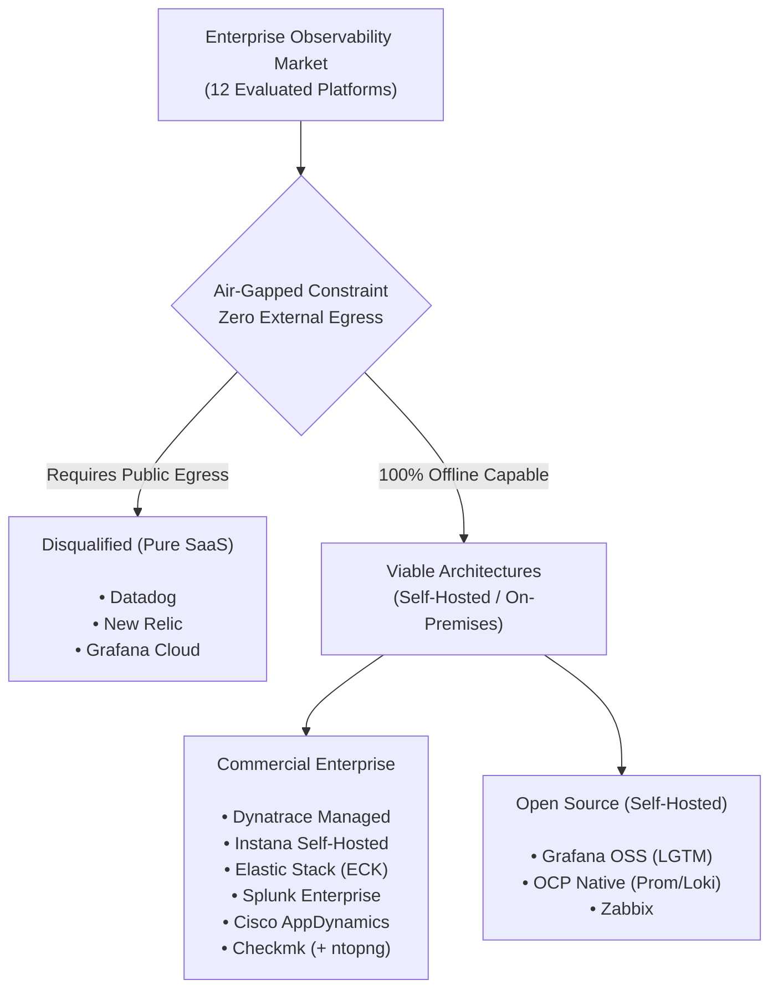
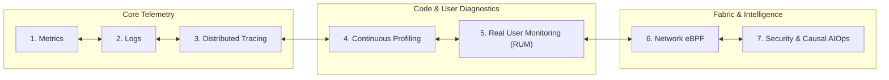
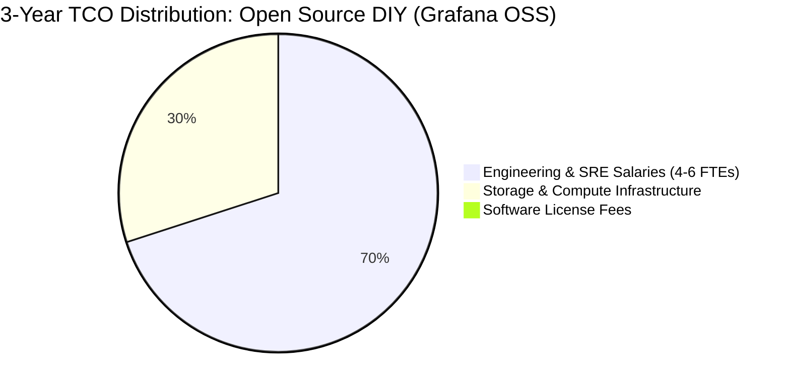
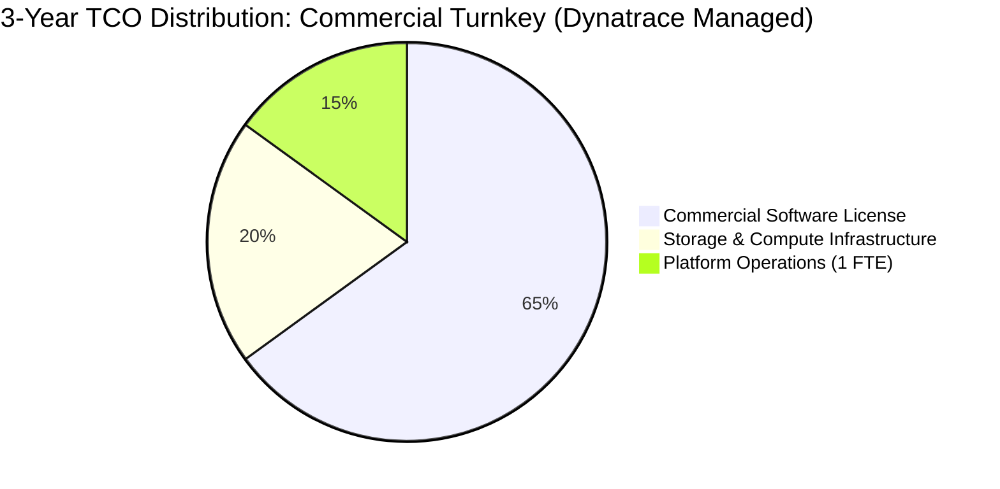
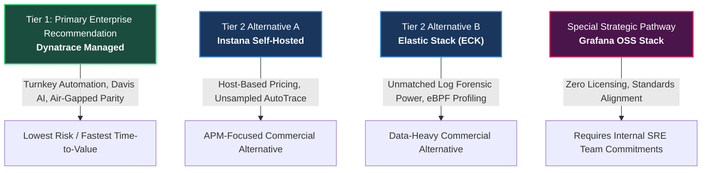
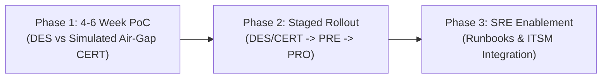
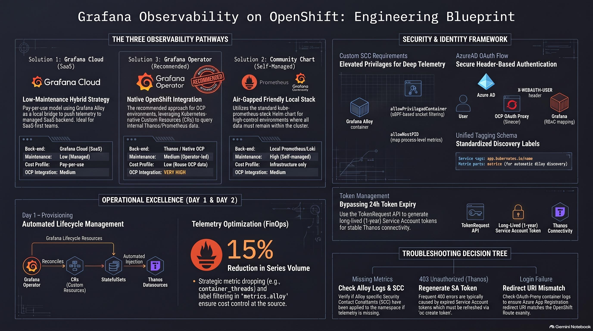

# Enterprise Observability Platforms Comparison (The 7 Pillars)

### Strategic Architectural Analysis & Comparative Evaluation of 12 Observability Platforms for Hybrid Cloud, Air-Gapped OpenShift, and Enterprise Workloads

---

> [!WARNING]
> ### ⚠️ AI-Generated Content & Environment Testing Disclaimer
> This repository, its technical documentation, architectural analyses, comparison matrices, reference code, proof-of-concept (PoC) templates, and configuration manifests were generated by **Gemini 3.8 Flash** and **have NOT been tested on a real platform or production environment**.
>
> Its sole purpose is to serve as an **architectural reference guide**, **conceptual framework**, and **educational companion** for enterprise platform engineering teams evaluating full-stack observability. All manifests, operators, chaos injection scripts, and sizing guidelines must be independently reviewed, audited, benchmarked, and verified in isolated sandbox or staging environments before any live cluster deployment.

---

## 📑 Table of Contents
1. [Executive Summary & The Air-Gapped Imperative](#1-executive-summary--the-air-gapped-imperative)
2. [From Monitoring to Observability (Unknown Unknowns)](#2-from-monitoring-to-observability-unknown-unknowns)
3. [The 7 Pillars of Modern Cloud-Native Observability](#3-the-7-pillars-of-modern-cloud-native-observability)
4. [Enterprise Target Architecture & Workload Landscape](#4-enterprise-target-architecture--workload-landscape)
5. [The Master Comparison Matrix (12 Platforms Across the 7 Pillars)](#5-the-master-comparison-matrix-12-platforms-across-the-7-pillars)
6. [Strategic Architectural Archetypes: Infra-First vs. App-First](#6-strategic-architectural-archetypes-infra-first-vs-app-first)
7. [Total Cost of Ownership (TCO): Open Source vs. Commercial](#7-total-cost-of-ownership-tco-open-source-vs-commercial)
8. [Strategic Recommendations & Decision Tiers](#8-strategic-recommendations--decision-tiers)
9. [Proof of Concept (PoC) & Implementation Roadmap](#9-proof-of-concept-poc--implementation-roadmap)
10. [Visual Architecture Blueprints](#10-visual-architecture-blueprints)
11. [Repository Documentation & Advanced Solutions Map](#11-repository-documentation--advanced-solutions-map)
12. [References & Industry Citations](#12-references--industry-citations)

---

## 1. Executive Summary & The Air-Gapped Imperative

In complex hybrid enterprises—spanning on-premises datacenters, sovereign cloud enclaves, **Red Hat OpenShift 4.18+**, and **VMware vSphere** virtualization—visibility is frequently fractured by organizational silos and strict security boundaries.

This project delivers an exhaustive, objective architectural evaluation of **12 market-leading observability platforms** to identify the optimal platform for mission-critical Java microservices, Apache Kafka event streaming, and Microsoft SQL Server databases.

### The Primary Architectural Divider: Air-Gapped Isolation
The single most decisive architectural filter in enterprise evaluation is the presence of **strictly disconnected (air-gapped) production (PRO) and pre-production (PRE) enclaves**. 

A truly air-gapped system operates with zero outbound internet connectivity. This creates an immediate market bifurcation:
1. **Viable Platforms (Self-Hosted / On-Premises)**: Platforms providing fully functional, autonomous backends installable on-cluster or within private datacenters without external dependencies.
2. **Disqualified Platforms (Pure SaaS)**: Platforms such as **Datadog**, **New Relic**, and **Grafana Cloud** that require continuous HTTPS telemetry egress to public cloud endpoints.

### The "Swivel-Chair" Anti-Pattern (The Two-Tool Fallacy)
Attempting to deploy a SaaS platform in connected lower environments (DES/CERT) and an on-premises tool in air-gapped production (PRE/PRO) is strongly discouraged. This introduces severe operational friction:
- **Telemetry Silos**: Inability to correlate or baseline transaction traces between staging and production.
- **Cognitive Overhead**: Operations teams must navigate two disparate user interfaces, query languages, and alerting engines.
- **Double TCO**: Paying cloud SaaS ingestion/host bills while simultaneously funding internal server infrastructure, storage, and maintenance for on-premises tools.

---

## 2. From Monitoring to Observability (Unknown Unknowns)

Traditional IT systems management relied on **monitoring**: tracking predefined metrics and firing threshold alerts (*"Is server CPU > 90%?"* or *"Is the HTTP ping responding?"*). Monitoring focuses on detecting **"known knowns"** and **"known unknowns"**.

In distributed microservices, asynchronous event pipelines, and container clusters, failures rarely manifest as simple server outages. Instead, they appear as subtle, emergent, cascading anomalies:
- A thread pool exhaustion triggered by uncommitted SQL locks.
- A consumer lag spike in Kafka caused by JVM garbage collection pauses.
- CFS quota CPU throttling on containers with low average utilization.

**Observability** is the mathematical and operational property of inferring the internal states of a system based on its external telemetry outputs. It enables engineers to ask arbitrary, complex questions without predicting failures in advance—diagnosing **"unknown unknowns"**.

---

## 3. The 7 Pillars of Modern Cloud-Native Observability

To achieve holistic observability, enterprise architecture has evolved beyond the classic "Three Pillars" (Metrics, Logs, Traces) into **7 Interconnected Pillars**:

1. **Pillar 1: Metrics (Aggregated Time-Series)**: High-frequency numeric measurements capturing resource utilization, throughput, error counts, and latency percentiles (USE/RED methods) across nodes, pods, JVMs, and hypervisors.
2. **Pillar 2: Logs (Immutable Event Context)**: Structured (JSON) and unstructured chronological records from operating systems, containers, application runtimes, and audit trails providing granular contextual narrative.
3. **Pillar 3: Distributed Tracing & APM (Transaction Waterfalls)**: End-to-end request path tracking across asynchronous microservice boundaries, Kafka message headers (W3C TraceContext), and database query executions.
4. **Pillar 4: Continuous Profiling (Code-Level Attribution)**: Always-on, low-overhead (<1–2%) CPU, memory allocation, and thread lock profiling via eBPF and JVM Flight Recorder (JFR), visualized as interactive **Flame Graphs**.
5. **Pillar 5: Real User Monitoring (RUM) & Digital Experience (DEM)**: Client-side browser and mobile performance tracking, Core Web Vitals (LCP, INP, CLS), JavaScript error capturing, and synthetic journey probing.
6. **Pillar 6: Network Observability & eBPF Telemetry**: Deep kernel-level visibility into inter-pod and inter-host communication flows, TCP packet retransmissions, socket buffer latency, and CoreDNS resolution metrics.
7. **Pillar 7: Security Observability, Audit & Causal AIOps**: Kubernetes API server audit logs, runtime threat detection, privilege escalation tracking, and topological causal AI engines (e.g., Davis AI) that collapse alert storms to pinpoint root causes.

*For an in-depth breakdown of telemetry standards, data models, and protocols, see [docs/THE_7_PILLARS.md](docs/THE_7_PILLARS.md).*

---

## 4. Enterprise Target Architecture & Workload Landscape

The evaluated architecture mirrors high-security enterprise environments across public sector, banking, and critical infrastructure:

| Infrastructure Category | Component / Environment | Network Zone | Primary Workloads & Dependencies | Critical Observability Needs |
| :--- | :--- | :--- | :--- | :--- |
| **Container Platform** | **OpenShift 4.18+ PRO** (Production) | **Air-Gapped Sovereign Cloud** | Core Java Microservices, Kafka, Keycloak IAM, HashiCorp Vault | 100% self-hosted, deep APM, continuous profiling, native Kafka tracing. |
| **Container Platform** | **OpenShift 4.18+ PRE** (Pre-Production)| **Air-Gapped Sovereign Cloud** | Pre-release Java microservices, regression test suites | Production environment parity, latency regression detection. |
| **Container Platform** | **OpenShift 4.18+ CERT** (Staging) | Sovereign Cloud (Controlled Egress) | Acceptance testing, simulated air-gap validation | Cross-environment correlation, APM performance baselining. |
| **Container Platform** | **OpenShift 4.18+ DES** (Development) | Enterprise On-Prem Datacenter | Feature development, Tekton CI, ArgoCD GitOps | Rapid developer feedback, CI/CD pipeline tracing. |
| **Virtualization Fleet**| **VMware vSphere (vCenter)** | Sovereign Cloud & Datacenter | Supporting services, legacy applications, VMs | Hypervisor CPU contention, ballooned memory, datastore latency. |
| **Relational Database** | **Microsoft SQL Server** | Internal Secure Network | Shared mission-critical business database | Wait-state analysis, execution plans, APM trace-to-query linking. |

*Detailed air-gapped network flows and mirroring mechanics are documented in [docs/ARCHITECTURE_AND_AIRGAP.md](docs/ARCHITECTURE_AND_AIRGAP.md).*

---

## 5. The Master Comparison Matrix (12 Platforms Across the 7 Pillars)

The table below synthesizes the findings across all **12 evaluated platforms**, scoring their capabilities across the **7 Pillars of Observability**, air-gapped viability, hybrid infrastructure support, and economic profiles:

| Evaluation Criteria | OCP Native (Prom/Loki) | Datadog | Elastic Stack (ECK) | Dynatrace | New Relic | Splunk Enterprise | Instana (IBM) | Cisco AppDynamics | Grafana Cloud | Checkmk (+ ntopng) | Grafana OSS (LGTM) | Zabbix |
| :--- | :---: | :---: | :---: | :---: | :---: | :---: | :---: | :---: | :---: | :---: | :---: | :---: |
| **Air-Gapped Viable** | **Yes** | **No** (SaaS) | **Yes** | **Yes** | **No** (SaaS) | **Yes** | **Yes** | **Yes** | **No** (SaaS) | **Yes** | **Yes** | **Yes** |
| **Pillar 1: Metrics (OpenShift)** | Excellent | Excellent | Good | Excellent | Excellent | Good | Excellent | Good | Excellent | Good | Excellent | Good |
| **Pillar 1b: Metrics (vSphere)** | Good (Exporter) | Excellent | Good | Excellent | Good | Good | Good | Good | Good | Excellent | Good (Exporter) | Good |
| **Pillar 2: Logs** | Good (Loki) | Excellent | Excellent | Excellent | Good | Excellent | Good | Moderate | Excellent | Moderate | Excellent (Loki) | Moderate |
| **Pillar 3: Tracing / APM (Java)** | Moderate (Tempo) | Excellent | Good | Excellent | Excellent | Good | Excellent | Excellent | Good | Poor / N/A | Good (Tempo) | Poor / N/A |
| **Pillar 3b: Tracing (Kafka)** | Moderate | Excellent | Good | Excellent | Good | Good | Excellent | Good | Good | N/A | Moderate | N/A |
| **Pillar 4: Continuous Profiling** | Poor / Assembly | Excellent | Excellent (eBPF) | Excellent | Good (JFR) | Poor / N/A | Excellent | Moderate (Snapshots) | Good (Pyroscope) | N/A | Good (Pyroscope) | N/A |
| **Pillar 5: Real User Monitoring (RUM)**| Poor / Assembly | Excellent | Good | Excellent | Excellent | Good | Good | Excellent | Good (Faro) | N/A | Moderate (Faro) | Moderate (Synthetic) |
| **Pillar 6: Network eBPF Observability**| Good (NetObserv) | Excellent (NPM)| Good | Excellent | Excellent (Pixie)| Moderate | Good | Good | Good (Beyla) | Good (ntopng) | Good (Beyla/NetObs)| Moderate |
| **Pillar 7: Security & Causal AIOps**  | Moderate | Excellent | Excellent | Excellent (Davis)| Good | Excellent (SIEM) | Excellent (DynGraph) | Good | Moderate | Moderate | Moderate | Moderate |
| **Microsoft SQL Server Monitoring**   | Good (Exporter) | Excellent | Good | Excellent | Good | Good | Good | Excellent | Good | Good | Good (Exporter) | Good |
| **Gartner MQ Position** | N/A | **Leader** | **Visionary** | **Leader** | **Leader** | **Leader** | **Visionary** | **Leader** | N/A | Niche | N/A | Niche |
| **CNCF / OTel Alignment** | **Very High** | Medium | Medium | Medium | Medium | Medium | Medium | Low | High | Low | **Very High** | Low |
| **Relative License Cost** | **$ (OSS)** | **$$$$** | **$$$** | **$$$$** | **$$$$** | **$$$$** | **$$$** | **$$$$** | **$$$** | **$$** | **$ (OSS)** | **$ (OSS)** |
| **Operational & SRE Overhead** | **Very High** | Low | High | **Low** | Low | High | **Low** | High | Low | Low | **Very High** | Moderate |

*For individual platform profiles and detailed rationales, see [docs/PLATFORM_EVALUATION_DEEP_DIVE.md](docs/PLATFORM_EVALUATION_DEEP_DIVE.md) and [docs/COMPARISON_MATRICES.md](docs/COMPARISON_MATRICES.md).*

---

## 6. Strategic Architectural Archetypes: Infra-First vs. App-First

Understanding platform origins is essential for proper evaluation:

```mermaid
graph TD
    subgraph "Infra-First Platforms (Checkmk, Zabbix)"
        I1["Originated in Hardware, Network & SNMP"]
        I2["Treats OpenShift as Just Another Node"]
        I3["Deep vSphere & Storage Health Checks"]
        I4["BLIND SPOT: No APM, No Kafka Traces, No Profiling"]
        I1 --> I2 --> I3 --> I4
    end

    subgraph "App-First Platforms (Dynatrace, Instana)"
        A1["Originated in Code Execution & Bytecode APM"]
        A2["Automated Runtime Container Injection"]
        A3["Infrastructure Exists Solely as App Context"]
        A4["STRENGTH: Instant Root-Cause & Code Flame Graphs"]
        A1 --> A2 --> A3 --> A4
    end

    subgraph "Convergent Platforms (Elastic, Splunk, Grafana OSS)"
        C1["Originated in Search/Logs or Time-Series Metrics"]
        C2["Expanded via Modules, Operators & Standards (OTel)"]
        C3["Exceptional Flexibility & Powerful Custom Querying"]
        C4["TRADE-OFF: Higher SRE Assembly & Scaling Burden"]
        C1 --> C2 --> C3 --> C4
    end
```

### The Checkmk / Zabbix Dilemma on OpenShift
While tools like **Checkmk** and **Zabbix** are exceptional for bare-metal, switches, and VMware ESXi, attempting to use them as the primary observability engine for containerized microservices on OpenShift is a critical architectural mistake:
- They lack distributed transaction tracing (Pillar 3).
- They have zero continuous profiling capabilities (Pillar 4).
- They cannot track Kafka consumer lag or correlate asynchronous message hops to database calls.
- Selecting them leaves software engineering teams blind to application bottlenecks.

---

## 7. Total Cost of Ownership (TCO): Open Source vs. Commercial

A common enterprise trap is assuming Open Source software (OSS) is "free":

$$\text{TCO} = \text{Direct License Cost} + \text{Infrastructure / Storage Compute} + \text{SRE Headcount and Maintenance} + \text{MTTR Business Impact}$$

- **Open Source (Grafana OSS, Prometheus/Loki)**:
  - Direct License: **$0**.
  - Operational Reality: Requires establishing a dedicated Platform Engineering / SRE team (4–6 senior engineers) to deploy, secure, shard, patch, and maintain distributed storage backends (Mimir, Loki, Tempo, Pyroscope) across air-gapped enclaves.
- **Commercial Enterprise (Dynatrace Managed, Instana Self-Hosted)**:
  - Direct License: **High / Predictable**.
  - Operational Reality: Vendor assumes R&D, integration, and upgrade stability. Automated agent injection and causal AI root-cause analysis drastically reduce manual engineering overhead.

---

## 8. Strategic Recommendations & Decision Tiers

Based on the air-gapped mandate, workload complexity (Java, Kafka, SQL Server), and operational economics, platforms are categorized into strategic decision tiers:

### 1. Tier 1 (Primary Recommendation): Dynatrace Managed
- **Why**: Delivers the most complete, turnkey coverage across all **7 Pillars of Observability**. Its **Dynatrace Managed** architecture is purpose-built for air-gapped enclaves.
- **Differentiators**: Single OneAgent deployment via certified OpenShift Operator; **Davis® Causal AI** automatically identifies root causes without manual alert rules; native deep visibility into Java, Kafka, vSphere, and SQL Server.

### 2. Tier 2 (Viable Alternatives): Instana & Elastic Stack
- **Instana Self-Hosted**: The closest direct competitor to Dynatrace. Exceptional 1-second metric resolution, **AutoTrace™** zero-touch instrumentation, and predictable host-based licensing.
- **Elastic Stack (ECK)**: Industry-leading log analysis and search. Now enhanced with **Universal Profiling** (whole-system eBPF). Best suited for teams with strong Elasticsearch operational skills.

### 3. Special Strategic Pathway: Grafana OSS Stack (LGTM + Pyroscope)
- **Why**: Highest technical flexibility, zero license costs, and complete CNCF alignment.
- **The Organizational Commitment**: Successfully adopting this stack is not merely a software choice; it requires committing to build and sustain an in-house SRE platform team responsible for distributed systems scaling, exporter patching, and custom dashboard development.

---

## 9. Proof of Concept (PoC) & Implementation Roadmap

To de-risk the investment, the enterprise should execute a structured **3-Phase Roadmap**:

### Phase 1: 5 Measurable Acceptance Criteria
1. **Disconnected Deployment**: Complete offline installation in air-gapped CERT via internal private registry; zero external internet egress.
2. **Zero-Touch Auto-Instrumentation**: Deploy a Java microservice container; verify agent bytecode injection without code or Dockerfile changes.
3. **End-to-End Tracing Across Kafka & SQL Server**: Generate test transactions; verify unbroken trace propagation from HTTP Ingress $\to$ Kafka $\to$ Consumer $\to$ SQL Server query.
4. **Unified Hybrid Visibility**: Display OpenShift pods and VMware vSphere host metrics side-by-side in a single pane.
5. **Causal Diagnostic Usability**: Inject a simulated SQL lock and Kafka lag; verify platform surfaces a single causal root-cause incident.

*The step-by-step test harness and failure injection scripts are in [docs/POC_EXECUTION_GUIDE.md](docs/POC_EXECUTION_GUIDE.md).*

---

## 10. Visual Architecture Blueprints

### Blueprint 1: Datadog on OpenShift 4.x Architecture

### Blueprint 2: Grafana Observability on OpenShift Architecture

---

## 11. Repository Documentation & Advanced Solutions Map

- **[docs/ADVANCED_SOLUTIONS_GUIDE.md](docs/ADVANCED_SOLUTIONS_GUIDE.md)**: **Master Technical Implementation Guide** explaining the complete Java 21 microservice workload, W3C Kafka trace injection, diagnostic chaos suites, and platform manifests.
- **[docs/THE_7_PILLARS.md](docs/THE_7_PILLARS.md)**: Deep technical breakdown of all 7 pillars, telemetry protocols (OTLP), and correlation matrices.
- **[docs/ARCHITECTURE_AND_AIRGAP.md](docs/ARCHITECTURE_AND_AIRGAP.md)**: Sovereign air-gapped enclave architecture, OLM offline mirroring, and proxy gateway mechanics.
- **[docs/PLATFORM_EVALUATION_DEEP_DIVE.md](docs/PLATFORM_EVALUATION_DEEP_DIVE.md)**: Exhaustive evaluations of each of the 12 platforms.
- **[docs/COMPARISON_MATRICES.md](docs/COMPARISON_MATRICES.md)**: The 7-Pillars Matrix, TCO comparison tables, and compliance checklists.
- **[docs/POC_EXECUTION_GUIDE.md](docs/POC_EXECUTION_GUIDE.md)**: 4–6 week evaluation plan, failure injection scenarios, and scoring rubrics.
- **[examples/poc-workload/](examples/poc-workload/)**: Production-grade Spring Boot 3 / Java 21 microservice with W3C Kafka header propagation, JFR continuous profiling events, and SQL Server queries.
- **[examples/chaos-fault-injection/](examples/chaos-fault-injection/)**: Automated failure scripts simulating Kafka consumer lag, SQL Server exclusive locks, and CPU/thread contention.
- **[examples/dynatrace/](examples/dynatrace/)**: Air-gapped Dynatrace Managed DynaKube CR, ActiveGate routing, and SQL Server DMV monitoring extension.
- **[examples/instana/](examples/instana/)**: Instana Agent DaemonSet with AutoTrace mutating webhook for zero-touch Java bytecode injection.
- **[examples/elastic-eck/](examples/elastic-eck/)**: Elastic Cloud on Kubernetes (ECK) offline cluster with Fleet Server and whole-system eBPF Universal Profiling.
- **[examples/grafana-lgtm/](examples/grafana-lgtm/)**: Grafana Alloy unified pipeline, LGTM + Pyroscope stack, and enterprise 7-pillars dashboard JSON.
- **[examples/opentelemetry/](examples/opentelemetry/)**: Vendor-neutral OpenTelemetry Collector gateway with Kafka metrics and SQL Server DMV receivers.

---

## 12. References & Industry Citations

This comparative analysis, architectural evaluation, and technical guide are built upon empirical enterprise telemetry research, official vendor documentation, and published industry standards. Every reference is hyperlinked to its respective online source:

### 12.1 Industry Analyst Reports & Telemetry Standards
1. [2025 Gartner® Magic Quadrant™ for Observability Platforms - Dynatrace](https://www.dynatrace.com/gartner-magic-quadrant-for-observability-platforms/)
2. [2025 Gartner® Magic Quadrant™ for Observability Platforms - Splunk](https://www.splunk.com/en_us/form/gartner-magic-quadrant-for-observability-platforms.html)
3. [Best Observability Platforms Reviews 2025 - Gartner Peer Insights](https://www.gartner.com/reviews/market/observability-platforms)
4. [Cloud Native 2024 - Cloud Native Computing Foundation (CNCF Annual Survey)](https://www.cncf.io/wp-content/uploads/2025/04/cncf_annual_survey24_031225a.pdf)
5. [W3C Recommendation: Trace Context (Level 1 & 2 Specification)](https://www.w3.org/TR/trace-context/)
6. [OpenTelemetry Project: Specifications, OTLP Protocol & Semantic Conventions](https://opentelemetry.io/)
7. [What is Observability? Not Just Logs, Metrics, and Traces - Dynatrace](https://www.dynatrace.com/news/blog/what-is-observability-2/)
8. [The Three Pillars of Observability: Metrics, Logs and Traces - eG Innovations](https://www.eginnovations.com/blog/the-three-pillars-of-observability-metrics-logs-and-traces/)
9. [Three Pillars of Observability: Logs, Metrics and Traces - IBM Think](https://www.ibm.com/think/insights/observability-pillars)
10. [What is Continuous Profiling? - Baselime ELI5 Observability Glossary](https://baselime.io/glossary/continuous-profiling)
11. [What is Continuous Profiling? - Elastic](https://www.elastic.co/what-is/continuous-profiling)
12. [What is Real User Monitoring (RUM)? - New Relic](https://newrelic.com/blog/best-practices/what-is-real-user-monitoring)
13. [What is Real User Monitoring (RUM)? - SolarWinds IT Glossary](https://www.solarwinds.com/resources/it-glossary/real-user-monitoring)

### 12.2 Air-Gapped & Sovereign Cloud Infrastructure
14. [Deploy Infrastructure for Telecom Workloads in an Air-Gapped AWS Environment - AWS Architecture Blog](https://aws.amazon.com/blogs/industries/deploy-infrastructure-for-telecom-workloads-in-an-air-gapped-aws-environment/)
15. [Simplify OpenShift Installation in Air-Gapped Environments - Red Hat Developer](https://developers.redhat.com/articles/2025/10/14/simplify-openshift-installation-air-gapped-environments)
16. [Air-Gapped Observability at the Edge: Monitoring Distributed Air-Gapped Infrastructures - GrafanaCon 2025](https://grafana.com/events/grafanacon/2025/monitor-distributed-air-gapped-infrastructures/)
17. [Airgapped Installation of Instana Custom Edition - IBM Community](https://community.ibm.com/community/user/blogs/sidharth-s/2025/03/28/airgapped-installation-of-instana-customedition)
18. [Setting Up Elastic Fleet in Air Gapped Environments - Planned Link](https://plannedlink.io/2025/10/13/deploying-the-elastic-stack-in-an-air-gapped-environment-part-3/)
19. [ActiveGate Diagnostics & Air-Gapped Operation - Dynatrace Docs](https://docs.dynatrace.com/docs/ingest-from/dynatrace-activegate/activegate-diagnostics)

### 12.3 Red Hat OpenShift & Kubernetes Observability
20. [Custom Grafana Dashboards for Red Hat OpenShift Container Platform 4 - Red Hat Blog](https://www.redhat.com/fr/blog/custom-grafana-dashboards-red-hat-openshift-container-platform-4)
21. [Monitoring OpenShift Using Zabbix and Prometheus API - Red Hat Blog](https://www.redhat.com/en/blog/monitoring-openshift-using-zabbix-and-prometheus-api)
22. [Dynatrace Operator - OperatorHub.io Registry](https://operatorhub.io/operator/dynatrace-operator)
23. [Deploy and Update Dynatrace Operator on Kubernetes & OpenShift - Dynatrace Docs](https://docs.dynatrace.com/docs/ingest-from/setup-on-k8s/guides/deployment-and-configuration/updates-and-maintenance/update-uninstall-operator)
24. [Elasticsearch (ECK) Operator - Red Hat Ecosystem Catalog](https://catalog.redhat.com/en/software/container-stacks/detail/5f32f067651c4c0bcecf1bfe)
25. [What Elastic Observability OpenShift Actually Does and When to Use It - Hoop.dev](https://hoop.dev/blog/what-elastic-observability-openshift-actually-does-and-when-to-use-it/)
26. [IBM Instana OpenShift Monitoring - IBM Products](https://www.ibm.com/products/instana/supported-technologies/openshift-monitoring)
27. [Enabling OpenShift Container Platform Monitoring - IBM Cloud Paks](https://www.ibm.com/docs/en/cloud-paks/cp-integration/16.1.0?topic=administering-enabling-openshift-container-platform-monitoring)
28. [AppDynamics ClusterAgent - Red Hat Ecosystem Catalog](https://catalog.redhat.com/en/software/containers/appdynamics/cluster-agent/5cc19ec569aea3638b0e35fb)
29. [Overview of Cluster Monitoring with AppDynamics Cluster Agent - Cisco AppDynamics Docs](https://docs.appdynamics.com/appd/24.x/latest/en/infrastructure-visibility/monitor-kubernetes-with-the-cluster-agent/overview-of-cluster-monitoring)
30. [AppDynamics OpenShift Agents DaemonSet - GitHub](https://github.com/Appdynamics/openshift-agents-daemonset)
31. [Red Hat OpenShift Monitoring Solutions - Datadog](https://www.datadoghq.com/solutions/openshift/)
32. [OpenShift Integration Guide - Datadog Docs](https://docs.datadoghq.com/integrations/openshift/)
33. [OpenShift Engineering Articles & Updates - Datadog Blog](https://www.datadoghq.com/blog/tag/openshift/)
34. [Red Hat OpenShift Instant Observability - New Relic](https://newrelic.com/instant-observability/red-hat-openshift)
35. [NewRelic Java Agent Container Image - Red Hat Ecosystem Catalog](https://catalog.redhat.com/en/software/container-stacks/detail/5e9872723f398525a0ceafaf)
36. [Red Hat OpenShift Configuration with Splunk Operator - Splunk GitHub](https://splunk.github.io/splunk-operator/OpenShift.html)
37. [Monitoring OpenShift - Metrics and Log Forwarding - Splunkbase](https://splunkbase.splunk.com/app/3836)
38. [Monitoring OpenShift in Splunk - Outcold Solutions](https://www.outcoldsolutions.com/docs/monitoring-openshift/)
39. [The Simplest Way to Make OpenShift Splunk Work Like It Should - Hoop.dev](https://hoop.dev/blog/the-simplest-way-to-make-openshift-splunk-work-like-it-should/)
40. [Enterprise-Grade Container Monitoring with Checkmk - Checkmk](https://checkmk.com/product/container-monitoring)
41. [Monitoring OpenShift Clusters - Checkmk Docs](https://docs.checkmk.com/latest/en/monitoring_openshift.html)
42. [Kubernetes: Cluster Collector for OpenShift - Checkmk Integrations](https://checkmk.com/integrations/openshift_queries)
43. [Grafana Operator for Kubernetes & OpenShift - Grafana Cloud Docs](https://grafana.com/docs/grafana-cloud/developer-resources/infrastructure-as-code/grafana-operator/)
44. [Zabbix Features & OpenShift Discovery Overview - Zabbix](https://www.zabbix.com/features)

### 12.4 Continuous Profiling & eBPF Telemetry
45. [Universal Profiling: Continuous Profiling via Whole-System eBPF - Elastic](https://www.elastic.co/observability/universal-profiling)
46. [Analyze Code Performance in Production with Continuous Profiler - Datadog Blog](https://www.datadoghq.com/blog/datadog-continuous-profiler/)
47. [Continuous Profiler Overview & Flame Graph Analysis - Datadog Product](https://www.datadoghq.com/product/code-profiling/)
48. [Real-Time Profiling for Java Using JFR Metrics - New Relic Docs](https://docs.newrelic.com/docs/apm/agents/java-agent/features/real-time-profiling-java-using-jfr-metrics/)
49. [Analyzing Execution Profiles with AutoProfile - IBM Instana Docs](https://www.ibm.com/docs/en/instana-observability/1.0.306?topic=processes-analyzing-profiles)

### 12.5 Workload, Messaging & Database Telemetry
50. [Java Monitoring & Observability - Dynatrace Hub](https://www.dynatrace.com/hub/detail/java/)
51. [Jakarta Servlet Monitoring & Observability - Dynatrace Hub](https://www.dynatrace.com/hub/detail/jakarta-servlet/)
52. [Introduction to New Relic for Java - New Relic Docs](https://docs.newrelic.com/docs/apm/agents/java-agent/getting-started/introduction-new-relic-java/)
53. [Monitoring Java Virtual Machine (JVM) - IBM Instana Docs](https://www.ibm.com/docs/en/instana-observability/1.0.306?topic=technologies-monitoring-java-virtual-machine)
54. [Monitoring Kafka Queues and Consumer Group Offsets - Datadog Docs](https://docs.datadoghq.com/tracing/guide/monitor-kafka-queues/)
55. [Kafka Monitoring Extension - Dynatrace Docs](https://docs.dynatrace.com/docs/ingest-from/technology-support/dynatrace-extensions/supported-out-of-the-box/kafka)
56. [Monitoring Kafka Brokers and Topics - IBM Instana Docs](https://www.ibm.com/docs/en/instana-observability/1.0.307?topic=technologies-monitoring-kafka)
57. [Kafka Monitoring Integration Guide - New Relic Docs](https://docs.newrelic.com/docs/infrastructure/host-integrations/host-integrations-list/kafka/kafka-integration/)
58. [How to Monitor Kafka for Free with Elasticsearch - Dattell Architecture Blog](https://dattell.com/data-architecture-blog/kafka-monitoring-with-elasticsearch-and-kibana/)
59. [How We Monitor and Run Kafka at Scale - Splunk Engineering Blog](https://www.splunk.com/en_us/blog/devops/how-we-monitor-and-run-kafka-at-scale.html)
60. [Microsoft SQL Server Integration - Elastic Docs](https://www.elastic.co/docs/reference/integrations/microsoft_sqlserver)
61. [Microsoft SQL Server Database Monitoring (DBM) - Datadog Docs](https://docs.datadoghq.com/integrations/sql-server/)
62. [Microsoft SQL Server Monitoring Extension - Dynatrace Hub](https://www.dynatrace.com/hub/detail/microsoft-sql-server-2/)
63. [Microsoft SQL Server Local Counters Monitoring - Dynatrace Hub](https://www.dynatrace.com/hub/detail/microsoft-sql-server-local-counters/)
64. [Monitoring Microsoft SQL Server - IBM Instana Docs](https://www.ibm.com/docs/en/instana-observability/1.0.305?topic=technologies-monitoring-microsoft-sql-server)
65. [Set Up MSSQL for Monitoring - Cisco AppDynamics Docs](https://docs.appdynamics.com/observability/cisco-cloud-observability/en/database-monitoring/set-up-database-for-monitoring/set-up-mssql-for-monitoring)
66. [Monitoring Microsoft SQL Server - Checkmk Docs](https://docs.checkmk.com/latest/en/monitoring_mssql.html)
67. [Database Monitoring with Checkmk - Checkmk](https://checkmk.com/product/database-monitoring)
68. [Monitor SQL Server Using Zabbix - SQLServerCentral](https://www.sqlservercentral.com/articles/monitor-sql-server-using-zabbix)
69. [VMware vSphere Monitoring & Observability - Dynatrace Hub](https://www.dynatrace.com/hub/detail/vmware/)
70. [vSphere Integration Guide - Datadog Docs](https://docs.datadoghq.com/integrations/vsphere/)
71. [Monitoring vSphere Clusters - IBM Instana Docs](https://www.ibm.com/docs/en/instana-observability/1.0.307?topic=instana-monitoring-vsphere)
72. [vSphere Monitoring Integration Guide - New Relic Docs](https://docs.newrelic.com/install/vsphere/)
73. [Splunk OVA for VMware - Splunkbase](https://splunkbase.splunk.com/app/3216)
74. [The Complete Guide to Virtual Server Monitoring - Checkmk](https://checkmk.com/guides/virtual-server-monitoring)
75. [Monitoring VMware vSphere with Zabbix - vMattroman Technical Blog](https://vmattroman.com/monitoring-vmware-vsphere-with-zabbix/)
76. [prezhdarov/vmware-exporter: VMware vCenter Exporter for Prometheus - GitHub](https://github.com/prezhdarov/vmware-exporter)

### 12.6 Open-Source Stacks & Platform Architectures
77. [Prometheus Monitoring System & Time Series Database - Prometheus.io](https://prometheus.io/)
78. [Prometheus Monitoring OSS: Storing Large Amounts of Metrics - Grafana Labs](https://grafana.com/oss/prometheus/)
79. [Grafana Loki OSS: Log Aggregation System - Grafana Labs](https://grafana.com/oss/loki/)
80. [Grafana OSS: Leading Observability Tool for Visualizations - Grafana Labs](https://grafana.com/oss/grafana/)
81. [Elastic Observability Overview & Documentation - Elastic](https://www.elastic.co/docs/solutions/observability)
82. [Overview of Cluster Monitoring with AppDynamics On-Premises Controller - Splunk Docs](https://help.splunk.com/en/appdynamics-on-premises/infrastructure-visibility/25.10.0/monitor-kubernetes-with-the-cluster-agent/overview-of-cluster-monitoring)
83. [Infrastructure & Application Monitoring - Checkmk](https://checkmk.com/)

### 12.7 Total Cost of Ownership (TCO) & Comparative Studies
84. [We Migrated to Grafana's LGTM Stack: Here Is the Story - Valensas Engineering](https://blog.valensas.com/we-migrated-to-grafanas-lgtm-stack-here-is-the-story-a8190d3a5a3a)
85. [Datadog vs. Zabbix in 2025: Features, Pricing, On-Prem vs. SaaS - SigNoz](https://signoz.io/comparisons/datadog-vs-zabbix/)
86. [New Relic Pricing: Plans, Features, and Best Deals Explained - Spendflo](https://www.spendflo.com/blog/new-relic-pricing-guide)
87. [IBM Instana Pricing 2025: TCO & Licensing Analysis - TrustRadius](https://www.trustradius.com/products/ibm-instana/pricing)

