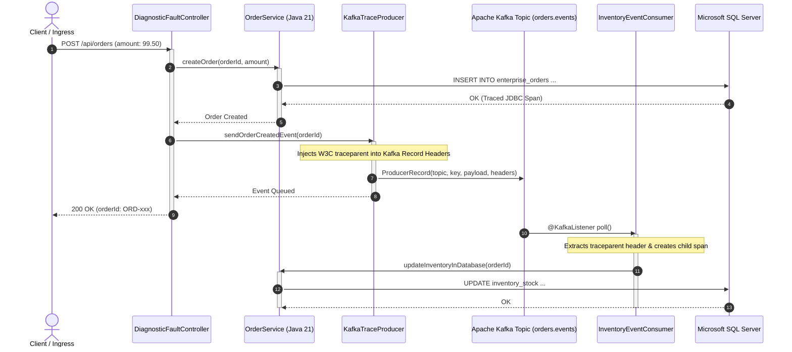

# Advanced Solutions, PoCs & Production Implementation Guide

[](https://www.redhat.com/)
[](https://openjdk.org/)
[](https://kafka.apache.org/)
[](https://www.microsoft.com/sql-server)
[](https://ebpf.io/)

> [!WARNING]
> ### ⚠️ AI-Generated Content & Environment Testing Disclaimer
> This technical guide, Java source code, chaos injection scripts, and OpenShift manifests were generated by **Gemini 3.8 Flash** and **have NOT been tested on a real platform or live production environment**.
> 
> All code snippets, JVM settings, container images, and database queries must be independently reviewed, audited, and tested in dedicated non-production environments before any live implementation.

This document provides a comprehensive technical walkthrough of the advanced solutions, reference code, proof-of-concept (PoC) templates, and chaos injection suites included in this repository. 

All solutions are designed for **Red Hat OpenShift 4.18+**, **hybrid VMware vSphere** environments, and **strictly air-gapped** networks.

---

## 📑 Table of Contents
1. [Core Microservice Architecture & W3C Trace Propagation](#1-core-microservice-architecture--w3c-trace-propagation)
2. [Diagnostic Chaos & Fault Injection Suite](#2-diagnostic-chaos--fault-injection-suite)
3. [Advanced Platform Deployment Architectures](#3-advanced-platform-deployment-architectures)
4. [Step-by-Step PoC Execution Lab](#4-step-by-step-poc-execution-lab)
5. [Summary of Reference Manifests & Artifacts](#5-summary-of-reference-manifests--artifacts)

---

## 1. Core Microservice Architecture & W3C Trace Propagation

The workload located in [`examples/poc-workload/`](file:///home/inaki/github/observability-platforms-comparison/examples/poc-workload/) is a production-grade Spring Boot 3.3+ / Java 21 microservice designed to exercise all 7 pillars of observability.



### Key Technical Mechanisms

#### 1. Asynchronous W3C TraceContext Propagation (`KafkaTraceProducer.java`)
In microservice architectures using message queues like Kafka, requests decouple across threads and processes. If headers are not explicitly injected, the trace is severed, creating two unrelated traces.

In [`KafkaTraceProducer.java`](file:///home/inaki/github/observability-platforms-comparison/examples/poc-workload/src/main/java/com/enterprise/observability/KafkaTraceProducer.java), we implement OpenTelemetry's `TextMapSetter`:
```java
private static final TextMapSetter<Headers> SETTER = (carrier, key, value) -> {
    if (carrier != null && value != null) {
        carrier.remove(key);
        carrier.add(key, value.getBytes(StandardCharsets.UTF_8));
    }
};

// Injection call before sending:
GlobalOpenTelemetry.getPropagators().getTextMapPropagator().inject(
    Context.current(),
    record.headers(),
    SETTER
);
```
This guarantees that the W3C `traceparent` (containing Version, Trace ID, Parent Span ID, and Trace Flags) travels inside the Kafka message envelope.

#### 2. Distributed Context Extraction (`InventoryEventConsumer.java`)
In [`InventoryEventConsumer.java`](file:///home/inaki/github/observability-platforms-comparison/examples/poc-workload/src/main/java/com/enterprise/observability/InventoryEventConsumer.java), the consumer extracts the carrier headers:
```java
Context extractedContext = GlobalOpenTelemetry.getPropagators().getTextMapPropagator()
    .extract(Context.current(), record.headers(), GETTER);

Span span = tracer.spanBuilder("KafkaConsume: " + record.key())
    .setParent(extractedContext)
    .startSpan();
```
This restores the parent context, ensuring that downstream database operations appear nested under the initial ingress HTTP request in transaction waterfalls (e.g., PurePath, AutoTrace, Tempo).

#### 3. Continuous Profiling Markers (`OrderService.java`)
In [`OrderService.java`](file:///home/inaki/github/observability-platforms-comparison/examples/poc-workload/src/main/java/com/enterprise/observability/OrderService.java), the service emits lightweight, zero-overhead **Java Flight Recorder (JFR)** events (`jdk.jfr.Event`):
- Captured automatically by profilers (Pyroscope, Instana AutoProfile, Dynatrace, Elastic Universal Profiling).
- Enables filtering flame graphs by specific business transaction states (`STARTING`, `SUCCESS`, `FAILED`).

---

## 2. Diagnostic Chaos & Fault Injection Suite

Located in [`examples/chaos-fault-injection/`](file:///home/inaki/github/observability-platforms-comparison/examples/chaos-fault-injection/), these scripts simulate real-world failure modes to evaluate how candidate platforms handle complex anomalies.

### Fault 1: Kafka Consumer Group Lag (`inject-kafka-lag.sh`)
- **Action**: Scales the consumer microservice down to 0 replicas while flooding the `orders.events` topic with 5,000 synthetic JSON records.
- **Evaluation Criteria**:
  - Does the platform detect the lag buildup before buffers fill?
  - Does the dashboard clearly isolate the stalled consumer group (`inventory-processing-group`) vs. healthy brokers?
  - Upon scaling consumers back up, does the platform track the consumer drain rate and CPU bursts?

### Fault 2: Database Lock & Wait-State Contention (`inject-db-lock.sql`)
- **Action**: Opens an exclusive table lock on `enterprise_orders` using `WITH (TABLOCKX)` for 90 seconds.
- **Evaluation Criteria**:
  - Does Database Monitoring (DBM) highlight `LCK_M_X` wait types?
  - Does the platform surface the root blocking SPID causing connection pool exhaustion?
  - Do APM distributed traces show that the high latency originated in database lock wait time rather than Java code execution?

### Fault 3: CPU Saturation & Synchronized Lock Contention (`inject-thread-contention.sh`)
- **Action**: Sends 15 concurrent worker threads triggering catastrophic regex backtracking (`(a+)+b` against `aaaa...c`) and Java synchronized monitor contention.
- **Evaluation Criteria**:
  - Does Continuous Profiling (Pillar 4) generate an interactive **Flame Graph** pinpointing the exact method: `DiagnosticFaultController.triggerCpuSaturation`?
  - Can engineers click directly from a slow APM trace into the flame graph without leaving the interface?

---

## 3. Advanced Platform Deployment Architectures

### 1. Dynatrace Managed Air-Gapped Architecture
- **Manifest**: [`examples/dynatrace/dynakube-airgap.yaml`](file:///home/inaki/github/observability-platforms-comparison/examples/dynatrace/dynakube-airgap.yaml)
- **Extension**: [`examples/dynatrace/dynatrace-extension-sqlserver.yaml`](file:///home/inaki/github/observability-platforms-comparison/examples/dynatrace/dynatrace-extension-sqlserver.yaml)
- **Key Features**:
  - Configures **ActiveGate** with `routing`, `kubernetes-monitoring`, and `dynatrace-api` capabilities.
  - Deploys **OneAgent** in `cloudNativeFullStack` mode with local image mirror paths (`registry.internal.corp`) and custom host groups.
  - ActiveGate executes SQL Server DMV queries out-of-band, mapping wait statistics directly to transaction entities.

### 2. IBM Instana Self-Hosted Architecture
- **Manifest**: [`examples/instana/instana-agent-daemonset.yaml`](file:///home/inaki/github/observability-platforms-comparison/examples/instana/instana-agent-daemonset.yaml)
- **Key Features**:
  - Deploys the **AutoTrace Webhook** for zero-touch bytecode rewriting at pod admission time.
  - Captures 1-second metric resolution across OpenShift nodes, Kafka brokers, and JVM runtimes.
  - Feeds telemetry into Instana's real-time **Dynamic Graph** engine for instant causal root-cause analysis.

### 3. Elastic Stack (ECK) & Whole-System eBPF Profiling
- **Manifests**:
  - [`examples/elastic-eck/eck-elasticsearch-fleet.yaml`](file:///home/inaki/github/observability-platforms-comparison/examples/elastic-eck/eck-elasticsearch-fleet.yaml)
  - [`examples/elastic-eck/universal-profiling-host-agent.yaml`](file:///home/inaki/github/observability-platforms-comparison/examples/elastic-eck/universal-profiling-host-agent.yaml)
- **Key Features**:
  - 3-node HA Elasticsearch cluster with dedicated persistent storage (`ocs-storagecluster-ceph-rbd`).
  - Configures an internal, offline **Fleet Package Registry** URL (`https://package-registry.internal.corp`) for air-gapped agent management.
  - Deploys the privileged **Universal Profiling Host Agent (`pf-host-agent`)**, using Linux kernel eBPF to continuously profile Java, Go, C/C++, and kernel runtimes simultaneously.

### 4. Grafana OSS LGTM + Pyroscope Stack
- **Manifest**: [`examples/grafana-lgtm/grafana-alloy-lgtm-stack.yaml`](file:///home/inaki/github/observability-platforms-comparison/examples/grafana-lgtm/grafana-alloy-lgtm-stack.yaml)
- **Dashboard**: [`examples/grafana-lgtm/dashboards/enterprise-overview.json`](file:///home/inaki/github/observability-platforms-comparison/examples/grafana-lgtm/dashboards/enterprise-overview.json)
- **Key Features**:
  - Uses **Grafana Alloy** as a unified telemetry collector routing metrics to Mimir, logs to Loki, traces to Tempo, and profiles to Pyroscope.
  - Pre-configured production JSON dashboard visualizing OpenShift CPU/Memory, Kafka consumer lag, MDC-correlated error logs, and distributed traces.

### 5. Vendor-Neutral OpenTelemetry Gateway
- **Manifest**: [`examples/opentelemetry/otel-collector-kafka-sql.yaml`](file:///home/inaki/github/observability-platforms-comparison/examples/opentelemetry/otel-collector-kafka-sql.yaml)
- **Key Features**:
  - Decouples application instrumentation from specific backend vendors.
  - Direct scraping of Apache Kafka broker/topic metrics and Microsoft SQL Server `sys.dm_os_wait_stats` without external daemon dependencies.
  - Memory limiter and batching processors configured for high-throughput enterprise resilience.

---

## 4. Step-by-Step PoC Execution Lab

To run the complete evaluation lab on Red Hat OpenShift:

### Phase 1: Deploy Workload & Infrastructure
```bash
# 1. Create target namespace
oc new-project enterprise-workloads

# 2. Deploy the core microservice
oc apply -f examples/poc-workload/k8s/deployment-openshift.yaml

# 3. Verify pod startup and automated agent injection
oc get pods -n enterprise-workloads -w
```

### Phase 2: Execute Simulated Chaos Tests
```bash
# Test 1: Trigger CPU Saturation & Java Thread Lock Contention
bash examples/chaos-fault-injection/inject-thread-contention.sh

# Test 2: Inject Apache Kafka Consumer Group Lag
bash examples/chaos-fault-injection/inject-kafka-lag.sh

# Test 3: Inject Microsoft SQL Server Table Lock
# (Execute inside sqlcmd or Azure Data Studio)
sqlcmd -S sqlserver.internal.corp -U sa -P 'SecretPass123' -i examples/chaos-fault-injection/inject-db-lock.sql
```

### Phase 3: Evaluate Candidate Observability Consoles
1. **Trace Inspection**: Search for `orderId` in APM waterfall. Verify Kafka produce span $\to$ Kafka consume span $\to$ SQL Server update span.
2. **Profile Inspection**: Inspect the Flame Graph during Test 1. Verify `Pattern.matcher` CPU allocation.
3. **Database Inspection**: Inspect the database wait statistics during Test 3. Verify `LCK_M_X` detection and root blocking SPID attribution.
4. **Causal Incident Verification**: Confirm the platform opened a single unified incident pointing to the root failure.

---

## 5. Summary of Reference Manifests & Artifacts

| Component | File Path | Focus & Purpose |
| :--- | :--- | :--- |
| **Java Microservice** | [`examples/poc-workload/src/...`](file:///home/inaki/github/observability-platforms-comparison/examples/poc-workload/src/main/java/com/enterprise/observability/) | Spring Boot 3 Java 21 app with W3C Kafka headers, JFR events, and SQL Server queries. |
| **OpenShift Deployment** | [`examples/poc-workload/k8s/deployment-openshift.yaml`](file:///home/inaki/github/observability-platforms-comparison/examples/poc-workload/k8s/deployment-openshift.yaml) | Deployment, Route, Service, ServiceMonitor with auto-injection annotations. |
| **Kafka Lag Chaos** | [`examples/chaos-fault-injection/inject-kafka-lag.sh`](file:///home/inaki/github/observability-platforms-comparison/examples/chaos-fault-injection/inject-kafka-lag.sh) | Simulates consumer group stall and evaluates metric/trace lag alerting. |
| **SQL Lock Chaos** | [`examples/chaos-fault-injection/inject-db-lock.sql`](file:///home/inaki/github/observability-platforms-comparison/examples/chaos-fault-injection/inject-db-lock.sql) | Exclusive table lock script testing Database Monitoring (DBM) and APM span correlation. |
| **Thread Contention**| [`examples/chaos-fault-injection/inject-thread-contention.sh`](file:///home/inaki/github/observability-platforms-comparison/examples/chaos-fault-injection/inject-thread-contention.sh) | CPU backtracking and monitor contention load generator testing Continuous Profiling. |
| **Dynatrace CR** | [`examples/dynatrace/dynakube-airgap.yaml`](file:///home/inaki/github/observability-platforms-comparison/examples/dynatrace/dynakube-airgap.yaml) | Air-gapped DynaKube custom resource with local ActiveGate proxying. |
| **Instana Agent** | [`examples/instana/instana-agent-daemonset.yaml`](file:///home/inaki/github/observability-platforms-comparison/examples/instana/instana-agent-daemonset.yaml) | Instana agent with AutoTrace mutating webhook for zero-touch Java bytecode injection. |
| **Elastic ECK** | [`examples/elastic-eck/eck-elasticsearch-fleet.yaml`](file:///home/inaki/github/observability-platforms-comparison/examples/elastic-eck/eck-elasticsearch-fleet.yaml) | Elasticsearch HA cluster with offline Fleet Server integration. |
| **eBPF Profiling** | [`examples/elastic-eck/universal-profiling-host-agent.yaml`](file:///home/inaki/github/observability-platforms-comparison/examples/elastic-eck/universal-profiling-host-agent.yaml) | Whole-system eBPF continuous profiling host agent DaemonSet. |
| **Grafana Alloy** | [`examples/grafana-lgtm/grafana-alloy-lgtm-stack.yaml`](file:///home/inaki/github/observability-platforms-comparison/examples/grafana-lgtm/grafana-alloy-lgtm-stack.yaml) | Unified Alloy pipeline configuration for Mimir, Loki, Tempo, and Pyroscope. |
| **7-Pillars Dashboard**| [`examples/grafana-lgtm/dashboards/enterprise-overview.json`](file:///home/inaki/github/observability-platforms-comparison/examples/grafana-lgtm/dashboards/enterprise-overview.json) | Complete production Grafana dashboard JSON across all 7 pillars. |
| **OTel Collector** | [`examples/opentelemetry/otel-collector-kafka-sql.yaml`](file:///home/inaki/github/observability-platforms-comparison/examples/opentelemetry/otel-collector-kafka-sql.yaml) | Vendor-neutral OpenTelemetry Collector with Kafka metrics and SQL Server DMV querying. |
