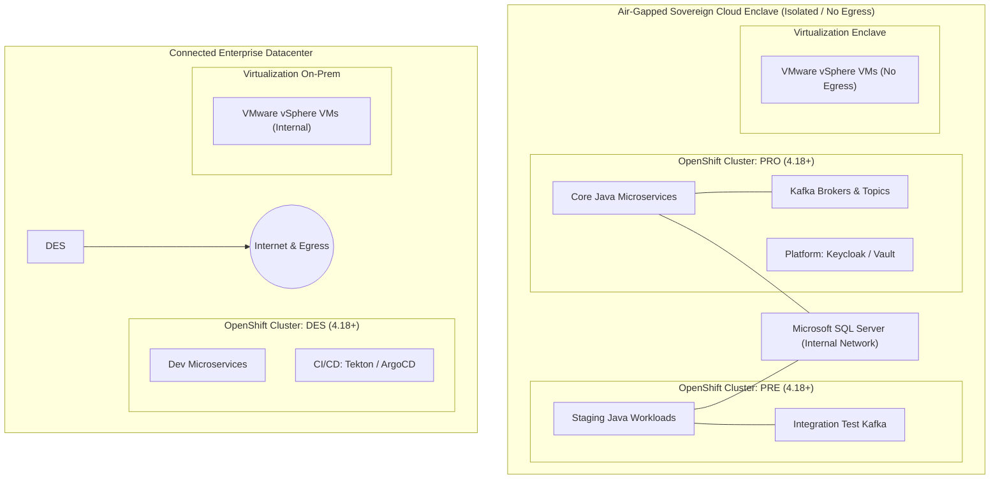

# Hybrid Cloud & Air-Gapped Enterprise Observability Architecture

> [!WARNING]
> ### ⚠️ AI-Generated Content & Environment Testing Disclaimer
> This architectural analysis and offline deployment models were generated by **Gemini 3.8 Flash** and **have NOT been tested on a real platform or production environment**.
> 
> All network isolation boundaries, OLM catalog mirror commands, and proxy architectures must be validated in staging environments before implementation.

---

| ⬅️ Previous | 🏠 Overview | Next ➡️ |
| :--- | :---: | ---: |
| [⬅️ The 7 Pillars of Observability](THE_7_PILLARS.md) | [📚 Document Index](../README.md#11-repository-documentation--advanced-solutions-map) | [12-Platform Deep-Dive Evaluation ➡️](PLATFORM_EVALUATION_DEEP_DIVE.md) |

---

## 1. Executive Summary & Topological Overview

Modern enterprise IT operating in regulated industries (financial services, telecommunications, healthcare, and public administration) is fundamentally characterized by **hybrid topology** and **strict network isolation**.

In this architecture, systems span across two primary operational zones:
1. **Regulated / Sovereign Private Cloud Enclave**: Hosts mission-critical applications across **Production (PRO)**, **Pre-Production (PRE)**, and **Certification (CERT)** clusters. Due to stringent cybersecurity mandates and regulatory compliance, the Production and Pre-Production clusters operate in **complete network isolation (air-gapped)**, with zero inbound or outbound internet access.
2. **Enterprise Datacenter (On-Premises)**: Hosts the **Development (DES)** OpenShift cluster and supporting infrastructure, equipped with internet connectivity to facilitate access to external software repositories, container registries, and developer tooling.
3. **Enterprise Virtualization Fabric (VMware vSphere)**: Large fleets of virtual machines hosted across both datacenters, running enterprise services, batch processing, and shared data stores.

---

## 2. Summary of Environment & Observability Requirements

The table below outlines the core target architecture, network connectivity profiles, workload dependencies, and essential observability requirements across all tiers:

| Infrastructure Layer | Component / Cluster | Hosting Location | Network Connectivity | Core Workloads & Dependencies | Primary Observability Requirements |
| :--- | :--- | :--- | :--- | :--- | :--- |
| **Container Platform** | **OpenShift 4.18+ PRO** (Production) | Sovereign Cloud Enclave | **Air-Gapped** (Zero external egress) | Mission-critical Java microservices, Apache Kafka event streaming, Keycloak IAM, HashiCorp Vault | Fully self-hosted / on-prem backend; deep APM; continuous profiling; native Kafka consumer lag & context propagation. |
| **Container Platform** | **OpenShift 4.18+ PRE** (Pre-Production) | Sovereign Cloud Enclave | **Air-Gapped** (Zero external egress) | Production mirror workloads, performance regression suites, Kafka event flows | Environment parity with PRO; distributed tracing; resource bottleneck isolation. |
| **Container Platform** | **OpenShift 4.18+ CERT** (Certification / Staging) | Sovereign Cloud Enclave | **Controlled Egress** (Internal / DMZ) | Pre-release validation, automated test pipelines, load testing | Cross-environment correlation; APM baseline comparison; performance regression tracking. |
| **Container Platform** | **OpenShift 4.18+ DES** (Development) | Enterprise Datacenter | **Connected** (Direct Internet Access) | Feature development, Tekton CI pipelines, ArgoCD GitOps controllers | Fast developer feedback; CI/CD pipeline observability; distributed tracing in IDE/browser. |
| **Virtualization** | **VMware vSphere Fleet** | Sovereign Cloud & Datacenter | **Internal Network** (Mixed egress) | Supporting services, legacy middleware, batch processing engines | Hypervisor & ESXi host metrics; VM CPU contention & memory ballooning; datastore I/O latency. |
| **Relational Database** | **Microsoft SQL Server** | Internal Secure Network | **Accessible via OCP/VMs** | Shared business databases, ACID transactions, high-volume tables | Deep Database Monitoring (DBM); wait-state analysis; slow query execution plans; APM trace-to-query correlation. |

---

## 3. The Air-Gapped Imperative: The Primary Architectural Filter

The requirement to monitor disconnected production enclaves is the **single most decisive factor** in the selection of an enterprise observability platform. 

### Why Pure SaaS Platforms Fail the Air-Gapped Test
Pure SaaS platforms (such as **Datadog**, **New Relic**, and **Grafana Cloud**) require persistent HTTPS egress from telemetry collectors to vendor-managed cloud ingest endpoints (`*.datadoghq.com`, `*.newrelic.com`, `*.grafana.net`).

In a strictly air-gapped environment:
- Firewalls explicitly drop all outbound traffic toward non-routable or internet IPs.
- Domain Name System (DNS) resolution for public domains is disabled.
- Security policies strictly prohibit exposing core operational metrics, transaction payloads, database queries, and audit logs outside national or corporate boundaries.

Consequently, **pure SaaS platforms cannot receive telemetry from the most critical production workloads**.

### The "Swivel-Chair" Anti-Pattern (The Two-Tool Fallacy)
Organizations occasionally consider deploying a SaaS platform for connected development and staging clusters while running a separate, self-hosted on-premises tool for air-gapped production. 

This **split-brain observability strategy** represents a catastrophic architectural anti-pattern:
1. **Broken Cross-Environment Correlation**: SRE and performance engineering teams cannot directly compare APM transaction waterfalls or flame graphs between CERT and PRO because the underlying telemetry schemas and data models are disparate.
2. **Operational Friction & "Swivel-Chair" Monitoring**: On-call engineers must maintain proficiency in two completely different user interfaces, two query languages (e.g., Datadog Query Language vs. PromQL/LogQL), and two alerting engines.
3. **Double Total Cost of Ownership (TCO)**: The enterprise pays SaaS subscription fees based on host/ingest tiers in lower environments while simultaneously paying hardware, storage, and licensing costs for on-premises infrastructure in PRO.
4. **Duplicated Maintenance & Governance**: Two sets of dashboards, alert routing policies, and role-based access control (RBAC) rules must be designed, audited, and maintained independently.

> [!CAUTION]
> **Architectural Recommendation**: The enterprise must mandate a **single, unified, self-hosted platform** capable of operating autonomously inside the air-gapped production enclave while scaling seamlessly across connected development environments.

---

## 4. Mechanics of Air-Gapped Observability Deployment

Deploying an observability stack in a disconnected OpenShift 4.18+ environment requires adherence to strict platform engineering patterns:

```mermaid
graph LR
    subgraph "External World"
        UpstreamRegistry["Public Registries<br/>(Quay.io, Docker Hub)"]
        OperatorHub["Red Hat OperatorHub"]
    end

    subgraph "Air-Gapped Enterprise Perimeter"
        Bastion["Secure Transfer / Bastion<br/>(Vulnerability & Antivirus Scan)"]
        PrivateRegistry["Internal Mirror Registry<br/>(Quay / Harbor)"]
        
        subgraph "Air-Gapped OpenShift Cluster"
            OLM["Operator Lifecycle Manager (OLM)<br/>(Offline CatalogSource)"]
            Operator["Platform Operator<br/>(Dynatrace / ECK / Instana)"]
            Collector["Agent / OneAgent DaemonSet"]
            LocalGateway["Internal Aggregator / Proxy<br/>(ActiveGate / Fleet / Alloy)"]
            LocalBackend["Self-Hosted Backend<br/>(Cluster / Storage)"]
        end
    end

    UpstreamRegistry -->|Offline Mirroring via Skopeo/oc mirror| Bastion
    OperatorHub -->|Catalog Index Mirroring| Bastion
    Bastion --> PrivateRegistry
    PrivateRegistry --> OLM
    OLM --> Operator
    Operator --> Collector
    Collector --> LocalGateway
    LocalGateway --> LocalBackend
```

### 1. Disconnected Operator Lifecycle Manager (OLM)
OpenShift operators (e.g., `Dynatrace Operator`, `Elasticsearch (ECK) Operator`, `Instana Agent Operator`, `Grafana Operator`) must be mirrored using the `oc-mirror` plugin or `skopeo`. 
- CatalogSource custom resources must point to the local internal mirror registry.
- ImageContentSourcePolicy (ICSP) or ImageDigestMirrorSet (IDMS) objects map upstream image references (`docker.io/dynatrace/...`) to the internal registry (`registry.internal.corp/...`).

### 2. Private Telemetry Gateways & Aggregators
In air-gapped clusters with high pod density, individual worker node agents should not overwhelm internal storage backends. Telemetry routing is structured via dedicated local aggregators:
- **Dynatrace ActiveGate**: Operates as a local secure proxy, caching software updates, aggregating container metrics, and routing vSphere and SQL Server API queries without requiring direct node-to-vCenter connectivity.
- **Elastic Fleet Server**: Deployed on-cluster to manage Elastic Agents, distribute offline integration packages, and coordinate log/metric ingestion into internal Elasticsearch clusters.
- **OpenTelemetry Collector Gateway**: Acts as an in-cluster buffering layer, receiving OTLP traces and metrics from applications and exporting them to self-hosted storage backends.

### 3. Offline Licensing & Version Upgrades
- License validation must operate via **offline license keys, self-contained digital certificates, or local activation files** transferred via secure bastions (sneakernet).
- Upgrade packages must be distributed as signed tarball bundles or mirrored container images.

---

| ⬅️ Previous | 🏠 Overview | Next ➡️ |
| :--- | :---: | ---: |
| [⬅️ The 7 Pillars of Observability](THE_7_PILLARS.md) | [📚 Document Index](../README.md#11-repository-documentation--advanced-solutions-map) | [12-Platform Deep-Dive Evaluation ➡️](PLATFORM_EVALUATION_DEEP_DIVE.md) |

