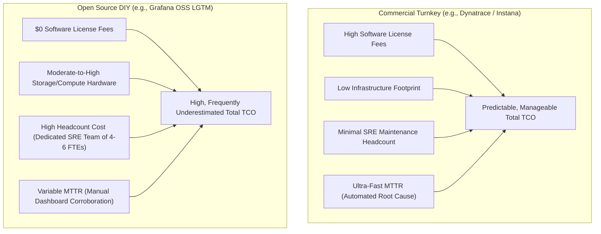

# Comprehensive Observability Comparison Matrices: The 7 Pillars & Beyond

[](https://www.redhat.com/)
[](docs/ARCHITECTURE_AND_AIRGAP.md)
[](docs/THE_7_PILLARS.md)

This document provides structured, comparative decision matrices evaluating **12 enterprise observability platforms** across the **7 Pillars of Modern Observability**, air-gapped architectural viability, hybrid infrastructure support, industry standing, and Total Cost of Ownership (TCO).

---

## 1. Master Comparison Matrix: 12 Platforms Across All 7 Pillars

| Evaluation Dimension | OCP Native (Prom/Loki) | Datadog | Elastic Stack (ECK) | Dynatrace | New Relic | Splunk Enterprise | Instana (IBM) | Cisco AppDynamics | Grafana Cloud | Checkmk (+ ntopng) | Grafana OSS (LGTM) | Zabbix |
| :--- | :---: | :---: | :---: | :---: | :---: | :---: | :---: | :---: | :---: | :---: | :---: | :---: |
| **Air-Gapped Viable** | **Yes** | **No** (SaaS) | **Yes** | **Yes** | **No** (SaaS) | **Yes** | **Yes** | **Yes** | **No** (SaaS) | **Yes** | **Yes** | **Yes** |
| **Deployment Model** | Self-Hosted | SaaS Only | Self-Hosted | Managed / On-Prem | SaaS Only | On-Prem / Cloud | Self-Hosted / On-Prem | On-Prem Controller | SaaS Only | On-Prem Appliance | Self-Hosted | Self-Hosted |
| **Pillar 1: Metrics (OpenShift)** | Excellent | Excellent | Good | Excellent | Excellent | Good | Excellent | Good | Excellent | Good | Excellent | Good |
| **Pillar 1b: Metrics (vSphere)** | Good (Exporter) | Excellent | Good | Excellent | Good | Good | Good | Good | Good | Excellent | Good (Exporter) | Good |
| **Pillar 2: Logs** | Good (Loki) | Excellent | Excellent | Excellent | Good | Excellent | Good | Moderate | Excellent | Moderate | Excellent (Loki) | Moderate |
| **Pillar 3: Tracing / APM (Java)** | Moderate (Tempo) | Excellent | Good | Excellent | Excellent | Good | Excellent | Excellent | Good | Poor / N/A | Good (Tempo) | Poor / N/A |
| **Pillar 3b: Tracing (Kafka)** | Moderate | Excellent | Good | Excellent | Good | Good | Excellent | Good | Good | N/A | Moderate | N/A |
| **Pillar 4: Continuous Profiling** | Poor / Assembly | Excellent | Excellent (eBPF) | Excellent | Good (JFR) | Poor / N/A | Excellent | Moderate (Snapshots) | Good (Pyroscope) | N/A | Good (Pyroscope) | N/A |
| **Pillar 5: Real User Monitoring (RUM)**| Poor / Assembly | Excellent | Good | Excellent | Excellent | Good | Good | Excellent | Good (Faro) | N/A | Moderate (Faro) | Moderate (Synthetic) |
| **Pillar 6: Network eBPF Observability**| Good (NetObserv) | Excellent (NPM)| Good | Excellent | Excellent (Pixie)| Moderate | Good | Good | Good (Beyla) | Good (ntopng) | Good (Beyla/NetObs)| Moderate |
| **Pillar 7: Security & Causal AIOps**  | Moderate | Excellent | Excellent | Excellent (Davis)| Good | Excellent (SIEM) | Excellent (DynGraph) | Good | Moderate | Moderate | Moderate | Moderate |
| **Microsoft SQL Server Monitoring**   | Good (Exporter) | Excellent | Good | Excellent | Good | Good | Good | Excellent | Good | Good | Good (Exporter) | Good |
| **Gartner MQ Position** | N/A | **Leader** | **Visionary** | **Leader** | **Leader** | **Leader** | **Visionary** | **Leader** | N/A | Niche | N/A | Niche |
| **CNCF / OTel Alignment** | **Very High** | Medium | Medium | Medium | Medium | Medium | Medium | Low | High | Low | **Very High** | Low |
| **Direct License Cost** | **$ (OSS)** | **$$$$** | **$$$** | **$$$$** | **$$$$** | **$$$$** | **$$$** | **$$$$** | **$$$** | **$$** | **$ (OSS)** | **$ (OSS)** |
| **Operational & SRE Overhead** | **Very High** | Low | High | **Low** | Low | High | **Low** | High | Low | Low | **Very High** | Moderate |

> **Rating Legend**:
> - **Excellent**: Production-ready, turnkey out-of-the-box, automated discovery and deep correlation.
> - **Good**: Fully capable, standard industry integration, solid documentation.
> - **Moderate**: Basic functionality supported; requires manual configuration or complementary plugins.
> - **Poor / Assembly Required**: Not available natively; requires assembling separate third-party components or heavy custom code.
> - **N/A**: Not supported by platform architecture.

---

## 2. Strategic Philosophical Archetypes: Infra-First vs. App-First vs. Convergent

Platforms differ fundamentally based on their historical engineering genesis:

```mermaid
quadrantChart
    title Observability Platform Landscape (Telemetry Depth vs Operational Automation)
    x-axis Low Operational Automation (DIY / High SRE Overhead) --> High Operational Automation (Turnkey / AI)
    y-axis Infrastructure-Centric Monitoring --> Deep Application & Code Observability
    quadrant-1 Turnkey Application Leaders
    quadrant-2 DIY Open-Source Powerhouses
    quadrant-3 Traditional Infrastructure Legacy
    quadrant-4 Enterprise Hybrid Engines
    "Checkmk": [0.35, 0.20]
    "Zabbix": [0.25, 0.25]
    "OCP Native (Prom/Loki)": [0.20, 0.45]
    "Grafana OSS Stack": [0.15, 0.70]
    "Elastic Stack (ECK)": [0.45, 0.65]
    "Splunk Enterprise": [0.50, 0.55]
    "AppDynamics": [0.65, 0.80]
    "Instana": [0.85, 0.88]
    "Dynatrace Managed": [0.92, 0.95]
```

### Archetype Breakdown

| Category | Typical Platforms | Core Philosophy & DNA | Key Advantages | Critical Enterprise Deficiencies |
| :--- | :--- | :--- | :--- | :--- |
| **Infra-First** *(Traditional Infrastructure)* | **Checkmk**, **Zabbix** | Originated in hardware, server, SNMP, and network device monitoring. Views OpenShift and VMs simply as additional hardware resources. | Exceptional vSphere host, datastore, and switch monitoring; vast catalog of legacy plugins; low hardware overhead. | **Completely blind to code-level execution**. Lacks distributed tracing (APM), cannot trace Kafka messages, and has no continuous profiling. |
| **App-First** *(Modern Application Performance)* | **Dynatrace**, **Instana**, **AppDynamics** | Originated in bytecode manipulation, transaction tracing, and code profiling. Infrastructure is viewed solely as context for application health. | Automated runtime injection; 100% unsampled distributed tracing; code-level continuous profiling; immediate causal root-cause analysis. | Higher commercial acquisition costs; requires automated cluster privileges (SCCs) for runtime injection. |
| **Convergent / Balanced** *(Search & Metrics Fab)* | **Elastic Stack**, **Splunk**, **Grafana OSS** | Originated in log aggregation (Elastic, Splunk) or time-series metrics (Grafana). Expanded across the remaining pillars via acquisitions and open standards. | High architectural flexibility; world-class log forensic search; massive developer community and CNCF ecosystem alignment. | Higher integration and operational complexity; requires significant in-house engineering to configure, optimize, and maintain at scale. |

---

## 3. Total Cost of Ownership (TCO) & SRE Operational Economics

When evaluating observability investments, looking solely at software licensing creates a dangerous distortion. The true cost includes **infrastructure compute/storage** and **internal engineering headcount (SRE/DevOps)**:



### TCO Comparison Table

| Platform Option | Direct License Cost | Infrastructure & Storage Footprint | Required In-House Engineering / SRE Headcount | Operational Complexity & Maintenance Risk | 3-Year TCO Summary |
| :--- | :---: | :---: | :---: | :---: | :--- |
| **Dynatrace Managed** | **High** (Predictable Host / DDU model) | **Low** (Highly optimized distributed backend) | **Low** (1 dedicated engineer for policy & agent management) | Vendor handles R&D, updates, and engine optimization; Davis AI eliminates alert noise. | **Predictable Enterprise Investment**. Higher licensing offset by immediate operational maturity and minimal staffing demands. |
| **Instana Self-Hosted** | **Moderate-to-High** (Host-based) | **Low-to-Medium** (ClickHouse / Kafka backend) | **Low-to-Medium** (1-2 engineers) | Automated AutoTrace eliminates application code changes; simple host licensing. | **Cost-Effective Turnkey Alternative**. Predictable pricing with low day-2 management burden. |
| **Elastic Stack (ECK)** | **Moderate** (Subscription or Free Basic) | **High** (Inverted indices demand significant RAM and fast NVMe storage) | **High** (2-3 dedicated Elasticsearch cluster administrators) | Cluster sharding, index lifecycle management (ILM), and node rebalancing require deep expertise. | **Storage-Heavy Enterprise TCO**. Cost-efficient if enterprise already has Elasticsearch skills; expensive if storage scales unchecked. |
| **Grafana OSS (LGTM)** | **$0** (Free Open Source) | **Moderate** (Object-storage backed: S3/MinIO for Loki/Tempo) | **Very High** (4-6 dedicated SRE/Platform engineers for scaling & maintenance) | Full responsibility for HA, upgrades, multi-tenant isolation, OTel pipelines, and exporter patching. | **People-Heavy TCO ("Build vs. Buy")**. Zero licensing cost, but massive ongoing salary and talent retention commitment. |
| **Checkmk / Zabbix** | **Low to $0** | **Very Low** (Single appliance / server architecture) | **Low-to-Moderate** (System administration focus) | Well-understood traditional sysadmin model; simple upgrades and static configs. | **Low TCO, but Incomplete Solution**. Leaves critical microservices and APM unmonitored, requiring secondary tool purchases. |

---

## 4. Air-Gapped Feasibility & Compliance Checklist

To pass the disconnected sovereign enclave gateway, platforms must satisfy strict platform engineering criteria:

| Platform | Offline Image Registry (Quay/Harbor) Support | Disconnected OLM Catalog Compatibility | Local Proxy / Gateway Architecture | Zero Internet Egress During Operation | Air-Gapped Licensing Mechanism |
| :--- | :---: | :---: | :---: | :---: | :---: |
| **Dynatrace** | ✅ Full (`oc-mirror`) | ✅ Red Hat Certified | ✅ ActiveGate Proxy | ✅ 100% Offline | ✅ Signed offline certificate file |
| **Instana** | ✅ Full (`skopeo`) | ✅ Red Hat Certified | ✅ Local Agent Gateway | ✅ 100% Offline | ✅ Offline sales key / license token |
| **Elastic Stack** | ✅ Full | ✅ Red Hat Certified (ECK) | ✅ Fleet Server Local | ✅ 100% Offline | ✅ Offline license bundle |
| **Splunk Enterprise** | ✅ Full | ✅ Red Hat Certified | ✅ Heavy Forwarder | ✅ 100% Offline | ✅ Local enterprise license file |
| **AppDynamics** | ✅ Full | ✅ Red Hat Certified | ✅ On-Prem Controller | ✅ 100% Offline | ✅ Local license.lic file |
| **Grafana OSS** | ✅ Full | ✅ Community Operator | ✅ Local Alloy Gateway | ✅ 100% Offline | ✅ Open source (No license required) |
| **Checkmk** | ✅ Full | ✅ Container / VM Image | ✅ Satellite / Site Proxy| ✅ 100% Offline | ✅ Offline license key |
| **Zabbix** | ✅ Full | ✅ RPM / Container Image | ✅ Zabbix Proxy | ✅ 100% Offline | ✅ Open source (No license required) |
| **Datadog** | ❌ Ineffective | ❌ Ineffective | ❌ No On-Prem Backend | ❌ Requires Cloud Egress | ❌ Requires Cloud Sync |
| **New Relic** | ❌ Ineffective | ❌ Ineffective | ❌ No On-Prem Backend | ❌ Requires Cloud Egress | ❌ Requires Cloud Sync |
| **Grafana Cloud** | ❌ Ineffective | ❌ Ineffective | ❌ No On-Prem Backend | ❌ Requires Cloud Egress | ❌ Requires Cloud Sync |
