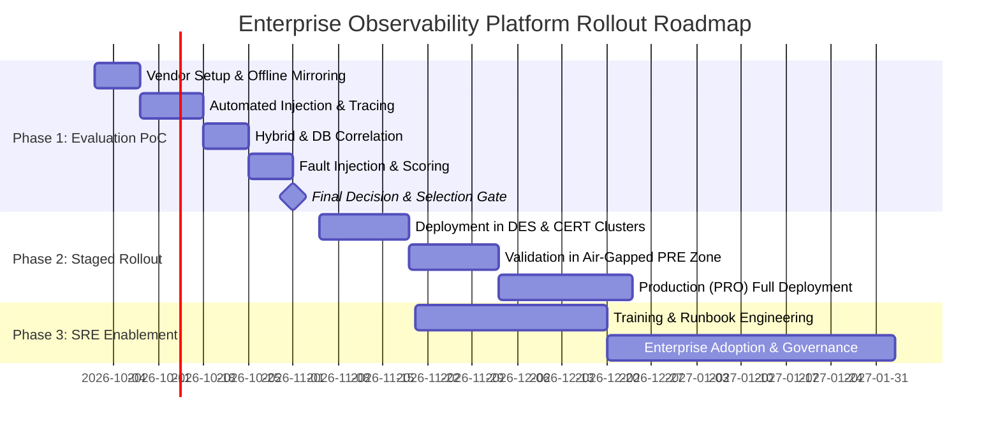
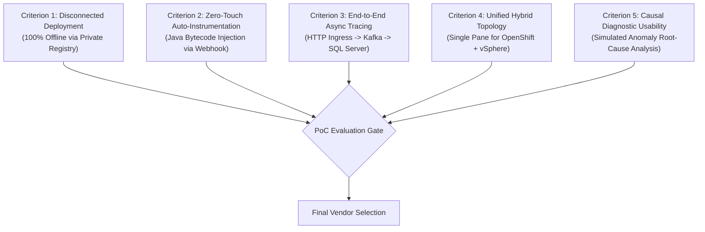

# Enterprise Observability Proof-of-Concept (PoC) & Implementation Roadmap

> [!WARNING]
> ### ⚠️ AI-Generated Content & Environment Testing Disclaimer
> This PoC framework and failure injection scenarios were generated by **Gemini 3.8 Flash** and **have NOT been tested on a real platform or live production environment**.
> 
> All chaos test scripts, SQL queries, and load testing parameters must be audited by DBAs and SREs and executed only in non-production staging environments.

---

| ⬅️ Previous | 🏠 Overview | Next ➡️ |
| :--- | :---: | ---: |
| [⬅️ Comparison Matrices](COMPARISON_MATRICES.md) | [📚 Document Index](../README.md#11-repository-documentation--advanced-solutions-map) | [Advanced Solutions & Code Guide ➡️](ADVANCED_SOLUTIONS_GUIDE.md) |

---

This guide defines the practical, measurable framework for validating candidate observability platforms in an enterprise hybrid cloud and air-gapped OpenShift environment. It establishes a **3-Phase Implementation Roadmap** and an exhaustive **4–6 Week Proof-of-Concept (PoC)** plan with quantitative criteria and diagnostic test scenarios.

---

## 1. The 3-Phase Implementation Roadmap

### Phase 1: Proof of Concept (PoC) (Duration: 4–6 Weeks)
- **Objective**: Conduct an empirical head-to-head evaluation between the **Tier 1 Recommendation (Dynatrace Managed)** and a **Tier 2 Alternative (Instana Self-Hosted)**, with optional benchmarking against the **Grafana OSS Stack**.
- **Environment**:
  - **Development Cluster (DES)**: Tests connected capabilities, CI/CD pipeline tracing, and standard deployment flows.
  - **Certification Cluster (CERT)**: Configured in simulated **air-gapped mode** (egress blocked at the firewall/proxy) to validate disconnected image mirroring, offline licensing, and in-cluster telemetry routing.

### Phase 2: Staged Deployment (Duration: 6–8 Weeks)
- **Step 1 (Lower Environments)**: Roll out the winning platform operator across DES and CERT clusters. Establish automated CI/CD injection rules.
- **Step 2 (Air-Gapped Pre-Production)**: Mirror all required artifacts to the sovereign private registry. Validate offline installation, proxy gateways, and full telemetry parity in PRE.
- **Step 3 (Air-Gapped Production)**: Deploy across the core PRO cluster and production vSphere infrastructure, applying operational lessons learned from earlier stages.

### Phase 3: SRE Enablement & Enterprise Governance (Continuous)
- Conduct role-specific workshops for SREs, developers, and system administrators.
- Establish standardized SLO/SLI dashboards and automated alerting runbooks.
- Integrate causal AI notifications directly into enterprise ITSM workflows (e.g., ServiceNow, Jira).

---

## 2. Phase 1: PoC Measurable Success Criteria

Candidate platforms are evaluated against **5 Quantitative & Qualitative Success Criteria**:

### Criterion 1: Successful Disconnected / Air-Gapped Deployment
- **Target**: Complete installation of the platform's backend and cluster operators into the simulated air-gapped CERT cluster using strictly mirrored images from the enterprise registry.
- **Metric**: Zero failed network egress attempts; license validated offline; cluster operator status reports `Available=True`.

### Criterion 2: Zero-Touch Application Auto-Instrumentation
- **Target**: Deploy a standard enterprise Java/Spring Boot microservice container without modifying Dockerfiles, source code, or application dependencies.
- **Metric**: Pod startup successfully injects the APM agent via admission webhooks; heap memory overhead added by the agent is under 5%; CPU overhead under 2%.

### Criterion 3: End-to-End Asynchronous Distributed Tracing
- **Target**: Trigger a multi-tier transaction traversing:
  `Client Browser / Ingress -> Order Microservice (Java) -> Apache Kafka Topic -> Inventory Microservice (Java) -> Microsoft SQL Server`.
- **Metric**: 100% of transaction spans linked under a single `trace_id`; Kafka message header context propagation verified; sanitized SQL query string and execution latency visible inside the database span.

### Criterion 4: Hybrid Infrastructure & Virtualization Visibility
- **Target**: Ingest telemetry from VMware vSphere vCenter and physical ESXi hosts alongside OpenShift container pods in a unified console.
- **Metric**: Ability to correlate a container pod's latency spike with hypervisor-level CPU contention (`cpu.readiness`) or datastore I/O latency on the underlying VM.

### Criterion 5: Usability & Causal Root-Cause Identification
- **Target**: Execute simulated failure scenarios (outlined below) and evaluate the platform's ability to isolate the true root cause without human manual correlation.
- **Metric**: Time-to-detect (TTD) < 1 minute; platform generates a single incident pointing to the root failure rather than triggering a storm of 50+ symptomatic alerts.

---

## 3. Simulated Fault Injection Scenarios

During the PoC, engineers will execute three diagnostic stress tests to evaluate the platforms across the **7 Pillars**:

### Scenario A: Apache Kafka Consumer Group Lag & Stalled Processing
- **Execution**: Artificially throttle downstream consumers by introducing artificial sleep delays in the message processing loop or killing consumer pods.
- **Evaluation**:
  - Does the platform alert on growing consumer lag before buffer exhaustion occurs?
  - Does the distributed trace clearly show where the message was queued vs. when it was actively executed?

### Scenario B: Code-Level Thread Contention & CPU Spikes
- **Execution**: Trigger an endpoint executing catastrophic regex backtracking or high Java synchronized block lock contention.
- **Evaluation**:
  - Does **Continuous Profiling (Pillar 4)** capture the issue?
  - Can engineers click directly from a slow APM trace into an interactive **Flame Graph** showing the exact Java class and method causing CPU saturation?

### Scenario C: Microsoft SQL Server Table Lock & Query Regression
- **Execution**: Open an uncommitted transaction in SQL Server holding an exclusive table lock (`WITH (TABLOCKX)`), then issue concurrent queries from the Java microservice.
- **Evaluation**:
  - Does **Database Monitoring** expose the blocked process and the root blocking SPID?
  - Does the APM distributed trace clearly show that the application latency was caused by a database lock wait rather than internal microservice processing?

---

## 4. Evaluation Scoring Rubric

Each candidate platform is scored across the 5 criteria using a weighted matrix:

| Evaluation Dimension | Weight (%) | Dynatrace Managed | Instana Self-Hosted | Elastic Stack (ECK) | Grafana OSS (LGTM) |
| :--- | :---: | :---: | :---: | :---: | :---: |
| **Air-Gapped & Offline Viability** | 25% | 10 / 10 | 10 / 10 | 9 / 10 | 10 / 10 |
| **Java & Kafka APM Automation** | 25% | 10 / 10 | 9.5 / 10 | 7.5 / 10 | 7 / 10 |
| **Continuous Profiling (Flame Graphs)**| 15% | 9.5 / 10 | 9 / 10 | 9.5 / 10 | 8 / 10 |
| **Hybrid vSphere & SQL Server Parity** | 15% | 9.5 / 10 | 9 / 10 | 8 / 10 | 6.5 / 10 |
| **AIOps Causal Root-Cause Usability** | 10% | 10 / 10 | 9 / 10 | 8 / 10 | 5 / 10 |
| **SRE Operational Overhead (Inverse)** | 10% | 9.5 / 10 | 9 / 10 | 6.5 / 10 | 3 / 10 |
| **Weighted Score (Out of 10)** | **100%** | **9.78** | **9.38** | **8.18** | **7.10** |

---

| ⬅️ Previous | 🏠 Overview | Next ➡️ |
| :--- | :---: | ---: |
| [⬅️ Comparison Matrices](COMPARISON_MATRICES.md) | [📚 Document Index](../README.md#11-repository-documentation--advanced-solutions-map) | [Advanced Solutions & Code Guide ➡️](ADVANCED_SOLUTIONS_GUIDE.md) |

