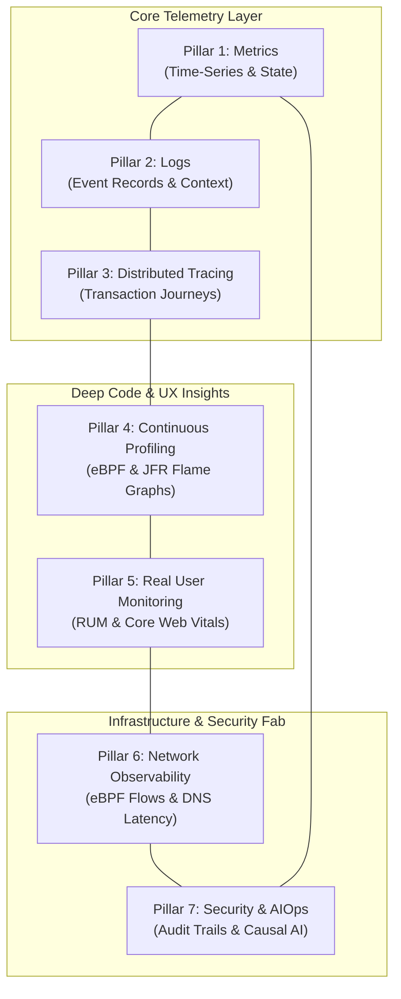
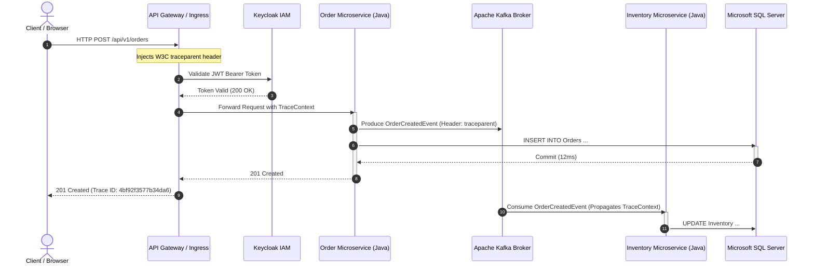

# The 7 Pillars of Modern Cloud-Native Observability

> [!WARNING]
> ### ⚠️ AI-Generated Content & Environment Testing Disclaimer
> This document and its technical specifications were generated by **Gemini 3.8 Flash** and **have NOT been tested on a real platform or production environment**.
> 
> It serves as an architectural conceptual guide. All telemetry configurations and protocols must be verified in staging environments before production deployment.

Observability is the ability to infer the internal states of a complex system based on the external outputs (telemetry) it emits. While classical monitoring asks predefined questions about known failure modes (*"Is the CPU above 90%?"* or *"Is the HTTP 500 rate elevated?"*), true observability empowers engineering and operations teams to diagnose unprecedented problems—the **"unknown unknowns"**—without having to modify or redeploy code.

For years, the industry relied on the **"Three Pillars"** (Metrics, Logs, Traces). However, in high-density Kubernetes/OpenShift architectures, asynchronous event-driven pipelines (Kafka), polyglot microservices, and air-gapped secure enclaves, these three signals leave critical visibility blind spots. 

Modern enterprise platform engineering has expanded this paradigm into the **7 Pillars of Cloud-Native Observability**:

---

## 1. Pillar 1: Metrics (Aggregated Numerical Telemetry)

### Definition & Characteristics
Metrics are structured, numeric measurements recorded over chronological time windows. They are computationally lightweight, highly compressible, and optimal for establishing statistical baselines, real-time dashboards, and threshold-based or anomaly-driven alerting.

### Core Methodologies
- **USE Method (Infrastructure-centric)**: **U**tilization (% time busy), **S**aturation (queue length / wait backlog), and **E**rrors. Applied to host CPUs, memory cgroups, network interfaces, and disk I/O.
- **RED Method (Request-centric)**: **R**ate (requests per second), **E**rrors (failed requests), and **D**uration (latency distributions: p50, p95, p99). Applied to APIs, microservices, and ingress controllers.

### Enterprise Hybrid Cloud Focus
1. **Container & Node Health**: CPU throttled time (`container_cpu_cfs_throttled_seconds_total`), memory working set vs. limits (`container_memory_working_set_bytes`), and pod restart loops.
2. **Java Virtual Machine (JVM)**: Garbage collection pause durations, Young/Old generation heap consumption, Metaspace usage, and thread states (BLOCKED, WAITING, RUNNABLE).
3. **Event-Driven Brokers (Apache Kafka)**: Under-replicated partitions, consumer group lag (`records-lag-max`), broker network handler idle percent, and topic byte in/out rates.
4. **Virtualization Layer (VMware vSphere)**: ESXi host CPU contention, ballooned memory, datastore I/O latency, and VM snapshot delta growth.

---

## 2. Pillar 2: Logs (Immutable Event Records & Context)

### Definition & Characteristics
Logs are timestamped, structured (JSON) or unstructured text records generated by operating systems, runtimes, middleware, and application code when a discrete event occurs. They provide the narrative and diagnostic context explaining *why* an anomaly identified by metrics took place.

### Architectural Patterns & Indexing Strategies
- **Full-Text Indexation (e.g., Elasticsearch / Splunk)**:
  - *Mechanism*: Tokenizes every word and field into an inverted index.
  - *Advantage*: Rapid search over arbitrary strings, deep regex filtering, and security forensic discovery.
  - *Disadvantage*: Massive compute and disk I/O storage overhead (often requiring 1.5x–2x the raw log size in disk indices).
- **Label-Metadata Indexing (e.g., Grafana Loki)**:
  - *Mechanism*: Compresses and chunks log streams, indexing only Kubernetes labels and metadata (namespace, pod, container). Log grep is performed dynamically via LogQL.
  - *Advantage*: Drastically lower storage cost (up to 80% reduction vs. Elasticsearch) and native Prometheus-like operational model.
  - *Disadvantage*: Slower querying for needle-in-a-haystack searches across non-labeled payload fields without structured parsing filters.

### Context Enrichment
Modern enterprise logging enforces **Mapped Diagnostic Context (MDC)** to automatically inject active `trace_id`, `span_id`, `service_name`, and `environment` into every log statement, bridging logs directly with distributed traces.

---

## 3. Pillar 3: Distributed Tracing & APM (End-to-End Transaction Journeys)

### Definition & Characteristics
Distributed tracing captures the exact path of an execution request as it traverses across multi-tiered microservices, event queues, and databases. A **Trace** consists of a directed acyclic graph (DAG) of **Spans**, where each span represents an individual unit of work with start/end timestamps, tags, and execution events.

### Critical Capabilities
1. **Asynchronous Context Propagation**: Propagating W3C `traceparent` and `tracestate` across message broker boundaries (e.g., Apache Kafka record headers) so downstream consumers correlate to the initial producer.
2. **Database Span Decomposition**: Automatic capture of sanitized SQL queries, bind parameters, connection pool acquisition delays, and execution times without manual developer code changes.
3. **Sampling Strategies**: Head-based sampling (sampling decision at root) vs. Tail-based sampling (buffering spans and retaining 100% of traces that contain errors or high latency).

---

## 4. Pillar 4: Continuous Profiling (Code-Level Resource Attribution)

### Definition & Characteristics
Continuous profiling measures code execution efficiency inside production runtimes with negligible overhead (<1–2% CPU/memory). Often referred to as the *"missing pillar"*, it answers: *"Which exact package, method, or line of code consumed 80% of CPU cycles or allocated 2 GB of memory during the latency spike?"*

### Profiling Technologies
- **Kernel-Level eBPF Profiling (e.g., Elastic Universal Profiling, Grafana Pyroscope, Parca)**:
  - *Mechanism*: Uses extended Berkeley Packet Filter (eBPF) programs running in kernel space to sample stack traces across all running processes (native binaries, Go, Rust, Java, Node.js) without modifying binaries or restarting containers.
  - *Key Benefit*: Zero application reconfiguration; profiles user space and kernel space simultaneously.
- **Runtime-Native Profiling (e.g., Java Flight Recorder / JFR)**:
  - *Mechanism*: Built directly into the OpenJDK JVM. Captures method execution samples, thread allocation rates, lock contention, and class loading events.
  - *Key Benefit*: In-depth JVM-specific insights into lock synchronization bottlenecks and garbage collector invocation causes.

### Visualization: Flame Graphs
Profiles are aggregated into interactive **Flame Graphs**, where the horizontal axis represents the proportion of total time or memory allocated, and the vertical axis represents the call stack depth.

---

## 5. Pillar 5: Real User Monitoring (RUM) & Digital Experience (DEM)

### Definition & Characteristics
While backend APM tracks server-side operations, Real User Monitoring (RUM) captures the actual user experience directly in the client browser or mobile application. Server-side response times of 150ms can easily translate to a 3-second perceived delay if client-side DOM parsing, JavaScript hydration, or third-party asset loading stalls.

### Core Signals & Standards
1. **Core Web Vitals (CWV)**:
   - **Largest Contentful Paint (LCP)**: Perceived render speed of main content (target: < 2.5s).
   - **Interaction to Next Paint (INP)**: Responsiveness to user inputs (target: < 200ms).
   - **Cumulative Layout Shift (CLS)**: Visual stability of page elements during load (target: < 0.1).
2. **Frontend Error Telemetry**: Uncaught JavaScript exceptions, failed network fetches, rejected promises, and CSP (Content Security Policy) violations.
3. **Session Replay & Funnel Analytics**: Visualizing exact user action sequences leading up to application errors or conversion drop-offs.
4. **Synthetic Transaction Probing**: Scheduled headless browser scripts testing critical user journeys (e.g., login, checkout) 24/7, independent of organic user traffic.

---

## 6. Pillar 6: Network Observability & eBPF Telemetry

### Definition & Characteristics
In dynamic container platforms like Red Hat OpenShift, network performance issues frequently masquerade as application bugs. Network observability provides kernel-level visibility into inter-pod and inter-node networking, overlay SDN performance (OVN-Kubernetes), and egress proxies.

### Critical Telemetry Dimensions
- **Connection Health**: TCP SYN retransmissions, connection timeouts, RST packets, and connection setup latency.
- **DNS Performance**: In-cluster CoreDNS response latency, NXDOMAIN error spikes, and DNS lookup throttling.
- **Traffic Topology & Service Mesh**: Dynamic service-to-service communication dependency mapping, identifying rogue dependencies and unauthorized cross-namespace calls.
- **Bandwidth & Socket Buffers**: Ingress/egress throughput per namespace, socket buffer overruns, and MTU mismatch drops.

---

## 7. Pillar 7: Security Observability, Audit & AIOps Event Intelligence

### Definition & Characteristics
Observability and security have fundamentally converged. Security observability captures compliance events, runtime threats, configuration drift, and audit trails, unifying operational debugging with threat hunting and automated root-cause analysis (AIOps).

### Critical Capabilities
1. **Kubernetes API Server Audit Logging**:
   - Tracking who did what, when, and from where across the cluster.
   - Immediate detection of unauthorized `exec` into production pods, privilege escalations to `cluster-admin`, or anomalous secret access from HashiCorp Vault / External Secrets.
2. **Runtime Threat Detection**:
   - Kernel syscall monitoring (via eBPF/Falco) for unexpected binary executions, container escapes, reverse shells, or modified `/etc/shadow` files.
3. **Causal AI & Anomaly Root-Cause Analysis (AIOps)**:
   - Modern systems ingest thousands of alerts per hour during a major cascading outage.
   - Causal engines (e.g., Dynatrace Davis AI, Elastic AI Assistant, Instana Dynamic Graph) automatically cluster symptomatic alerts, evaluate topological dependencies, and isolate the exact root cause (e.g., *"Database deadlock in SQL Server triggered thread exhaustion in Order Microservice, causing Kafka consumer lag and upstream HTTP 504 timeouts"*).

---

## The Unified Telemetry Correlation Matrix

True observability is achieved not by purchasing point tools for each pillar, but by **unifying all 7 pillars** into a single contextual graph:

| Initial Signal | Pillar Correlated Next | Ultimate Diagnostic Outcome |
| :--- | :--- | :--- |
| **Pillar 1 (Metric Alert)** | High JVM CPU utilization on pod `order-svc-7b8f` | Identifies that a specific microservice instance is starved of compute resources. |
| **Pillar 3 (Distributed Trace)** | P99 trace latency shows 4,200ms delay in `executeOrderValidation()` | Pinpoints the exact RPC call and transaction span responsible for the delay. |
| **Pillar 4 (Continuous Profiling)** | Flame graph reveals 78% CPU time spent in Regex compiling inside `validateTaxCode()` | Locates the specific line of Java code causing catastrophic backtracking. |
| **Pillar 2 (Structured Logs)** | Log entries reveal unexpected payload formatting received from legacy client | Explains why the regex input violated expected pattern bounds. |
| **Pillar 6 (Network eBPF)** | TCP reset spike between ingress proxy and order microservice | Confirms connection termination due to client timeout before response completed. |
| **Pillar 5 (RUM)** | Frontend Core Web Vital (INP) spikes to 4.8s for users clicking "Confirm Order" | Measures the actual user impact and business disruption caused by the bug. |
| **Pillar 7 (Security & AIOps)** | Causal engine suppresses 85 downstream alerts and opens 1 prioritized incident | Eliminates alert fatigue and directs the on-call engineer directly to the regex issue. |
