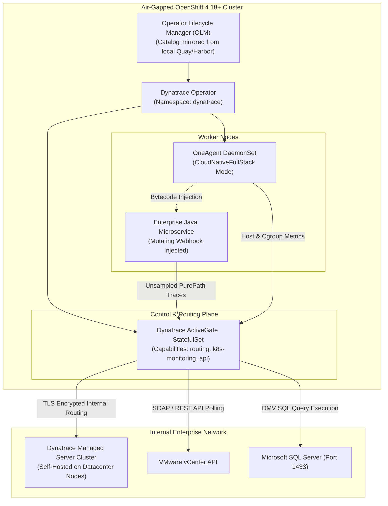

# Advanced Dynatrace Managed Architecture for Air-Gapped OpenShift

[](https://www.dynatrace.com/)
[](https://www.redhat.com/)
[](docs/ARCHITECTURE_AND_AIRGAP.md)

This directory provides advanced production manifests and architecture blueprints for deploying **Dynatrace Managed** on Red Hat OpenShift 4.18+ inside strictly disconnected (air-gapped) environments.

---

## 🏗️ Architectural Overview



---

## 🔑 Key Architectural Capabilities

### 1. OneAgent Zero-Touch Bytecode Injection
In OpenShift, developers **never modify Dockerfiles or add JAR dependencies**. When a pod manifest with the label or namespace configuration is created:
1. The **Dynatrace Mutating Webhook** intercepts the API request before `etcd` persistence.
2. It injects an `initContainer` containing the OneAgent binary from the local private mirror registry (`registry.internal.corp`).
3. An internal `emptyDir` volume mounts the agent library into `/opt/dynatrace/oneagent`.
4. The application container receives an injected `LD_PRELOAD` or Java `-agentpath` environment variable, attaching PurePath instrumentation upon process launch.

### 2. Air-Gapped ActiveGate Routing
In disconnected sovereign enclaves, worker nodes cannot reach external IPs. The **ActiveGate** acts as an intelligent local gateway:
- **Telemetry Proxy**: Bundles and compresses metrics, logs, and traces from hundreds of pods before routing them to the Dynatrace Managed server backend.
- **Out-of-Band Integration**: Queries the VMware vCenter API and Microsoft SQL Server Dynamic Management Views (DMVs) without requiring agents on database servers or hypervisors.
- **Air-Gapped Package Cache**: Caches OneAgent updates locally so nodes update instantly within the private perimeter.

### 3. Davis® Causal AI Engine
Unlike basic alerting systems that trigger hundreds of notifications during an outage, Davis AI uses deterministic dependency mapping (**Smartscape**):
- Evaluates billions of topological dependencies in real time.
- Identifies causality vs. correlation (e.g., distinguishing whether a CPU spike caused high latency or if a blocking database query caused thread starvation that resulted in a CPU spike).
- Produces a single, prioritized problem ticket with identified root cause and affected business impact.

---

## 🚀 Deployment Instructions

### Step 1: Pre-load Offline Images
Mirror the required container images to your local enterprise registry:
```bash
skopeo copy docker://docker.io/dynatrace/dynatrace-operator:v1.2.0 \
  docker://registry.internal.corp/dynatrace/dynatrace-operator:v1.2.0

skopeo copy docker://docker.io/dynatrace/oneagent:latest \
  docker://registry.internal.corp/dynatrace/oneagent:latest

skopeo copy docker://docker.io/dynatrace/activegate:latest \
  docker://registry.internal.corp/dynatrace/activegate:latest
```

### Step 2: Apply DynaKube Manifest
Deploy the air-gapped DynaKube custom resource:
```bash
oc create namespace dynatrace
oc apply -f dynakube-airgap.yaml
```

### Step 3: Verify Status
Check the status of the operator and OneAgent DaemonSet:
```bash
oc get dynakube -n dynatrace
oc get pods -n dynatrace -o wide
```
