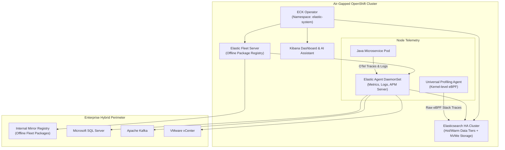

# Elastic Stack (ECK) Architecture & Whole-System eBPF Continuous Profiling

[](https://www.elastic.co/)
[](https://www.elastic.co/observability/universal-profiling)
[](https://www.redhat.com/)

This directory provides advanced architectural configurations for deploying the **Elastic Stack** on Red Hat OpenShift 4.18+ inside air-gapped sovereign environments, combining **Elastic Cloud on Kubernetes (ECK)** with **Universal Profiling**.

---

## 🏗️ Architectural Overview



---

## 🔑 Key Architectural Capabilities

### 1. Air-Gapped Fleet Package Registry
In an air-gapped environment, Elastic Agent cannot connect to `epr.elastic.co` to download integration packages (such as SQL Server, Kafka, or Kubernetes assets).
- An internal container running the **Elastic Package Registry (EPR)** is deployed within the sovereign network.
- Kibana and Fleet Server are configured with `xpack.fleet.registryUrl: "https://package-registry.internal.corp"`, enabling full offline policy management.

### 2. Universal Profiling via Whole-System eBPF
- Unlike traditional profilers that require modifying runtime startup parameters or adding agents to every container, Elastic's **Universal Profiling Host Agent (`pf-host-agent`)** operates at the Linux kernel level via eBPF.
- Profiles all processes running on the node simultaneously: Java (JVM), Go, Rust, C/C++, Node.js, and kernel syscalls.
- Zero CPU symbolization overhead on application pods: symbol resolution is performed asynchronously against the Elasticsearch backend.

### 3. Log Mastery & ES|QL Querying
Elasticsearch remains the industry gold standard for log analysis:
- **Full-Text Inverted Indexing**: Sub-second search across billions of log records, regardless of formatting or schema.
- **ES|QL (Elasticsearch Query Language)**: Modern piped query language allowing transformations, enrichments, and aggregations inline with search commands.

---

## 🚀 Deployment Instructions

### Step 1: Deploy ECK Operator & Storage Classes
Ensure your OpenShift cluster has persistent storage (such as ODF/Ceph RBD) and deploy the ECK Operator:
```bash
oc create namespace elastic-system
oc apply -f https://download.elastic.co/downloads/eck/2.14.0/crds.yaml
oc apply -f https://download.elastic.co/downloads/eck/2.14.0/operator.yaml
```

### Step 2: Deploy Elasticsearch & Kibana Manifest
```bash
oc apply -f eck-elasticsearch-fleet.yaml
```

### Step 3: Deploy Universal Profiling DaemonSet
Deploy the privileged eBPF host agent to profile all OpenShift nodes:
```bash
oc adm policy add-scc-to-user privileged -z default -n elastic-system
oc apply -f universal-profiling-host-agent.yaml
```
Verify profiling data ingestion in the **Kibana > Observability > Universal Profiling** console.
