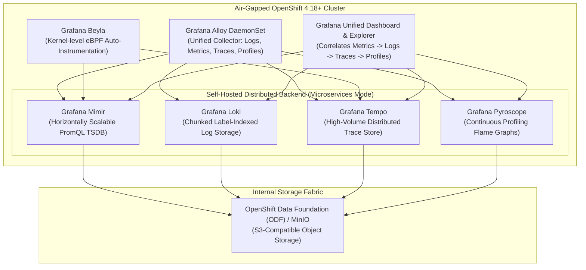

# Advanced Open-Source Observability: The Grafana LGTM + Pyroscope Stack

[](https://grafana.com/)
[](https://www.cncf.io/)
[](https://www.redhat.com/)

This directory provides advanced configuration manifests, pipelines, and dashboards for running the self-hosted **Grafana LGTM Stack** (**L**oki, **G**rafana, **T**empo, **M**imir) paired with **Pyroscope** (Continuous Profiling) and **Alloy** (Telemetry Collector) on Red Hat OpenShift 4.18+.

---

## 🏗️ Architectural Overview



---

## 🔑 Key Architectural Capabilities

### 1. Grafana Alloy: The Unified Open-Source Telemetry Collector
Grafana Alloy replaces legacy fragmented agents (Promtail, Grafana Agent, OTel Collector) with a single declarative pipeline engine:
- Ingests Kubernetes pod logs via container log paths.
- Exposes native OTLP endpoints (`:4317` gRPC, `:4318` HTTP) for application tracing.
- Scrapes Prometheus metrics and user workloads via OpenShift ServiceMonitors.
- Forwards continuous profiling data to Grafana Pyroscope.

### 2. High-Density, Low-Cost Storage Architecture
- **Zero Inverted Indexing Overhead**: Loki indexes only labels, storing compressed log chunks directly in S3/Ceph object storage. This reduces storage footprint by up to 75% compared to full-text Elasticsearch clusters.
- **Trace to TraceContext Lookup**: Tempo stores spans in object storage and indexes only trace IDs, enabling cost-effective storage of millions of spans per second.

### 3. Continuous Profiling with Grafana Pyroscope
- Integrated directly into Grafana: clicking a trace span in Tempo with an active profile opens the corresponding **Pyroscope Flame Graph** at that exact millisecond.
- Visualizes CPU consumption, heap memory allocations, and lock contention.

---

## ⚠️ Operational Reality: SRE Team Requirements

While software licensing fees for the Grafana OSS stack are **$0**, successfully operating this distributed architecture at enterprise scale requires:
1. **Dedicated SRE / Platform Engineering Team**: 4 to 6 full-time senior engineers to maintain sharding, compactor maintenance, query frontend caching (Memcached/Redis), and upgrades.
2. **Object Storage High Availability**: Resilient, low-latency S3 storage (Ceph/ODF) capable of sustaining high concurrent writes.
3. **Manual Instrumentations**: Developers must configure OpenTelemetry SDKs or leverage eBPF collectors for transaction waterfalls.

---

## 🚀 Deployment Instructions

### Step 1: Deploy Storage & Operators
Deploy the Grafana Operator and ensure S3 bucket credentials exist:
```bash
oc create namespace observability-oss
oc apply -f https://github.com/grafana/grafana-operator/releases/latest/download/kustomize-openshift.yaml
```

### Step 2: Deploy Alloy Collector Pipeline
```bash
oc apply -f grafana-alloy-lgtm-stack.yaml
```

### Step 3: Import Enterprise 7-Pillars Dashboard
Import the pre-configured production dashboard from `dashboards/enterprise-overview.json` into Grafana to visualize unified telemetry across all 7 pillars.
